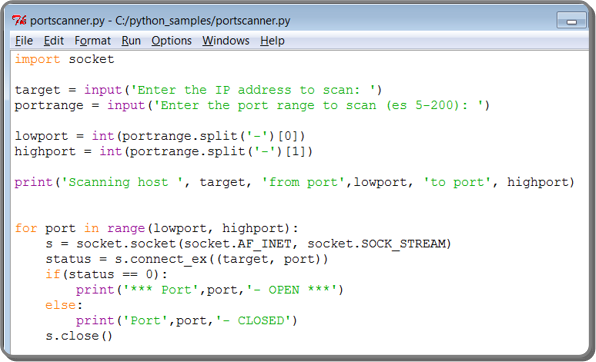
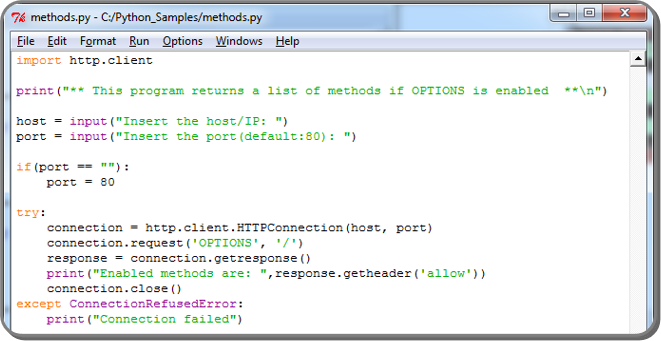

Preliminary Skills and Programming

# Introduction to Programming

# C++

# Python
Pentester Scripting
Network sockets
Port Scanner / Backdoor

HTTP (http.client) - Login Brute Force

# Command Line Scripting

## Bash Scripting

## Windows Scripting

Command Line

Environment

Commands and Programs

Output Redirectors and Special Characters

Conditional Statements and Loops
