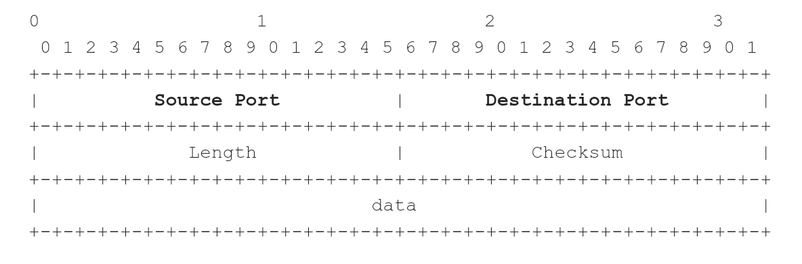

Prerequisites

# Introduction

## The Information Security Field
Infosec Culture
Career Opportunities
Terms to Know
* White Hat/ Black Hat Hacker (Crackers is a separate category) 
* User / Malicious System User
* Root/Administrator
* Privileges 
* Security Through Obscurity
* Attack
* Privilege Escalation
* Denial of Service
* Remote Code Execution
* Shellcode

# Networking

## Protocols
Packets
* Made up of Header and Payload
Protocol Layers
ISO/OSI
Encapsulation

## Internet Protocol 
https://youtu.be/LIzTo6e4FgY 

In charge of 

## Routing*
* Routing Table: Maps IP to interface (for routers and hosts) 
* Routing Metrics: Select the fastest route
* Check Routing Table on host: ip route/ route print(windows) /netstat -r (MacOS) 

Link Layer Devices and Protocols*
* MAC Addresses: identify network card
* MAC and IP Address: send MAC address of device directly connected, router change MAC address to device to send to
* Switch
* Broadcast MAC address
* Switches: work with MAC Addresses, use a forwarding (Content Addressable Memory) table
  * Forwarding table has MAC Address, Interface, Time to Live(How long entry stays in table, as table has finite size)
  * Forwarding: switch reads dest MAC address, look up CAM table, forwards to specific interface (to all interfaces if table no address) 
* Address Resolution Protocol: Learn MAC from IP
  * Basically sender sends ARP request to all packets (FF:FF... Mac address, with receiver's IP address). Receiver responds with ARP reply, telling sender MAC address. This is saved in cache (also has a TTL due to RAM limits) 
  * Checking ARP: arp command
* Hubs: just simple repeaters of electrical signals

TCP/UDP*

* Ports: Used to Identify a single network process on the machine
* Well known ports
* TCP and UDP headers: Source and destination ports
* Netstat command
* TCP 3 way handshake : Used header fields (Sequence Number, Acknowledgement numbers, SYN/ACK flags) 
  * Sender to Client - SYN, random seq no
 * Client to Sender - SYN + ACK, another random seq no & ACK no (simple increment of SYN no. Sent by client) 
  * Sender to Client - ACK, seq is the prev ACK no, ACK no is increment of 1 of prev SYN no

TCP Header

UDP Header

DNS
Reverse DNS

Wireshark
Capture/Display Filters

# Web Applications

HTTP Protocol
Request and response format

HTTP Cookies
In short server sends data to client. Client checks data and parameters (eg. Expiry, domain) and sends back to server

HTTP Session
Basically the server remembers the session, and knows the session of the client with a session cookie

Same Origin Policy
The Javascript code cannot interact with hosts of different port, protocol and host
* only same host & port with different path

Burp Suite - Study Guide
An Intercepting proxy (another tool is ZAP) 
 - they intercept browser traffic

Features
* Burp Proxy configuration: Intercept and View browser Traffic
* Burp Repeater: Manually edit HTTP Requests

# Penetration Testing

Life cycle of a Penetration Tester

Engagement : All details of pentest
Quotation: Defines fee based on type, time consuming, complexity, number of targets
Proposal submittal : 
Incident Handling 
Legal Work

Information gathering: only right after start date
* General
* Business
* Infrastructure: whois/DNS info (give meaning to every IP address in scope) 
* Web app
* Footprinting (Fingerprinting OS) and Port Scanning -> Detecting Services

Vulnerability Assesment
Exploit all vulnerabilities 
Reporting
Consultancy (regarding report) 
