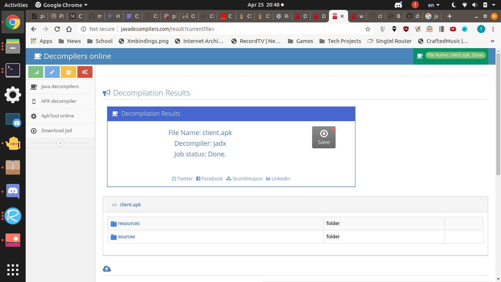
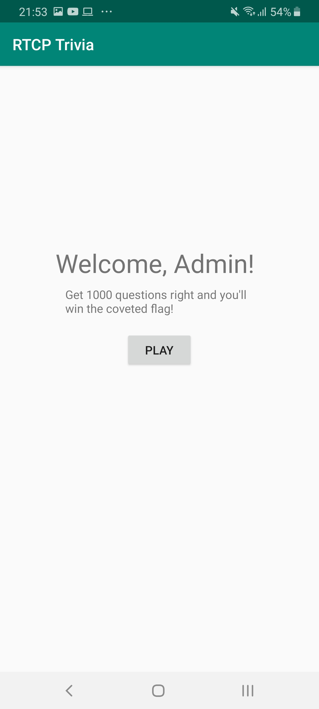

# Main

# Solution

## Decompilation

Use an online decompiler

package name is `wtf.riceteacatpanda.quiz`

Checking the `AndroidManifest.xml`, the 
Under `sources/wtf/riceteacatpanda/quiz/Flag.java`, 
```
package wtf.riceteacatpanda.quiz;

import android.os.Bundle;
import android.widget.TextView;

public class Flag extends C0282e {
    /* access modifiers changed from: protected */
    public void onCreate(Bundle bundle) {
        super.onCreate(bundle);
        setContentView((int) R.layout.activity_flag);
        ((TextView) findViewById(R.id.flag)).setText(getIntent().getStringExtra("flag"));
    }
}
```

Checking the strings list in ` resources/res/values/strings.xml`
```
<string name="flag">rtcp{it_isnt_that_easy}</string>
```

And true enough, this flag fails.

Also in this xml file:
```
<string name="wsUrl">ws://challs.houseplant.riceteacatpanda.wtf:40001/</string>
```

## Running the actual app
Things noticed
1. First you login. Any username works. You **need** to be online. Most likely the `MainActivity`
2. You get to a page showing your username and asking you to start. Most likely the `LoggedIn` Activity
3. You have to answer questions within a time limit. Most likely the `Game` Activity


In other words, if we get into the Flag activity we get the flag? Well it's a hypothesis so let's test it out.

```
$ adb shell am start -n wtf.riceteacatpanda.quiz/wtf.riceteacatpanda.quiz.Flag
Starting: Intent { cmp=wtf.riceteacatpanda.quiz/.Flag }
$ adb shell uiautomator dump
UI hierchary dumped to: /sdcard/window_dump.xml
$ adb shell cat /sdcard/window_dump.xml
.....
$
```


Yeah the activity needs to like get something from the previous activity / online first.

## Checking online URL
